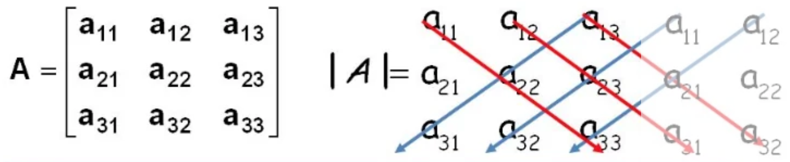
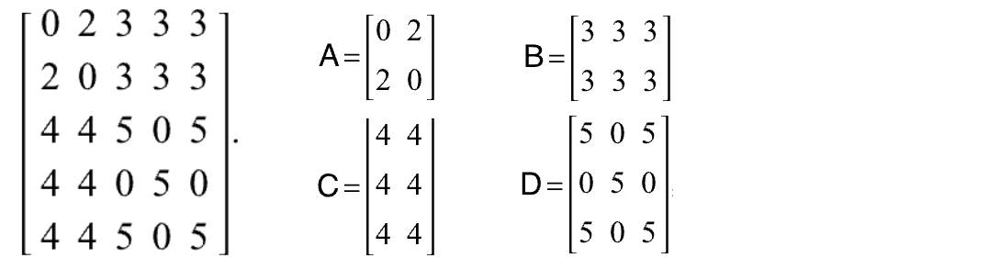

```text
线性代数核心知识点
├── 1. 行列式
│   ├── 1.1 行列式定义
│   ├── 1.2 行列式性质（交换行、因子提取、加法性质）
│   ├── 1.3 拉普拉斯展开
├── 2. 矩阵
│   ├── 2.1 矩阵的基本概念（加减乘、数乘、转置）
│   ├── 2.2 逆矩阵与伴随矩阵
│   │   └── 【公式】A⁻¹ = 1/|A| × adj(A)（可逆条件：|A| ≠ 0）
│   ├── 2.3 矩阵分块运算
│   └── 2.4 初等变换与初等矩阵
├── 3. 向量
│   ├── 3.1 向量的线性运算
│   ├── 3.2 线性相关与无关
│   └── 3.3 向量组的秩
├── 4. 线性方程组
│   ├── 4.1 齐次与非齐次方程组
│   ├── 4.2 解的结构（有解、无解、唯一解、无穷多解）
│   ├── 4.3 矩阵方法解线性方程组（增广矩阵、行简化）
│   └── 4.4 克拉默法则
├── 5. 特征值与特征向量
│   ├── 5.1 特征值与特征向量定义
│   ├── 5.2 求特征值与特征向量（|A-λI|=0）
│   ├── 5.3 特征多项式与代数重数、几何重数
│   └── 5.4 相似矩阵与对角化
├── 6. 二次型
│   ├── 6.1 二次型定义
│   ├── 6.2 正定、负定、不定的判别
│   │   └── 【公式】Sylvester判别法（主子式符号）
│   └── 6.3 二次型标准化（正交变换）
├── 7. 向量空间
│   ├── 7.1 子空间、零空间、列空间
│   ├── 7.2 维数定理（rank-nullity theorem）
│   ├── 7.3 基底与坐标变换
│   └── 7.4 线性变换与矩阵表示
└── 8. 正交与单位矩阵
    ├── 8.1 内积与正交性
    ├── 8.2 正交矩阵定义与性质
    │   └── 【公式】QᵀQ = I
    └── 8.3 格拉姆-施密特正交化过程
```

## 行列式 (Determinant)

> ⚠️：行列式是一个**标量**(普通数字)， 它不是方阵本身，而是方阵特殊计算后的值。
> 行列式只能计算方阵的值


$$ \begin{vmatrix}
a & b \\
c & d
\end{vmatrix} \quad
\begin{vmatrix}
a & b & c \\
d & e & f \\
g & h & i
\end{vmatrix}\quad
\begin{vmatrix}
1 & 2 & 3 & 4 \\
2 & 3 & 4 & 5 \\
3 & 4 & 5 & 6 \\
4 & 5 & 6 & 7 \\
\end{vmatrix} $$
二阶方阵，三阶方阵，四阶方阵


<font style="background-color: #FFFACD; color: #333333; padding: 4px; border-radius: 8px; text-shadow: 1px 1px 2px rgba(0,0,0,0.1); font-weight: bold;">应用</font>

- **克拉姆法则** 解线性方程
- 判断矩阵是否可逆。 行列式=0，不可逆
- 几何应用

### 行列式计算

二阶行列式：

$$ \begin{vmatrix}
a & b \\
c & d
\end{vmatrix} =a*d-b*c  $$

三阶行列式：

$$\begin{vmatrix} a & b & c \\
d & e & f \\ 
g & h & i 
\end{vmatrix} = (a \times e \times i) + (b \times f \times g) + (c \times d \times h)$$
$$ \\ \quad - (c \times e \times g) - (a \times f \times h) - (b \times d \times i)$$


四阶行列式：

```python
import numpy as np
matrix_4_4 = np.array([
[1, 2, 3, 4], 
[2, 3, 4, 5], 
[3, 4, 5, 6],
[4, 5, 6, 7]]) # 4阶行列式
det_4_4 = np.linalg.det(matrix_4_4)
print("四阶行列式的值： ", det_4_4) # =0
```

### 行列式的性质
1. 互换行列式的行或列，行列式变

2. 提公因式

$$ \begin{vmatrix}
1 & 2 & 3 \\
3 & 3 & 3 \\
7 & 8 & 9
\end{vmatrix} \quad  = 3*
\begin{vmatrix}
1 & 2 & 3 \\
1 & 1 & 1 \\
7 & 8 & 9
\end{vmatrix} $$

3. 倍数加减
4. 拆分
5. 对应相等或成比例，值为0
6. 轻转置的行列式，值不变

### 拉普拉斯展开 (Laplace Expansion)

只能展开到2阶，2阶行列式不支持Laplace展开
$$

\begin{vmatrix}

a & b & c \\

d & e & f \\

g & h & i \\

\end{vmatrix}

= a \cdot \begin{vmatrix} e & f \\ h & i \end{vmatrix} - b \cdot \begin{vmatrix} d & f \\ g & i \end{vmatrix} + c \cdot \begin{vmatrix} d & e \\ g & h \end{vmatrix}

$$


## 矩阵 Matrix
 
$$ A = \begin{bmatrix}
1 & 2 & 3 \\
1 & 1 & 1 \\
7 & 8 & 9 \\
4 & 5 & 6
\end{bmatrix} $$

每一行的数组，叫**行向量**  
每一列的数组，叫**列向量**    

<font style="background-color:#FBDE28; color:black;">矩阵只能表示二维平面，不能表示三维立体。</font>


### 方阵

**方阵** ： 行和列相等的矩阵 如$2*2$的方阵叫2阶方阵    

对角阵，单位矩阵，全1矩阵，都是方阵

+ 上对角阵：左下区域全是0； 
+ 下对角阵：右上区域全是0
+ 对角阵：只有对角线有值；
+ 单位矩阵：对角阵，且对角线数字全是1
+ 全1矩阵： 元素全是1

$$ 上三角矩阵\begin{bmatrix}
1 & 2 & 3 \\
0 & 1 & 1 \\
0 & 0 & 9 \\
\end{bmatrix} \quad
下三角矩阵 \begin{bmatrix}
1 & 0 & 0 \\
1 & 1 & 0 \\
7 & 8 & 9 \\
\end{bmatrix}$$
$$对角阵 \begin{bmatrix}
1 & 0 & 0 \\
0 & 1 & 0 \\
0 & 0 & 9 \\
\end{bmatrix} \quad
单位矩阵 \begin{bmatrix}
1 & 0 & 0 \\
0 & 1 & 0 \\
0 & 0 & 1 \\
\end{bmatrix}$$


### 矩阵的运算

```text
矩阵运算
├── 1. 矩阵基础
│   ├── 矩阵加法：A + B
│   ├── 矩阵减法：A - B
│   ├── 矩阵逐元素相乘：A * B  # Hadamard乘积,在数学上用 $C=A\circB$表示，但pandas和NP都用* 
│   ├── 矩阵数乘：cA
│   ├── 矩阵转置：A.T # 将m*n矩阵转为n*m矩阵
│   ├── 矩阵的形状：A.shape
│   ├── 矩阵的元素访问：A[i, j]
│   ├── 矩阵的大小：A.size
│   ├── 矩阵的类型：A.dtype

├── 2. 矩阵乘法
│   ├── 矩阵乘法：A.matmul(B) 或 A @ B 或 np.dot(A, B)

├── 3. 矩阵的逆
│   ├── 矩阵的逆：A.inv() 或 np.linalg.inv(A)
│   ├── 特性：A @ A.inv() = I（单位矩阵）

├── 4. 行列式（Determinant）

├── 5. 矩阵的秩（Rank）
│   ├── 计算秩：np.linalg.matrix_rank(A)

├── 6. 特征值与特征向量（Eigenvalues and Eigenvectors）
│   ├── 计算特征值：np.linalg.eigvals(A)
│   ├── 计算特征向量：np.linalg.eig(A)

├── 7. 矩阵的奇异值分解（SVD）
│   ├── 计算SVD：np.linalg.svd(A)

├── 8. 伪逆（Moore-Penrose Inverse）
│   ├── 计算伪逆：np.linalg.pinv(A)

├── 9. 矩阵的迹（Trace）
│   ├── 计算迹：np.trace(A)
```
相等、加减、逐元素乘法  
	- 只有同型矩阵才能加减和逐元素乘法 
#### 矩阵相乘

点积运算要求：$m行*n列$ 只可以 $x行*m列$ 的矩阵点乘，x是任意值

$$ A = \begin{bmatrix}
1 & 2 \\
3 & 4 \\
5 & 6
\end{bmatrix}, \quad
B = \begin{bmatrix}
7 & 8 \\
9 & 0
\end{bmatrix} $$

$$ A @ B =
\begin{bmatrix}
1 \times 7 + 2 \times 9 & 1 \times 8 + 2 \times 0 \\
3 \times 7 + 4 \times 9 & 3 \times 8 + 4 \times 0 \\
5 \times 7 + 6 \times 9 & 5 \times 8 + 6 \times 0
\end{bmatrix} \quad
= \begin{bmatrix}
25 & 8 \\
57 & 24 \\
89 & 40
\end{bmatrix} $$
#### 逆矩阵
- 公式：$B = A^{-1}$
- 条件：
	+ 必须是方阵
	+ $A@B=I$（单位矩阵）
	
#### 正交矩阵
- 向量的正交，向量a * 向量b = 1.  
- 正交矩阵： $\mathbf{Q}^T \mathbf{Q} = \mathbf{I}$
	- $\mathbf{Q}^T$是矩阵Q的转置矩阵
	- $\mathbf{I}$是单位矩阵
	- $\mathbf{Q}^T$ 和 Q 使用矩阵相乘

#### 方程组与矩阵的转换
$$ \begin{aligned}
a_1x + b_1y + c_1z &= d_1 \\
a_2x + b_2y + c_2z &= d_2 \\
a_3x + b_3y + c_3z &= d_3 \\
\end{aligned} $$

$$ \begin{bmatrix}
a_1 & b_1 & c_1 \\
a_2 & b_2 & c_2 \\
a_3 & b_3 & c_3
\end{bmatrix}  \quad @
\begin{bmatrix}
x \\
y \\
z
\end{bmatrix} =
\begin{bmatrix}
d_1 \\
d_2 \\
d_3
\end{bmatrix} $$

#### 矩阵的秩 (Rank of Matrix)
> 矩阵中最大**线性无关**的行或列的量
> ⚠️：秩是一个**标量**

$$ A = \begin{bmatrix}
1 & 2 & 3 & 4\\
2 & 4 & 6 & 8\\
3 & 6 & 9 & 12 \\
3 & 5 & 7 & 9
\end{bmatrix}  $$

- <font style="background-color:tomato; color:white; padding:4px; text-shadow: 1px 1px 2px rgba(0,0,0,0.2);font-weight: bold;">线性无关</font>
	- 描述两个或多个的向量之间的关系
	- 向量A 和 向量B 不是简单的线性关系
		- 线性关系：向量加减、数乘
	
- 特性：
	- <font style="background-color: #FFFACD; color: #333333; padding: 4px; border-radius: 8px; text-shadow: 1px 1px 2px rgba(0,0,0,0.1); font-weight: bold;">行秩必定等于列秩</font>
	- 秩适用于所有矩阵
	- 全0矩阵的秩是0；其他非0矩阵的秩至少是1
- 满秩： $秩 = \min(m, n)$
	- 矩阵的秩 等于 行数和列数的最小值

#### 矩阵的迹 (Trace)

> **方阵**（行列数相同的矩阵）**主对角线**元素的**和**

$$A = \begin{pmatrix} 1 & 2 & 3\\ 4 & 5 & 6\\ 7 & 8 & 9 \end{pmatrix}, trace(A) = 1+5+9=15$$

#### 分块运算
矩阵维度
- 优点：
	- 提高效率
	- 适应硬件限制
	- 分治

#### 初等变换（Elementary Transformation）
	
1. **行交换变换**（Row Interchange）：
    - 交换矩阵中的两行。例如，交换矩阵的第 i 行和第 j 行。
    
2. **行倍加变换**（Row Scaling）：
    - 将矩阵的某一行的所有元素乘以一个非零常数。例如，将第 i 行的所有元素乘以常数 $c（c \neq 0）$。
    
3. **行线性变换**（Row Replacement）：
    - 将矩阵的一行加上另一行的倍数。例如，将第 i 行加上第 j 行的 c 倍，得到新的第 i 行。
	
#### 初等矩阵（Elementary Matrix）
	
1. **行交换初等矩阵**：
    - 通过交换单位矩阵中的两行得到的矩阵。例如，交换第 i 行和第 j 行。
    
2. **行倍加初等矩阵**：
    - 通过将单位矩阵的某一行乘以非零常数得到的矩阵。例如，将单位矩阵的第 i 行乘以常数 $c（c \neq 0）$。
        
3. **行线性变换初等矩阵**：
    - 通过将单位矩阵的某一行加上另一行的 c 倍得到的矩阵。例如，将单位矩阵的第 i 行加上第 j 行的 c 倍。

## 向量 Vector
> 向量**既有大小又有方向**。表示：$\vec{v} = (2, 3)$ （在线代中，向量的大小都是相对于原点而言的）
> 如：速度是一个向量，而速率是一个标量，速率是速度的模。

### 向量运算

| **运算**     | **公式/解释**                                                    |
| ---------- | ------------------------------------------------------------ |
| 加法         | $(a_1, a_2) + (b_1, b_2) = (a_1 + b_1, a_2 + b_2)$           |
| 数乘         | $k(a_1, a_2) = (ka_1, ka_2)$                                 |
| 线性组合       | $c_1 \vec{v}_1 + c_2 \vec{v}_2 + \cdots + c_k \vec{v}_k$     |
| 点积（内积）     | $\vec{a} \cdot \vec{b} = a_1b_1 + a_2b_2 + \cdots + a_n b_n$ |
| 叉积（外积，限3维） | $\vec{a} \times \vec{b}$                                     |
| 单位向量       | 模长为1的向量：                                                     |
### 向量组
| **概念**    | **说明**                     |
| --------- | -------------------------- |
| 线性相关 / 无关 | 向量组是否可通过其他向量线性表示           |
| 向量空间      | 一组向量和其线性组合构成的空间            |
| 基底        | 能生成整个向量空间的一组线性无关向量         |
| 维度        | 向量空间中基底的个数                 |
| 张成空间      | 向量组所有线性组合形成的集合（就是它“张成”的空间） |
#### 线性相关
- 向量相关：
	- $\vec{a} = 2*\vec{b}$
	-  $\vec{a} = \vec{b} + 2$
	-  $\vec{a} = \vec{b} + \vec{c}$ , ($\vec{a}$可以用$\vec{b}$、$\vec{c}$线性组合得到)
	- $\vec{a} = (0,0,0)$, 任意$\vec{b}$（有零向量必相关）
- 向量不相关：
	- $\vec{a} = 2*\vec{b} + 1$
	-  $\vec{a} = (1,0)，\vec{b} = (0,1)$ , （标准基底，互相独立）
#### 向量组的秩

**向量组中，线性无关向量的最大个数**

## 线性方程组

例：三元一次线性方程组。$$\begin{cases} 
	a_1x + b_1y + c_1z = d_1 \\
	a_2x + b_2y + c_2z = d_2 \\ 
	a_3x + b_3y + c_3z = d_3 
	\end{cases} $$
- 概念
	- 系统矩阵：$A = \begin{pmatrix} a_1 & b_1 & c_1 \\ a_2 & b_2 & c_2 \\ a_3 & b_3 & c_3 \end{pmatrix}$
	- 常数列： $B=\begin{pmatrix} d_1 \\  d_2 \\ d_3 \end{pmatrix}$
- 线性方程的特点：
	- 未知数的指数为1
	- 方程式的系数是常数，而不是未知数
- 线性方程组解的类型：
	- 惟一解
	- 无解
	- 无穷解
	- ⚠️：任何线性方程组存在 有限多个解
- <font style="background-color: #FFFACD; color: #333333; padding: 4px; border-radius: 8px; text-shadow: 1px 1px 2px rgba(0,0,0,0.1); font-weight: bold;">齐次方程组</font>
	- $\begin{aligned} x + 2y - 3z &= 0 \\ 2x + 5y + z &= 0 \end{aligned}$
	- 概念： **所有常数项都是 0** 的线性方程组
	- 特点：
		- 必有0解 (x,y,z等未知数都为0) 
### 解法
- 代入法
- 加减法
- 消元法
- 矩阵法
	- 增广矩阵
	- 高斯消元法
- 克拉默法则

#### 增广矩阵（Augmented matrix）

- **系数矩阵 + 常数列**
	如上面三元一次方程的 增广矩阵：$$\left[\begin{array}{ccc|c}a_1 & b_1 & c_1 & d_1 \\ a_2 & b_2 & c_2 & d_2\\ a_3 & b_3 & c_3 & d_3 \\\end{array}\right]$$
- 作用： **把线性方程组变成矩阵运算**

#### 高斯消元法 （**Gaussian elimination**）

**通过行变换，把增广矩阵一步步化简成「上三角形」的过程**

- 为什么增广矩阵一定能简化成上三角阵？
	- **因为初等行变换**（交换行、倍乘、加减行）**不改变方程组的解，同时可以一步步消掉下面的数**

#### 克拉默法则 (Cramer’s Rule)

将方程组的解表示为一系列**行列式的比值**。

克拉默法则仅适用于系数矩阵为**方阵** (square matrix) 且**可逆** (invertible)。
如行列式=0，不可逆转，无惟一解。

<font style="background-color:tomato; color:white; padding:4px; text-shadow: 1px 1px 2px rgba(0,0,0,0.2);font-weight: bold;">克拉默法则</font>：
1. 假设有3元一次方程组：
	$$\begin{cases} 
	a_1x + b_1y + c_1z = d_1 \\
	a_2x + b_2y + c_2z = d_2 \\ 
	a_3x + b_3y + c_3z = d_3 
	\end{cases} $$
2. 用矩阵表示： 
	- AX = B
		- 系数矩阵：$A = \begin{pmatrix} a_1 & b_1 & c_1 \\ a_2 & b_2 & c_2 \\ a_3 & b_3 & c_3 \end{pmatrix}$
		- $X = \begin{pmatrix} x \\  y \\ z \end{pmatrix}$
		- 常数列：$B=\begin{pmatrix} d_1 \\  d_2 \\ d_3 \end{pmatrix}$
3. 克拉默的解
	- 公式：$$x = \frac{\Delta_x}{\Delta}, \quad y = \frac{\Delta_y}{\Delta}, \quad z = \frac{\Delta_z}{\Delta}$$
		- $\Delta$ 是矩阵A的行列式
		- $\Delta_x$ 是把A的第1列换成B后的方阵的行列式，同理， $\Delta_y$ 换A的第2列， $\Delta_z$ 换A的第3列
			- 如， $\Delta_y = \begin{pmatrix} a_1 & d_1 & c_1 \\ a_2 & d_2 & c_2 \\ a_3 & d_3 & c_3 \end{pmatrix}$
		- 代码入上面公式，可解线性方程。

## 特征值和特征向量
	
$$A\vec{v} = \lambda \vec{v}$$
- 概念：给定矩阵 A，存在一个非零向量 $\vec{v}$，使得 $A\vec{v} = \lambda \vec{v}$。此时 $\lambda$ 是特征值，$\vec{v}$ 是对应的特征向量。
	- 使用点乘： **行向量 × 列向量**，一行一行地「点乘」
	- 🧠：矩阵作用在特征向量上，只是简单绽放，不改变向量的方向。
- 特征方程：
	- 公式$$\det(A - \lambda I) = 0$$
- 特性：
	- 只有方阵才有特征值和特征向量
	- 特征值数量：n阶方程最多有n个特征值
	- 特征值可以是复数。 即使是实矩阵，特征值也可能是复数。
	-  矩阵 A 的特征值之和 = A 的迹
	-  矩阵 A 的特征值之积 = A 的行列式
	- 通常情况下，我们说特征向量时，说的是单位向量。模=1
- 对角化：
	- 如果矩阵 A 有 n 个线性无关的特征向量，可以写成 $A = PDP^{-1}$，D 是对角矩阵。
- 实对称矩阵：
	- 一定可以被对角化，而且特征值都是实数，特征向量可以正交。
