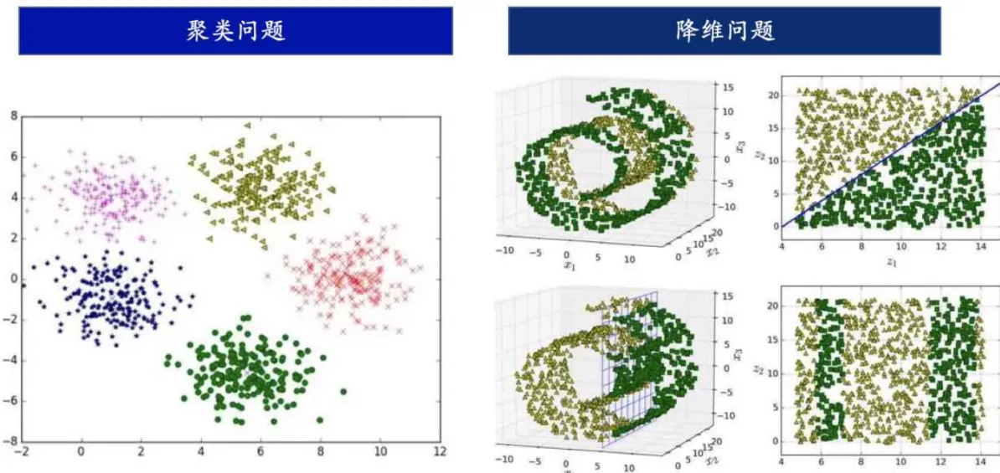
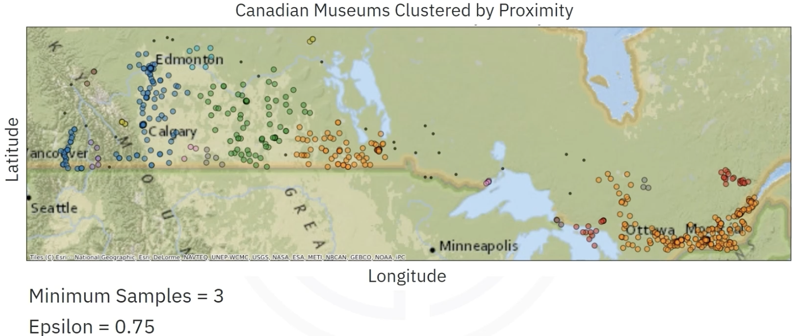
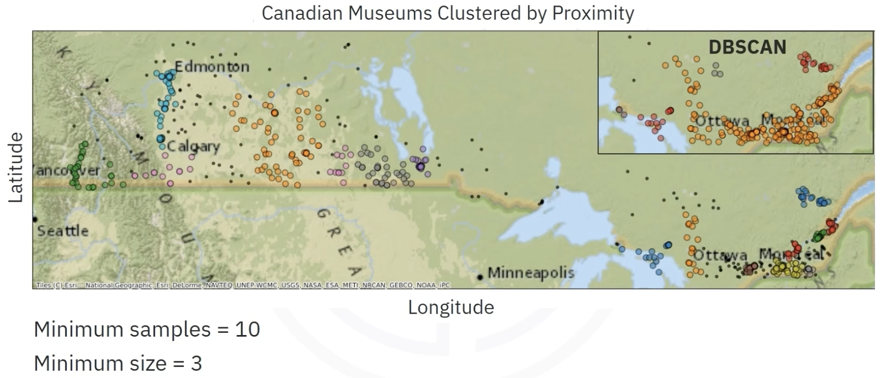
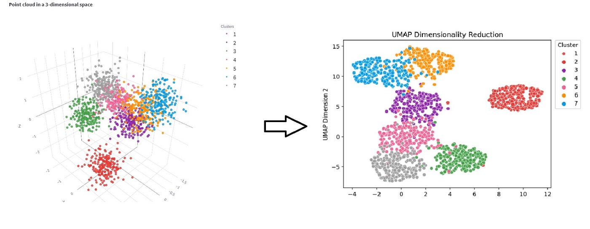

<h1 style=" text-align: center; font-size: 3em; font-family: 'Georgia', serif; color: #2c3e50; margin: 0.5em 0; padding: 10px 0; border-top: 4px solid #3498db; border-bottom: 4px solid #3498db; text-transform: uppercase; letter-spacing: 3px;"> 无监督学习常用算法</h1>

## 聚类 Clustering

> 将数据集中的样本**自动分组**，使得同一组内的样本**相似度高**
	
- 特征
	- **无监督学习**
	- **自动分组**
	- 适用于一个或多个数据特征。
- 类型
	- 基于**划分** Partitioning Methods： 
		将数据集划分为k个互不重叠的簇，每个数据点属于一个簇
	- 基于**层次**划分 Hierarchical Methods：
		创建簇的层次结构,称为聚类树。
		- **自底向上 Agglomerative**： 每个数据点作为簇的开始，不断合并最相似的簇，直到所有点合并到一个簇或达到停止条件
		- **自顶而下 Divisive**：所有数据点作为一个簇的开始，不断分裂簇，直到每个数据点自成一组或达到停止条件
	- 基于**密度**的方法 Density-Based Methods：
		寻找样本密集的区域，将密集区域中的点划分为簇，稀疏区域点视为噪音或异常。
- 应用
	- 识别音乐题材
	- 用户分组
	- 市场细分
	- 异常检测
	- 特征工程
		- 降维
		- 识别有类别的特征
		- 提高模型表现和可解释性
	- 数据压缩：发现数据内在结构和冗余
	
###   🪼 K-Means
[✍️ K-means DEMO](../IBM-AI-Engineer-Course/jupyter-demo/IBM-1-4-1-K-Means.ipynb)  
[NVIDIA-K-Means Clustering Algorithm](https://www.nvidia.com/en-us/glossary/k-means/)

**基于划分** Partitioning

> 找到一组簇中心，使得簇内的样本尽量相似，而不同簇之间差异尽量大
> 不定义簇半径， 不限制簇内点数，就像找星系一样，定义几个质点，样本离哪个质点近，就归属哪个簇
	 
- 核心算法：
	- 最小化每个样本点到簇中心的距离
	- 欧式距离
- 主要步骤：
	
	- 初始化：随机选择K个点作为初始簇中心
	- 分配簇：
		- 计算每个数据点 到 k个质点的距离(质点 centroid)，将它分配到最近的质点所有在簇，形成K个簇
		- 不存在一个样本点 同属两个质点; 到多个质点距离相同，选其中一个作为质点
	- 更新簇中心：对于每个簇，计算簇中所有点的均值，并将该均值作为新的簇中心
	- 重复2-3步，直到簇中心不再发生变化，或者达到预设的迭代次数
- **优化目标**：
	- 最小化簇内误差
		$$J(K) = \sum_{k=1}^{K} \sum_{x_i \in C_k} \|x_i - c_k\|^2$$
		- J(K) 是目标函数（总平方误差）。
		- $C_k$ 是簇 k 中的所有数据点集合。
		- $\| x_i - c_k \|^2$ 是数据点 x_i 到其簇中心 $c_k$ 的欧几里得距离的平方。
- **非凸数据集**不适合K-means 
	- 凸包 Convex Hull： 通过数据点的外部边界划定一个区域，表示数据集的最远扩展。
	- 近近似边界 Approximate Boundary
- 缺点：
	- 需要预设K值
	- 对初始簇中心敏感
	- 簇形状假设。
	- 不适合处理异常值
- 如何选K的值
	
	- 肘部法则 elbow method	
		- `kmeans.inertia_` 可调用inertia_使用plot打印
	- 轮廓系数 Silhouette Score
	- Gap Statistics
	
### 🪼 密度聚类算法 (DBScan)
基于密度的空间聚类  Density-Based Spatial Clustering Applications with Noise.

- **DBSCAN**：画一个固定大小的圆圈，到处扫，看哪里最密集。
    
- **HDBSCAN**：像灵活调整圆圈大小，根据不同区域的密度，自适应地找出各种的数据。
	
- 适用Kaggle竞赛：旧金山犯罪分类 [**SF Crime Classification**](https://www.kaggle.com/c/sf-crime) 
	
- 核心概念
	- **ε邻域（Epsilon Neighborhood，ε）** ： 某个点周围半径为ε的区域
	- **核心点（Core Point）**： 如果一个ε领域内包含至少MinPts个点，这个点就是核心点
	- **簇 (Clusters)**: 多个相连接的ε区域内的核心点和边界点
	- 边界点：本身不是核心点，但在核心点的ε领域内
	- 噪声点：既不是核心点，又不是边界点
- 工作流程
	1. 随机选一个未访问的点
	2. 看它的ε领域内有多少点
		- 如果>=Minpts，就把它和它领域内的所有点组成一个新簇
		- 如果小于 MinPts，把它暂时标记为噪声
	3. 对新簇内的每个点，如果它们是核心点，就进一步扩展它们的ε领域
	4. 重复上述过程，直到所有点被处理完
- 密度不可达如何区分不同簇？
	- 当两个区域之间， **没有“足够密集”的路径**，它们将被划分为两个不同的簇
- **优点**：
	- 不需要事先指定簇的数量
	- 能发现任意形状的簇
	- 对Outliers有很好的识别能力
- **缺点**：
	- 对ε和MinPts 两个超参数比较敏感
	- 维度灾难：在高维数据中，效果可能会变得很差
- 现实用例：基于地理位置的聚类分析
	
	- 数据点：代表加拿大的一个博物馆
	- 聚类依据：经续度，也就是地理上的距离
	- 现实意义：发现博物馆集中区域；规划旅游线；政府Mesum配置决策；偏远、孤立的异常点分析；
	
### 🪼 层次密度聚类算法 (HDBSCAN) 
**Hierarchical Density-Based Spatial Clustering of Applications with Noise**

**HDBSCAN = DBSCAN + 层次聚类思想 + 自动选参数 + 更聪明的噪声处理**

- 核心改进
	- 不用设置 ε： 自动动态调整“局部密度”
	- 用最小簇 代替 MinPts： 如 min_cluster_size = 10，就不会把小于10个点的小团体当作簇
	- 支持**不同密度的簇**
	- 有**层次结构（Hierarchical Clustering）**
	- **噪声识别更灵活**
- 现实用例：
	
	- HDBSCAN除了找到较大的不同密度的连通区域外，HDBSCAN 还跟踪并区分了位于曲线上的点集。 结果看起来更加连贯，噪点更少。
	
### 🪼 凝聚式层次聚类 (Agglomerative Hierarchical Clustering)

基于层次 Hierarchical

聚类过程可以看作一棵树，
凝聚式 Agglomerative Hierarchical Clustering 是自下而上 **合并** 成带有层次节点的树的过程，Bottom-up；
而 分裂式 Divisive Hierarchical Clustering 是自上而下 **分裂** 出不同分支的过程，top-down。
	
- 核心概念
	- 距离矩阵 记录每对样本 之间的距离，是一个矩阵，对脚线永远是0(对自己的距离)
	- 距离的多种定义方法：
		- 单链接 Single Linkage： 簇中最近两个点的距离
		- 全链接 Complete Linkage：簇中最远两个点的距离
		- 平均链接 Average Linkage：
		- 质心链接 Centroid Linkage：
	
- 工作流程
	1. 每个样本视为一个簇
	2. 计算每一对簇之间的距离，找一对最近的簇，合并为一个新簇
	3. 更新距离矩阵
		- 在实际聚类过程中，计算距离时，可能使用簇与簇之间的距离而不是点到点，需要更新
	4. 重复2-4，直到达到设定的条件，如分成了K个簇
- 优点：
	- 不需要预设簇数量
	- 可以生成树状图
	- 适用任意形状的簇
- 缺点
	- 计算复杂度高，时间复杂度O($n^3$),空间复杂度O($n^2$)
	- 对噪音和异常值敏感
	- 聚类结果受距离度量方式影响大
- 应用：
	- 基因数据分析
	- 图像分割
	- 市场细分
	- 推荐系统

## 降维 Dimensionally Deduction

### 🪼 PCA (Principal Component Analysis)

	 
- 定义：通过线性变换将原始数据投影到新的特征子空间
	- 找出数据变化最大的方向 -- 主成分
	- 丢掉信息少、冗余多的方向
	- 在保留尽可能多的原始信息的前提下，把数据变简单
- 核心步骤：
	1. 对数据进行标准化 ft_transform
	2. 计算协方差矩阵
		- 协方差矩阵是找**各个特征之间如何变化**的工具，用于计算特征向量。
	3. 计算特征值和特征向量
	4. 选取最大的几个特征值对应的特征向量，这就是主成分
	5. 把原始数据投影到这些主成分上，得到新的数据表示
		- 把数据样本投影在特征向量(可能是多个)上，完成了降维
- 作用：
	- 降维，减少计算资源
	- 去冗余，提高模型效率
	- 可视化高维数据
	- 消除特征间的多重共线性
### 🪼 t-SNE (t-Distributed Stochastic Neighbor Embedding)

- 定义：将高维数据投影到低维空间。
- 核心目的：保留数据局部结构的同时，尽可能地降低数据维度，方便可视化和进一步分析。
- 工作原理：
	- 使用**高斯分布** 计算每对数据点在 原高维空间中的相似性，距离越近，相似性越高
	- 使用**t分布** 计算低维空间的相似性，然后映射到低维空间
	- 优化：通过梯度下降不断优化样本在低维空间的位置，直到低维空间中的点的相似性 与高维空间的点相似性尽可能一致。
- 达到效果：
	- 通过t-SNE降维后的数据，能够在2D或3D平面上清晰显示出来
	- t-SNE常用于数据可视化
- 特点：
	- 局部结构保留
	- 全局结构失真
	- 计算过程相对较慢，因此，一般适用于中小型数据
- 用途：
	- 发现数据中的簇结构和分类模式
	- 生成数据在低维空间的清晰可视化
	
### 🪼 UMAP (Uniform Manifold Approximation and Projection)

- 定义：将高维数据降维到低维空间(通常是2D或3D)
- 工作原理：
	- 构建图结构：关注数据点之间的局部相似性，基于每个点的局部领域来构建图结构
		- 计算数据点之间的距离，开成一个包含相似数据点的邻接图。
		- 每个点的领域包含一定数量的最近邻点
		- 用概率分布来表达数据点之间的相似性
	- 图形的低维映射：
		- 使用流形学习方法，将高维数据映射到低维空间，同时尽可能保留高维空间中的相似性
	- 优化：通过**最小化损失函数**来实现高维数据到低维数据的映射。
		- 损失函数需要同时考虑局部结构(点之间相似性)和全局结构(点之间大规模关系)
- 特性：
	- 比t-SNE更高效
	- 保留全局和局部结构
	- 对大规模数据集更有效
	- 基于拓扑学，通过流形假设来指导降维过程，能够更好地处理数据中的非线性结构。
	- 支持参数调优
- 与t-SNE的核心区别：使用的底层算法不同
	
| **对比点**     | **t-SNE**                            | **UMAP**                        |
| ----------- | ------------------------------------ | ------------------------------- |
| **核心思路**    | 用**概率分布**描述高维点对相似度，把它映射到低维，同时最小化两者差异 | 通过**邻居图 + 拓扑结构**建模局部连接，然后降维保持结构 |
| **注重**      | **局部结构**（小范围相邻的数据点）                  | **局部 + 全局结构**（相邻点+远处点的关系）       |
| **计算速度**    | 较慢（特别是大数据集）                          | 快很多，适合大数据（百万级）                  |
| **可解释性**    | 降维结果较好看，但无法保证结构的全局关系                 | 保持原数据的全局形状更好（比如聚类之间的距离更合理）      |
| **数学背景**    | 信息论（KL散度最小化）                         | 流形学习+拓扑学                        |
| **降维后数据布局** | 可能过度挤压、拉伸（因为只关心局部）                   | 整体分布更自然，连通性好                    |

