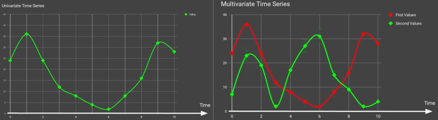
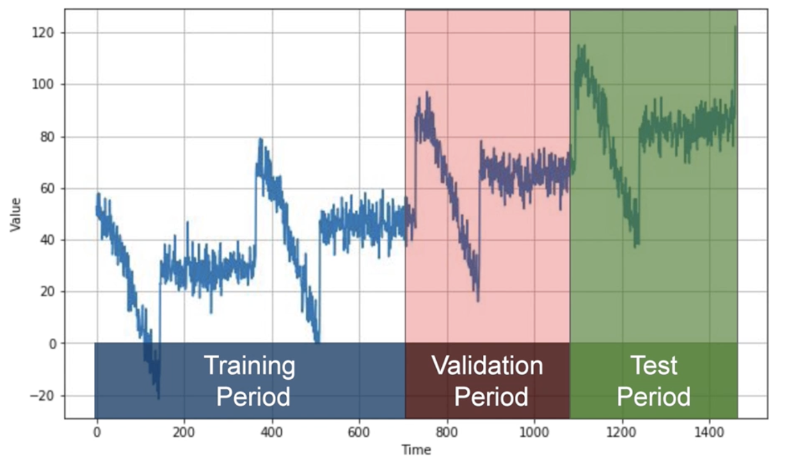
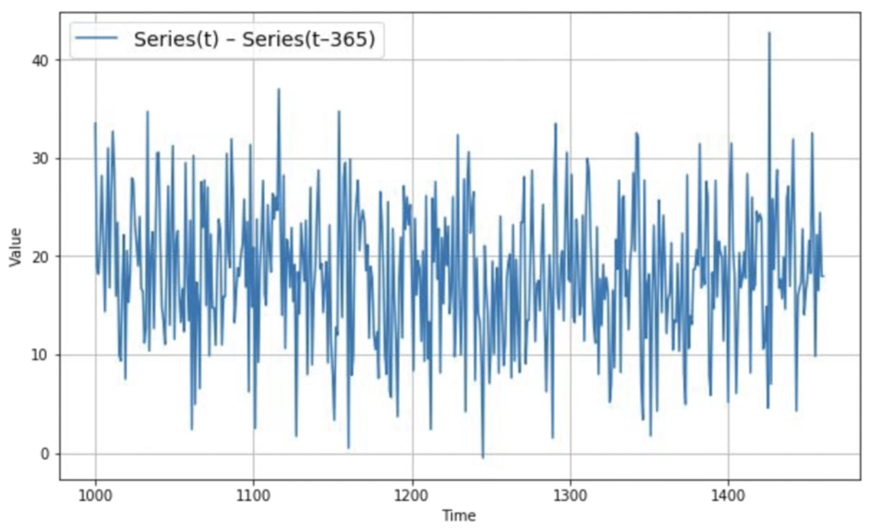
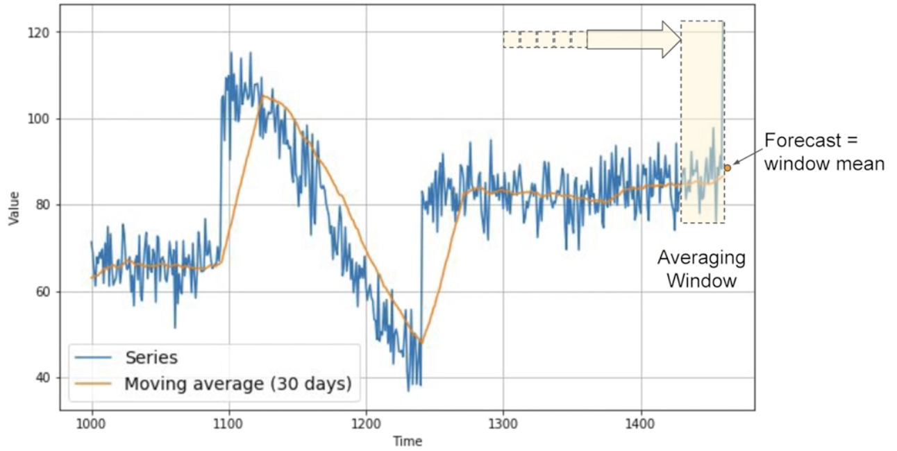

## 时间序列问题

- 定义：
	- 按照时间顺序排列的数据序列
	- 这些数据都是定期收集的
- 特点：
	- 时间依赖性
	- 顺序性
	- 周期性
	- 非平衡性
- 预测目标：
	- 预测未来 和 过去 (Imputed)
	- 预测时间点 和 预测区间
- 典型应用场景
	- 自然语言处理
		- 机器翻译
		- 文本生成
		- 命名实体识别
	- 时间序列预测
		- 股市预测
		- 天气预测
		- 销售预测
	- 异常检测
		- 设备故障检测
		- 欺诈检测
	- 时间序列分解 Decoposition
		- 趋势
		- 季节性
		- 残差
### 常见任务
- 单步预测 One-Step Forecast
- 多步预测 Multi-step Forecast
- 滚动预测 Rolling Forecast

### 关键概念
- 趋势 Trend
- 季节性  Seasonality：周期
- 噪声 Noise
- 滞后 Lag

### 预测方法
#### 简单模型 
- Naive Forecast
	- 原理：用最后一个值用为预测结果$(X_{t+1} = X_t)$
- Moving Average Forecast
	- 用滑动窗口的平均值作为预测 $X_{t+1} = \frac{1}{k} \sum_{t-k+1}^t$
	- 消除短期波动适合平稳序列
### 数据处理

#### 数据划分
- 固定划分 **Fixed Partitioning**
	- 按照固定起止点划分训练/测试集
	- 适用于预测固定未来时间段

- 滑动窗口划分 (Sliding Window Partitioning)
	- 用窗口滑动生成重叠的输入-输出对
	- 保留时间依赖性，适合模型训练
- 循环划分 (Circular Partitioning)

#### 平稳化处理
- 差分 Differencing
	- 定义：$X'_t = X_t - X_{t-d}$
	- 作用：
		- 消除趋势和季节性因素, 使序列平稳
		- 稳定方差
		- 提示序列的长期依存性
- 变换 Log/Box-Cox
- **移动平均（Moving Average）**
	- 原理：
		- 通过计算时间序列中固定窗口大小内的均值，
		- 来减少噪声干扰，从而让数据更加稳定，便于分析和建模

#### 缺失值处理
- 前向填充 Forward Fill
- 差值 Linear / Spline

#### 特征工程
- 滑动统计量 Rolling Mean /Std
- 滞后特征 Log Features
- 傅里叶变换 Fourier Features

### 经典算法
- 传统统计
	- ARIMA 
	- SARIMA
	- 指数平滑法 Exponential Smoothing
- 机器学习方法
	- 随机森林
	- SVR
	- KNN
	- 时间序列分解+回归
- 深度学习方法
	- RNN
	- LSTM
	- GRU
	- Transformer

#### ARIMA
- 定义
	- **Autoregressive Integrated Moving Average (ARIMA)**
	- 捕捉时间序列中的依赖关系
	- 预测未来数值
- 三个部分组成：
	- **AutoRegressive (AR)**：自回归部分
		- 表示时间序列当值依赖于其过去若干值
	- **Integrated (I)**：差分部分
		- 通过计算当前值与前一个值的差异来消除趋势或季节性影响 ，使非平稳时间序列变得平稳。
		- 时间序列的平稳性指的是 统计属性 (如均值和方差) 不随时间变化。
	- **Moving Average (MA)**：移动平均部分
		- 表示 误差项 (噪声) 加权平均的关系
		- 利用过去的误差来调整当前的预测。
	

### 序列模型
#### 隐马尔可夫模型
- 概率图模型 
- 三个基本问题
	- 评估
	- 解码
	- 学习
- 前向算法 / Baum-welch算法
#### RNN系统
- Vanilla RNN
	- 基础循环结构
	- 缺点：易梯度消失
- LSTM
	- 三要素：
		- 输入门
		- 遗忘门
		- 输出门
	- 特点：解决长程依赖
- Transformer
	- 自注意力机制
	- 位置编码
	- 变体： BERT，T5， GPT(自回归)

### 典型任务类型
- 单步预测 One-Step Forecast
- 多步预测 Multi-step Forecast
- 异常检测 Anomaly Detection
- 分类 Time Series Classification

### 最新发展方向
- 多变量时序建模
- 概率预测 
- 元学习
- 时空联合建模

## 参考资料
 <a href="https://www.coursera.org/learn/tensorflow-sequences-time-series-and-prediction/home/welcome" target="_parent" style="display: flex; align-items: center; height: 100%;">    Sequences, Time Series and Prediction</a>
 