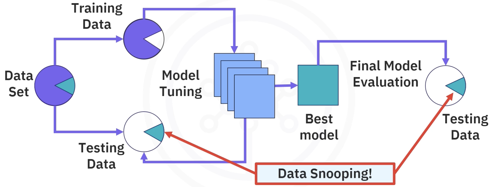
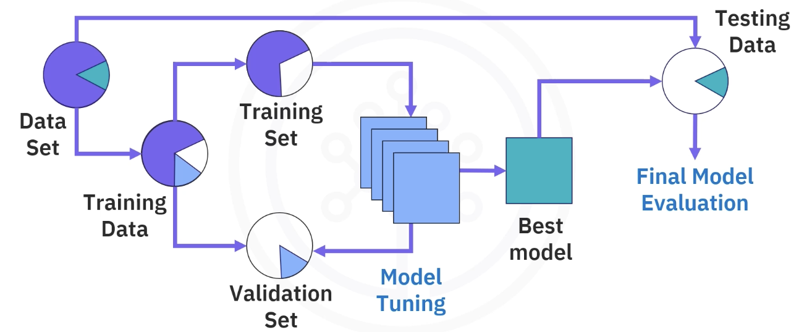
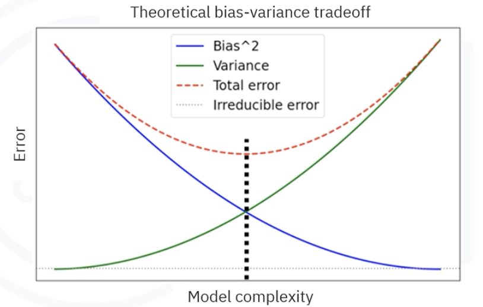
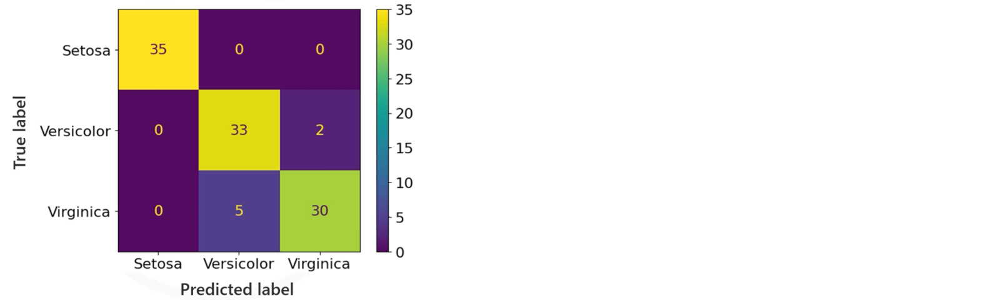
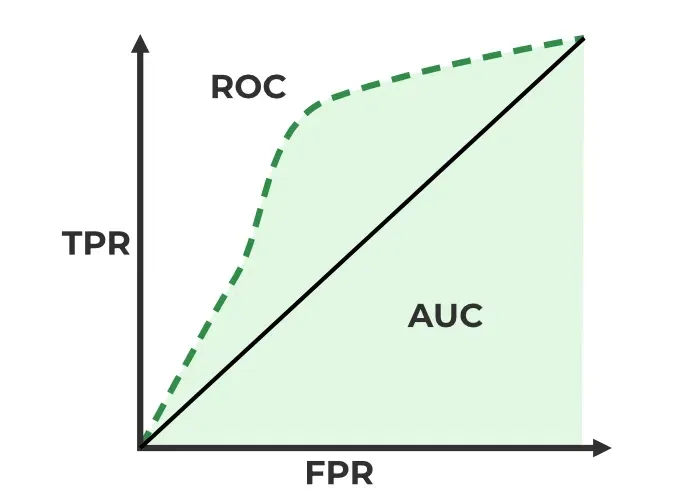
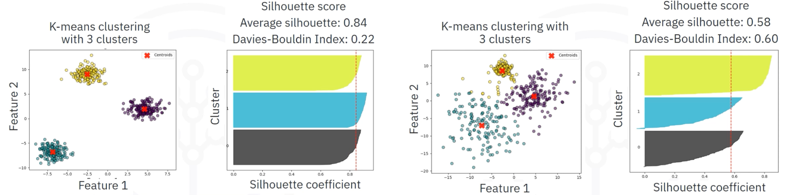
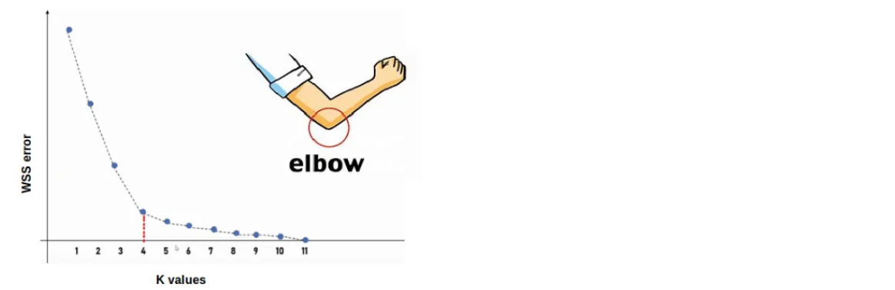
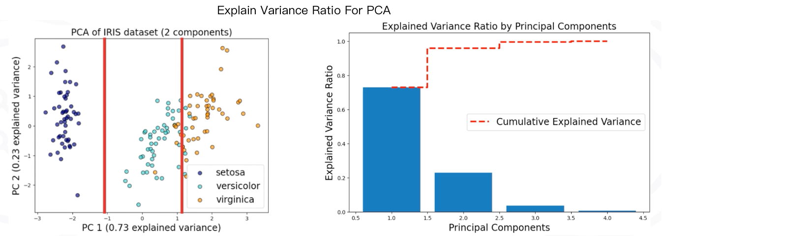

<h1 style=" text-align: center; font-size: 3em; font-family: 'Georgia', serif; color: #2c3e50; margin: 0.5em 0; padding: 10px 0; border-top: 4px solid #3498db; border-bottom: 4px solid #3498db; text-transform: uppercase; letter-spacing: 3px;"> 模型评估与调优</h1>

## 模型训练常见问题

#### 数据窥探 (Data Snooping)


- 定义：在模型开发过程中，不恰当地使用了测试集来设计模型和特征
- 风险：导致模型评估结果过于乐观、泛化能力被 高估
- 如何避免？
	- 将模型调优和最终估计解耦



#### 数据泄露 (Data Leakage)
- 定义： 
	- 在训练模型时，模型无意中获取了本应未知的信息。
- 影响：
	- 导致模型在训练集上表现得非常好，但在测试集上**无法泛化**
	- 造成**虚高**的性能表现。
- 造成的原因：
	- 信息在真实世界不可用
- 如何改善？
	- 从training set里面排除任何future data (test/validation/未来实际应用适用的数据)
	- train/test/validation 避免重叠和包含
	- 参加训练的特征在真实部署中有效
	- 慎重使用cross-validation, 特别是时间序列数据
	- 超参数调优
	- 避免使用全局衍生特征 (从整个数据集合计算)

#### 常见陷阱 （Pitfalls）
##### 🔹 特征重要性解释陷阱
	Feature Import Interpretation Pitfall
- 有哪些？
	- 特征冗余
		- 影响：**重要性被共享**（shared importances），从而**降低单个特征的影响力**
		- 解决办法：
			- 使用**相关性分析**或方差膨胀因子（**VIF**）检测冗余特征。
			- 通过主成分分析（**PCA**）或**聚类**合并相关特征。
	- 数据尺度敏感性 scale sensitivity
		- 未标准化的数据会**扭曲特征重要性的排名**，如数值范围大的特征（如“年薪100,000元”）可能被误认为比数值范围小的特征（如“年龄30岁”）
	- 避免误解读
	- 忽略特征相关性 
	- 不恰当的因果分析
		- 定义：将特征重要性（feature importance）误认为**因果关系**（causation），而实际上它仅表示**相关性**（correlation）
		- 解决办法
			- 结合领域知识或**因果推断方法**（如因果图、双重差分法）验证
			- 明确区分**预测模型**（关注相关性）和**因果模型**（需实验或准实验设计）
	
#####  **🔹 数据问题**
	包含不一致的标记、缺失值或错误的标签
#####  **🔹 过拟合与欠拟合**
- 过度拟合(Overfitting): 
	训练集表现极佳, 但测试集表现差（泛化能力弱）
- 欠拟合： 训练和测试误差均高
	  
#####  **🔹 评估误差**
- 没有正确划分训练集和测试集
- 使用了不恰当的评估指标
#####  **🔹 偏差与方差（Bias-Variance）**
- **Bias** 是模型太傻，**Variance** 是模型太敏感 (换点内容就不行了)
	
- <font style="background-color: #FFFACD; color: #333333; padding: 4px; border-radius: 8px; text-shadow: 1px 1px 2px rgba(0,0,0,0.1); font-weight: bold;">偏差 Bias</font>
	**偏差**是指模型预测的结果**和真实结果之间的误差**。
	- 偏差高 → 说明模型太简单，不够聪明，看不懂数据的复杂规律，预测不佳。
	- 偏差低 → 模型能够比较好地理解数据
  
- <font style="background-color: #FFFACD; color: #333333; padding: 4px; border-radius: 8px; text-shadow: 1px 1px 2px rgba(0,0,0,0.1); font-weight: bold;">方差 Variance</font>
	**方差**是指模型在不同训练数据上预测结果的**波动性**。
	- 方差高 → 说明模型太依赖训练数据了，容易**过拟合**，新数据上表现不佳。
	- 方差低 → 模型比较稳健，换数据也不会乱飘。
- <font style="background-color: #FFFACD; color: #333333; padding: 4px; border-radius: 8px; text-shadow: 1px 1px 2px rgba(0,0,0,0.1); font-weight: bold;">偏差-方差权衡 （Bias-Variance Tradeoff）</font>
	常常需要在 偏差和方差 之间找到一个平衡

##### **🔹外推失败（Extrapolation Error）**
- <font style="background-color: #FFFACD; color: #333333; padding: 4px; border-radius: 8px; text-shadow: 1px 1px 2px rgba(0,0,0,0.1); font-weight: bold;">内推 (Interpolation)</font>：在训练数据范围内做预测
- <font style="background-color: #FFFACD; color: #333333; padding: 4px; border-radius: 8px; text-shadow: 1px 1px 2px rgba(0,0,0,0.1); font-weight: bold;">外推 (Extrapolation)</font>: 在训练数据之外做预测

 模型在训练数据范围之外进行预测时失效。
 如，模型在`[0,10]`的数据区间训练，然后去预测大于100的测试数据。
- 🔹 指标矛盾
	- 不同评估指标结果不一致，如准确率高但召回率低。
- 🔹 跨域泛化差
	 - 在训练分布外的数据上表现骤降，如不同医院的医疗数据

---
## 模型评估 (Model Evaluation)

<font style="background-color:yellow; color:black">模型验证是为了调优参数， 它是训练过程的一个优化步骤；而模型评估是训练完成后的最终性能评测</font>。

为什么做模型评估？
- 确定模型预测结果的**准确度**
- 验证模型有效性
- 在训练过程中基于评估指标**优化预测**
- 发现改进方向
- 比较不同模型
模型评估三要素：
- 数据
- 指标
- 方法

---
### 可视化工具支持

#### 可视化工具
- Matplotlib
- Seaborn
- TensorBoard
#### 模型评估框架
- Scikit-learn
- Keras
- Metrics
#### 自动评估平台
- wandb
- MLFlow
- Comet

---
### 模型评估指标 (Evaluation Metrics)

- 功能：
	- 评估模型在未见数据上的表现，以了解模型泛化能力

### 📈 回归任务的评估指标

##### 📈  平均绝对误差 MAE
	Mean Absolute Error 
	
- 定义：预测值与真实值之间的 误差的绝对值的平均值
- 公式: $$\text{MAE} = \frac{1}{n} \sum_{i=1}^{n} \left| y_i - \hat{y}_i \right|$$
	- $y_i$ 第i个样本的真实值
	- $\hat{y_i}$ 模型预测值
- 特点：
	- 不敏感于极端值， 能最小化较大误差Error对模型评估结果的影响
- 缺点：
	- 绝对值不可导，因些，某些模型不能直接用MAE作为损失函数
	
##### 📈  $R^2$ 分数 
$R^2$ 分数也叫 **决定系数** (Coefficient of Determination)
$$R^2 = \frac{SSR}{SST} = 1 - \frac{SSE}{SST}$$   
- 目标：衡量模型**对数据变化的解释能力**有多强
- 值越接近于1越好。
	- **R² = 1** 表示完美拟合，模型可以完全解释数据。
	- **R² = 0** 表示模型跟简单用**均值**预测差不多，没什么用
	- **R² < 0**（负数）则是模型比直接用均值还烂

###### 1️⃣ <font style="background-color: #FFFACD; color: #333333; padding: 4px; border-radius: 8px; text-shadow: 1px 1px 2px rgba(0,0,0,0.1); font-weight: bold;">回归平方和 SSR</font>
Regression Sum of Squares
	
- 定义： 找到一条直线（或超平面），使得所有数据点的预测误差平方和最小。
- 目标：衡量模型成功解释掉的数据波动。(多少数据中规则能把握住)
- 公式：$$SSR = \sum_{i=1}^{n} (\hat{y}_i - \bar{y})^2$$
	- $\bar{y}$ 表示 使用平均值 去猜
	- $\hat{y_i}$ 表示模型预测值
	- $y_i$ 第i个样本的真实值
	
- 公式解释：
	- SSR=0， 说明：
		- 两者相同，用平均数瞎猜的效果差不多
		- 模型预测能力很弱，也就是没**解释掉任何变异性**。
	- SSR接近SST，说明：
		- 预测值 与 用平均值瞎猜 的差异大，说明预测有效
		- 模型几乎完美解释了数据的全部变异性
	
###### 2️⃣ <font style="background-color: #FFFACD; color: #333333; padding: 4px; border-radius: 8px; text-shadow: 1px 1px 2px rgba(0,0,0,0.1); font-weight: bold;">误差平方和 (SSE / RSS)</font>
Sum of Squares Errors ,或者叫 **RSS** (Residual Sum of Squares), 属于残差分析 (Residual Analysis)
$$SSE = \sum_{i=1}^{n} (y_i - \hat{y}_i)^2$$
- 目标：衡量模型没有解释掉的误差。 真实值和预测值之间还有多少误差
	
###### 3️⃣ <font style="background-color: #FFFACD; color: #333333; padding: 4px; border-radius: 8px; text-shadow: 1px 1px 2px rgba(0,0,0,0.1); font-weight: bold;">总平方和 SST</font>
Total Sum of Squares $$SST = \sum_{i=1}^{n} (y_i - \bar{y})^2 = SSR + SSE$$
- 目标： 衡量真实数据本身的**总波动**。
- 优点：
	- 和模型无关，纯数据特性
- Variance（方差）$\frac{SST}{n-1}$
##### 📈 均方误差 MSE
Mean Squared Error$$\text{MSE} = \frac{1}{n} \sum_{i=1}^{n}(y_i - \hat{y}_i)^2 = \frac{\text{RSS}}{n}$$
- 目标：衡量 预测值 与 真实值 误差平方和 取平均数。
- 值越低，说明预测误差越小。MSE=0表示能完全正确预测。
- 优点：
	- 数学性质好
- 缺点：
	- 对Outliers非常敏感
- 应用：
	- 回归模型常用损失函数
	
##### 📈  均方根误差 RMSE
它是MSE的平方根。$$RMSE = \sqrt{MSE}$$

---

### 📊 分类任务的评估指标
##### 📊 混淆矩阵 Confusion Matrix

- 定义：用表格把模型预测对的，错的全列出来。

|           | **预测是正类 (Positive)** | **预测是负类 (Negative)** |
| --------- | -------------------- | -------------------- |
| **真实是正类** | True Positive (TP)   | False Negative (FN)  |
| **真实是负类** | False Positive (FP)  | True Negative (TN)   |
 - 统计 TP，FN，FP， TN的数量
	 - T/F：是否预测正确 (预测对了吗)
	 - P/N:  预测的结果是什么 (不分对错)
 - 然后，就可以计算更多指标：
	 - 准确率 Accuracy
	 - 精准率 Precision
	 - 召回率 Recall
	 - F1-Score
 - 特点：
	 - 混淆矩阵 总是一个 **n × n 的方阵**，其中 **n 是类别（class）的数量**。
	 
- sk-learn 查看分类评估报告： `classification_report(y_test, y_pred)`
- `confusion_matrix(y_test, y_pred)`
##### 📊 准确率 (Accuracy)

- 就是正确预测样本的比率
- 公式：$$Accuracy = \frac{TP+TN}{n}$$
- 什么时候用？：
	- 分类类别比较均匀，比如猫狗识别，各50%
	- 简单初步判断模型表现。

##### 📊 精准率 Precision

- 定义：模型预测为正的样本中，有多少是预测正确的
- 公式：$$\text{Precision} = \frac{TP}{TP + FP}$$
##### 📊 召回率 Recall

- 定义：所有真实的正样本中，找回了多少？
- 公式：$$Recall=\frac{TP}{TP+FN}$$
##### 📊 F1-Score

- 定义：F1是Precision和Recall的综合衡量指标
- 公式：$$F1 = 2 * \frac{Precision * Recall}{Precision+Recall}$$
- 适用：
	- FP高

##### 📊 ROC - AUC Score

**ROC-AUC score** = <font style="background-color:pink; color:black"><b>测量分类器区分正负样本能力的指标</b></font>
**ROC是曲线，AUC是面积**。<font style="background-color:yellow; color:black">分数越高，模型越强</font>。


🍏 **ROC** 全名是：**Receiver Operating Characteristic**（接收者操作特征曲线）
反映分类器在<font style="background-color:pink; color:black">各种不同阈值下的表现</font>，比如
- 阈值很松 → 什么都分类为正例，TPR高但FPR也高
    
- 阈值很紧 → 什么都分类为负例，TPR低但FPR也低
    
- 把所有可能的阈值都走一遍 → 就画出一条曲线

🍏 **AUC** 全名是：**Area Under the Curve**（曲线下的面积）


##### 📊 Log-Loss /  Cross-Entropy 损失


---

### 🔍 聚类任务的评估指标

<font style="background-color: #FFFACD; color: #333333; padding: 4px; border-radius: 8px; text-shadow: 1px 1px 2px rgba(0,0,0,0.1); font-weight: bold;">启发式方法  (Heuristics)</font>
- 定义：基于经验 或 直觉的规则，用来在面对复杂、难以精确求解的问题时，找到一个够好的解决方案，不保证最优解。
- 特点：
	- 不是严格的数学推导或理论证明
	- 未必最优，但通常表现足够好
- 🌰 ：
	- 超参数设置使用经验值，而不是严格推导出来的
	- 特征工程时，选择标准化数据来加速收敛
	- 小数据优先试试SVM，大数据优先试试随机森林

聚类不像分类那样有标准答案，评估聚类的好坏，得靠各种**启发式**策略：

| **名字**                                       | **解释**                                                            |
| -------------------------------------------- | ----------------------------------------------------------------- |
| **Internal evaluation metrics**              | 内部指标，只用输入数据本身来评估，比如轮廓系数（Silhouette Score）、Davies-Bouldin Index。   |
| **External evaluation metrics**              | 外部指标，用已知的真实标签（如果有的话）来比较，比如Rand Index、Adjusted Mutual Information。 |
| **Generalizability or stability evaluation** | 泛化性或稳定性评估，比如在不同采样、不同初始化条件下聚类是否稳定。                                 |
| **Dimensionality reduction techniques**      | 用降维（PCA, t-SNE, UMAP）可视化聚类结果，看聚类是否分得清晰、合理。                        |
| **Cluster-assisted learning**                | 用聚类辅助学习，比如半监督学习中用聚类结果帮助分类器优化。                                     |
| **Domain expertise**                         | 专家知识，比如领域专家肉眼审查聚类结果是否符合业务逻辑。                                      |

##### 🔍 轮廓系数 (Silhouette Score)

- 目标：衡量一个点在自己簇内的**紧密度** VS 距离其他簇的**远离度**
	

- 取值范围： $\text{WCSS} \in [0, -1]$
##### 🔍 DBI (Davies-Bouldin Index)
- 目标：聚类的 类内**相似度** 和 类间**差异度**
- 取值范围： $\text{WCSS} \in [0, +\infty)$
##### 🔍 CHI (**Calinski-Harabasz Index**)
- 目标： 类间方差 / 类内方差，比值越大越好
- 取值范围： $\text{WCSS} \in [0, +\infty)$

##### 🔍  **Inertia**
- 定义：评估每个样本点 所属簇中心的距离的平方和。
- 目标：衡量「簇内紧凑程度」
- 取值范围： $\text{WCSS} \in [0, +\infty)$
- 用途：
	- 肘部方法：
		- 观察Inertia随着K增加的变化曲线
		- 找到拐点：k增大时，Inertia总是下降，需要找到「下降明显变慢的位置」也就是肘部
		- 在拐点处停止增加K，k就是较合理的簇数
	
##### 🔍  簇内平方和 **WCSS**
> **Within-Cluster Sum of Squares**
- 目标：衡量同一个簇内部的数据点 彼此有多接近
- 取值范围： $\text{WCSS} \in [0, +\infty)$
##### 🔍 Dunn Index

- 目标：最小簇间距 / 最大簇间距， 越大越好
- 取值范围： $\text{WCSS} \in [0, +\infty)$
##### 🔍 NMI (Normalized mutual Information)
	
- 一种外部评估指标，属于监督式评估。用来比较：
	- 聚类的分组
	- 聚类的标签
- 衡量：聚类与真实分类标签的<font style="background-color:yellow; color:black">一致性程序</font>
- 核心思路：互信息 MI 衡量：聚类结果与真实标签 有多大关联
- 取值范围：`[0,1]`
	- NMI = 1, 完美匹配
	- NMI = 0 完全无关
- 优点：
	- 可解释性强
	- 聚类数目不同也能比较
- 缺点：
	- 需要真实标签，不适合无监督评估
	- 类目特别多或特别少，会导致值偏高或偏低
	
##### 🔍 **Adjusted** rand index (ARI)


##### 🔍 **福克斯-马洛斯指数** (FMI)
	
- **Fowlkes-Mallows Index**, 是一种外部聚类评估指标，用来比较：
	- 聚类结果 vs 真实标签 (ground truth)
- 🎯 目标：衡量聚类结果有没有正确把同一样本放一起
- 核心思路：关注 成对 的样本关系
	- **TP（True Positive）**：同一个簇的样本对，真实也在同一类别。
	- **FP（False Positive）**：同一个簇的样本对，但真实不在同一类别。
	- **FN（False Negative）**：不同簇的样本对，但真实是同一类别。
- 公式：$FMI = \sqrt{ \frac{TP}{TP + FP} \times \frac{TP}{TP + FN} }$
	- FMI 就是Precision和Recall的几何平均值
- 取值 `[0,1]`
	- **1** ：聚类结果完美（每对同类样本都在同一个簇里）
	- **0** ：聚类结果和真实标签毫无关系
- 👍 优点：
	- 简单直观
	- 可用于不同聚类数目的模型比较
	- 样本量大时计算稳定
- 👎 缺点：
	- 需要真实标签
	- 不考虑簇大小，只关注样本的正确性

---

### 📉 降维任务的评估指标


##### 📉 **解释方差** (Explained Variance)

- 定义：保留了多少数据的变异性
- 目标：解释度越高越好
- 适用方法：PCA、LDA

##### 📉 重构误差 (Reconstruction Error)

- 定义：原数据和降维后恢复的数据差异
- 目标：误差越小越好
- 适用方法： PCA、Autoencoder

##### 📉 可信度 (Trustworthness)

- 定义：降维后局部邻居关系是否保持
- 适用方法：t-SNE、UMAP

##### 📉 连续性 (Continuity)

- 定义：原始空间邻居在低维空间是否还近
- 适用方法：t-SNE、UMAP

##### 📉 MSE
[#📈 均方误差 MSE](.md#📈 均方误差 MSE)

### 多标签分类评估 Marco/Micro Averaging
### 序列/时间序列评估 Rolling Forecast

#### 点预测评估
- MAE
- RMSE
- MAPE
#### 区间预测评估
- Coverage Probability
- Pinball Loss
### 图像/生成模型评估
- FID
- IS
- PSNR
- SSIM
---
## 模型验证方法 (Model Validation)

- 目的：
	- 在模型训练过程中，定期评估模型性能
	- 优化和调节模型的超参数，
	- 避免过度拟合。
-  功能：使用验证集，观察模型在不同<font style="background-color: #FFFACD; color: #333333; padding: 4px; border-radius: 8px; text-shadow: 1px 1px 2px rgba(0,0,0,0.1); font-weight: bold;">超参数设置</font>下的表现，选择最优参数。
	- 避免过拟合
	- 帮助决定模型架构
- ⚠️：
	- 模型验证发生在 机器学习生命周期-模型训练阶段
#### 训练集/测试集划分 
train-test split technique
	
- 常见划分比例
	- 70% 训练 / 30% 测试
	- 80% 训练 / 20% 测试
- 用训练集 + 验证集 预测，如果训练集评估良好，而验证集预测结果评估很糟糕，那说明overfitting.
- 用于快速评估，不适合数据量小的情况

#### 留出法 (Hold-Out)
- 类似 Train/Test Splt，但**保留一部分作为验证集**
- 训练集 → 模型训练
- 验证集 → 用于调参（非测试）
- 测试集 → 最终评估性能（只使用一次）
#### 交叉验证（cross-validation）

- 目标：提高模型对**新数据的泛化能力**，防止过拟合。
- 核心思想：把训练数据切成若干 训练集和验证集，反复多次训练和验证，然后把每次评估结果**评估**。
- 交叉验证后，如何部署？
	- 评估多个模型/**参数组合**
	- 选出平均性能最优的组合
	- 用所有数据重新训练一个模型
	- 用最后训练的这个部署上线
##### 🔹 K 折交叉验证  K-Fold
- 工作流程：
	1. 将数据集分成K份
	2. 进行K次训练
		- 每次用其中K-1份训练，1份验证
		- 每一轮都轮流当验证集一次
	3. 得到5个结果，计算平均值，作为模型表现。
- 优点：
	- 增加模型训练和测试的数据量
	- 改变测试集和

##### 🔹 留一法 Leave-One-Out
- 每一个样本轮流当验证集，其余所有样本作训练集
- 优点：
	- 最大化训练数据使用
- 缺点：
	- 计算成本高：需要训练n次模型
	- 容易对异常值敏感
	- 仅适用小数据集

##### 🔹 分层采样 Stratified Sampling
- 按**标签类别比例** 对数据分层抽样， 使得每一折中各类别的比例与原始数据一致。
- 通常用于分类任务
- 优点：
	- 结果更稳定、代表性更强，特别是在样本不平衡时
	- 分类任务中的推荐做法

#### 早停 Early Stopping
- 早停的目的：
	- 防止模型在训练过程中出现 过拟合 
	- 并确保在模型的验证集上达到最佳性能。
- 实现原理：
	- 通过监控模型在验证集上的表现，通常是val_loss或val_accurate
		- 依赖**验证集上的性能指标**来做出决策
```python
class myCallback(tf.keras.callbacks.Callback):  
    def on_epoch_end(self, epoch, logs={}):  
        if(logs.get('loss') < 0.4 ):
            self.model.stop_training = True  
callbacks = myCallback()
# 训练模型时加入回调
model.fit(training_images, training_labels, epochs=5, callbacks=[callbacks])
```

#### 学习曲线分析

####  模型泛化能力对比
 评估的是模型在未见过的数据上的表现，通常通过交叉验证（cross-validation）等方法来测试。


#### 自助法 Bootstrapping


#### 统计显著性检验
- T检验
- McNemar检验
- Wilcoxon符号秩检验


#### 时间序列验证 （Time Series Input）


---

## 模型解释

#### SHAP值
#### LIME

#### 特征重要性


---
## 模型调优

> 传统机器学习模型复杂度一般不高，整体上调优的工作量相对较少。 
> 这里只做模型调优知识架构的整理，具体的调优方法策略放在每3章节深度学习-模型调优
> [3.x 模型优化](3.x%20%E6%A8%A1%E5%9E%8B%E4%BC%98%E5%8C%96)

```text
模型调优知识框架
├── 1. 数据层面优化
│   ├── 数据质量
│   │   ├── 异常值处理（IQR/Z-score）
│   │   ├── 缺失值填充（均值/中位数/预测模型）
│   ├── 特征工程
│   │   ├── 特征选择（方差阈值/卡方检验/RFE）
│   │   ├── 特征变换（标准化/归一化/对数变换）
│   │   ├── 特征构造（交叉特征/多项式特征）
│   ├── 数据平衡
│   │   ├── 过采样（SMOTE）
│   │   ├── 欠采样（Tomek links）
│   │   ├── 类别权重调整

├── 2. 模型层面优化
│   ├── 模型选择
│   │   ├── 问题匹配（线性问题/非线性问题）
│   │   ├── 复杂度权衡（偏差-方差权衡）
│   ├── 超参数调优
│   │   ├── 网格搜索（GridSearchCV）
│   │   ├── 随机搜索（RandomizedSearchCV）
│   │   ├── 贝叶斯优化（Hyperopt）
│   ├── 正则化技术
│   │   ├── L1/L2正则化
│   │   ├── Dropout（神经网络）
│   ├── 集成方法
│   │   ├── Bagging（随机森林）
│   │   ├── Boosting（XGBoost/LightGBM）
│   │   ├── Stacking

├── 3. 训练过程优化
│   ├── 学习率策略
│   │   ├── 学习率衰减（Step/Exponential）
│   │   ├── 自适应优化器（Adam/RMSprop）
│   ├── 早停机制（Early Stopping）
│   ├── 批量大小调整
│   │   ├── 小批量梯度下降
│   ├── 交叉验证
│   │   ├── K折交叉验证
│   │   ├── 分层交叉验证（分类问题）

├── 4. 评估与迭代
│   ├── 评估指标选择
│   │   ├── 分类（准确率/召回率/F1/AUC-ROC）
│   │   ├── 回归（MSE/R²/MAE）
│   ├── 误差分析
│   │   ├── 混淆矩阵分析
│   │   ├── 残差分析（回归问题）
│   ├── 模型解释
│   │   ├── SHAP值
│   │   ├── LIME
│   │   ├── 特征重要性

├── 5. 高级优化技术
│   ├── 自动化机器学习（AutoML）
│   ├── 神经架构搜索（NAS）
│   ├── 迁移学习
│   │   ├── 预训练模型微调
│   ├── 半监督学习
│   ├── 对抗训练

└── 6. 资源优化
    ├── 计算加速
    │   ├── GPU/TPU利用
    │   ├── 混合精度训练
    ├── 模型压缩
    │   ├── 量化（8-bit/4-bit）
    │   ├── 知识蒸馏
    │   ├── 剪枝

```

