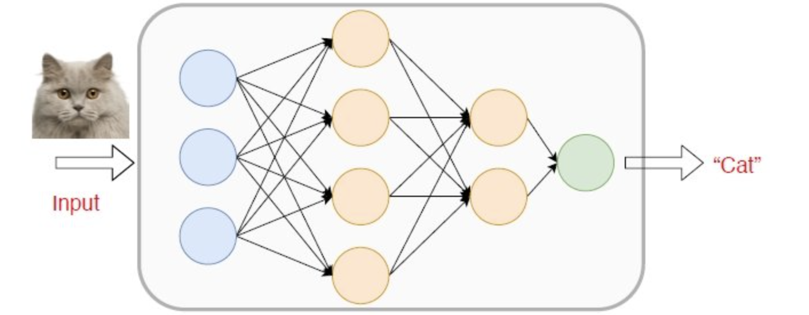
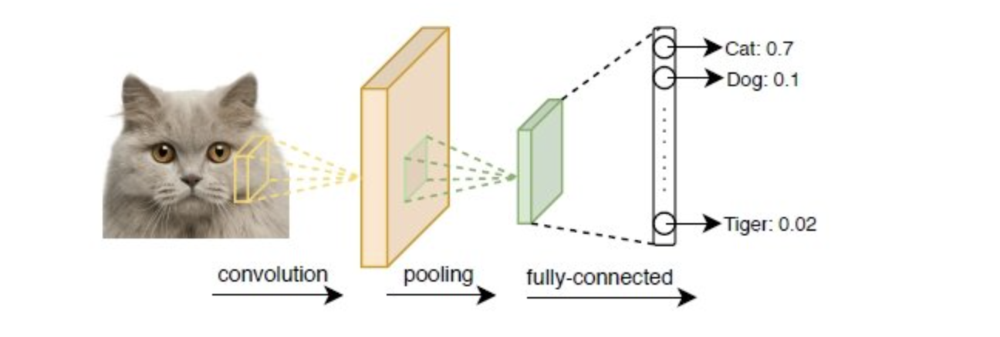
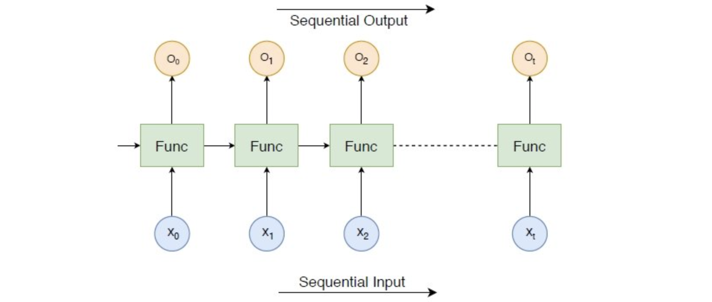
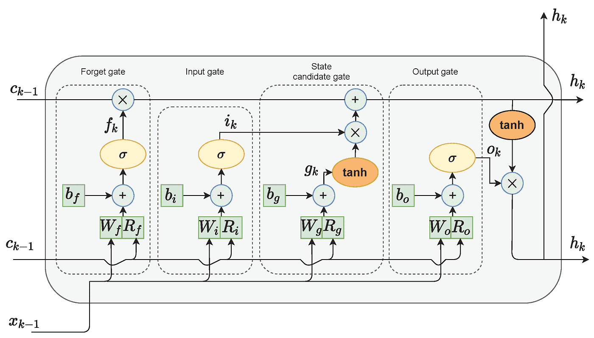
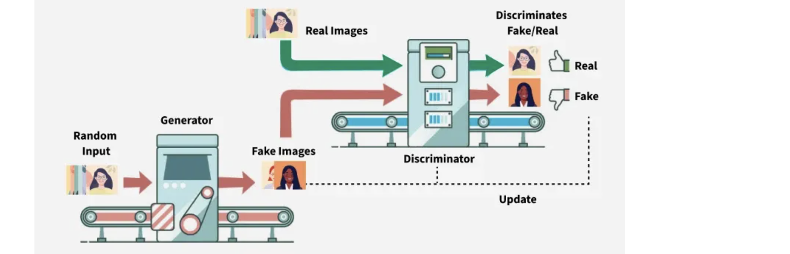

<h1 style=" text-align: center; font-size: 3em; font-family: 'Georgia', serif; color: #2c3e50; margin: 0.5em 0; padding: 10px 0; border-top: 4px solid #3498db; border-bottom: 4px solid #3498db; text-transform: uppercase; letter-spacing: 3px;">深度学习概述</h1>

## 主流深度学习库

### Keras
- 作用
	- 构建DL模型的高阶API
- 特点
	- 最简单的API，快速开发的首选库
		- 少量代码就能构建复杂深度学习网络
		- 不适合对节点和层进行  **细粒度控制** 
	- 可在底层库如tf上运行
		- ==必须先安装tf==
	- 谷歌支持
- Keras提供了哪些API用于定义和构建模型？
    - Sequential API
    - Functional API [[Tensorflow 和 Keras 入门实战#Functional API in Keras|✍️Functional API示例]]
        - 主要特性
            - 灵活性（Flexibility）：支持复杂模型架构设计
            - 可调试性（Debugging）：清晰的模型结构便于调试和可视化
            - 可复用性（Reusability）：支持自定义层和操作的重复使用
	- Subclassing API
		- 原理：
			- 允许继承Keras的基础类tf.keras.Model来创建自定义模型
		- 优点：
			- 灵活性：完全控制模型前向传播过程
			- 支持自定义行为： 
				- 为构建复杂网络结构（如 残差连接、多输入/多输出）或者涉及多个前向传播路径 提供了灵活性
			- 支持动态计算： call()方法可以在前向传播中自定义数据流动。
		- 缺点
			- 代码量多
			- 难以调试
			- 复杂性较高
### TensorFlow  
- **简介**  
	- TensorFlow是由Google Brain团队开发的开源机器学习框架，广泛应用于深度学习模型的构建与训练。  
	- **应用现状与社区生态**  
	    - 目前是深度学习领域主流的框架之一，在学术研究和工业应用中均被广泛采用  
	    - 拥有活跃的开发者社区，提供完善的文档体系、教程资源和开源项目支持  
	- **发展历史与工业应用**  
	    - 由Google于2015年正式开源发布，其核心算法基于Google Brain团队多年的研究成果  
	    - 作为Google内部机器学习研究及生产系统的核心框架，支持大规模分布式训练与部署  
- **核心特性**  
	- 即时执行模式（Eager Execution）
	- 直观的高级API接口
	- 多平台与多设备支持
	- 优异的可扩展性与计算性能
	- 丰富的生态
		- TensorFlow Lite
			- 在移动和前入式设备上部署机器学习模型
			- 低延迟高性能
		- TensorFlow.js
			- 在JS中部署机器学习模型
		- TensorFlow Extended (TFX)
		- TensorFlow Hub
			- 可复用机器学习模块仓库
		- TensorBoard
			- TF 可视化工具集
	
### PyTorch
- 基于 Lua 的 Torch 框架 
- 支持运行在gpu的机器学习算法
- 快速且原生流畅
- 2016年发布，成为tf的重要竞品
- Facebook (Meta) 支持和使用
- PyTorch 和 tf 有陡峭的学习曲线
## 深度模型架构设计
### 自定义模型层 Custom Layers
[[Tensorflow 和 Keras 入门实战#自定义模型层]]
- 定义
	- 自行设计并实现的神经网络层结构，而非使用框架提供的标准层
	- 这些层通过继承基础层类并重写关键方法来实现特定功能
- 为什么需要自定义？
	- 解决特定领域问题：标准层可能无法满足某些特殊任务的需求（如图像处理中的特殊卷积操作）
	- 实现创新架构：研究人员需要自定义层来实现新型神经网络结构
	- 性能优化：针对特定硬件或场景进行定制化优化
	- 实验需求：验证新提出的算法或模型结构时需要专门设计的层
	
## 深度神经网络模型分类
[深度学习模型分类](../3-DeepLearning/%E6%B7%B1%E5%BA%A6%E5%AD%A6%E4%B9%A0%E6%A8%A1%E5%9E%8B%E5%88%86%E7%B1%BB.canvas)

![[dl-models-classification-1.png]]

### 前馈神经网络 (FNN)

- 定义:（Feedforward Neural Network, FNN）
	> 信息单向流动（输入层→隐藏层→输出层）, 无反馈连接
- 特点：
	- 全连接结构
	- 没有循环，信息单向流动
	- 适合处理固定大小的输入数据
	- 适合结构化数据
- 实现：
	- 多层感知机 MLP
- 关键点：
	- 激活函数，如ReLU/Sigmoid
	- 反向传播
	- 梯度消失问题
- 缺点：
	- 不适合处理序列数据，或具有长期依赖关系的数据
	- 无法处理空间数据和时间序列
	- 参数量大，计算成本高
- 应用：
	- 图像分类
	- 回归任务
	- 结构化数据预测

### 卷积神经网络 (CNN)

[3.3 卷积神经网络 CNN](3.3%20%E5%8D%B7%E7%A7%AF%E7%A5%9E%E7%BB%8F%E7%BD%91%E7%BB%9C%20CNN)
- 特点：
	- 局部连接和权值共享，减少参数量
	- 自动提取空间特征
	- 具有平移不变性
	- 适合处理图像等高维数据

### 循环神经网络 (RNN)

[3.4 循环神经网络 RNN](3.4%20%E5%BE%AA%E7%8E%AF%E7%A5%9E%E7%BB%8F%E7%BD%91%E7%BB%9C%20RNN)

#### 长短期记忆网络 (LSTM)

[3.4 循环神经网络 RNN#长短期记忆网络 LSTM](3.4%20%E5%BE%AA%E7%8E%AF%E7%A5%9E%E7%BB%8F%E7%BD%91%E7%BB%9C%20RNN#长短期记忆网络 LSTM)

### 生成对抗网络 (GANs)

- 定义：（Generative Adversarial Networks, GANs）
	- 有两部分组成
		- 生成器 Generator
		- 判别器 Discriminator
	- 生成器生成假数据，判别器区分真假数据
	- 二者通过对抗训练提升模型能力
- 特点：
	- 生成器学习生成样本，判别器学习判断样本真假
	- 可以生成相对真实的高质量图像、视频
	- 无需显式定义数据分布
- 缺点：
	- 训练过程不稳定，容易出现模式崩溃(Model Collapse)问题
	- 训练过程需要精心调参
	- 评估生成质量较困难
- 应用场景：
	- 图像生成
	- 风格转换
	- 图像修复
	- 虚拟现实

### Transformer
[[3.5 Attention Models]]
![[transformer-simple.png]]

### 自编码器 (Autoencoders, AE)
[3.6 Autoencoder, AE](3.6%20Autoencoder%2C%20AE)

### 图神经网络 (GNN)
- 定义：
	- 处理图结构数据
	- 通过信息传播机制处理图节点之间的关系
- 特点：
	- 节点之间通过边进行信息交换
	- 能处理非欧几里德结构的数据，适用于复杂关系的学习
	- 具有归纳学习能力
- 缺点：
	- 计算复杂度较高
	- 图的结构可能需要额外的预处理
	- 对大规模图处理效率较低
- 应用场景：
	- 社交网络分析
	- 分子结构预测
	- 推荐系统
	- 交通预测

### 深度强化学习模型 (Deep RL)
- 定义：
	- 强化学习是使代理在环境中通过试错学习最优策略的算法
	- 而深度强化学习，则结合深度学习方法，利用深度神经网络作为RL的函数逼近器
- 特点：
	- 基于奖励机制进行学习
	- 适用性强，能够在没有明确标签的情况下学习，适应复杂环境
	- 可以处理高维状态空间
- 缺点：
	- 训练过程不稳定
	- 样本效率低
	- 超参数敏感
- 应用场景：
	- 游戏AI
	- 机器人控制
	- 自动驾驶
	- 资源调度
	
### 多模态模型 (Multimodal Models)
- 定义：
	- 能够同时处理和融合多种类型数据
		- 如文本、图像、视频、声音
- 特点：
	- 结合不同模态的数据进行联合学习，提升模型泛化能力
	- 具有跨模态学习和推理的能力
	- 能够处理复杂的多模态任务
- 缺点：
	- 需要大量的多模态数据和复杂的预处理
	- 网络结构复杂，训练难度大
	- 计算资源需求高
- 应用场景：
	- 图文检索
	- 视觉问答
	- 视频分析
	- 多模态生成

### 预训练模型 Pre-Trained Models
- 定义
	- 在一个大规模、特定任务的数据集上已经训练好的机器学习模型
- 目标：
	- 学习能通用，能够捕捉到数据中基本模式和特征的知识表示 或 特征提取能力
- 用途
	- 在新任务上[迁移学习](3.x%20%E6%A8%A1%E5%9E%8B%E4%BC%98%E5%8C%96#迁移学习)
	- 用于 **特征提取**
- 🧠
	- 预训练模型就像是已经学会了“识字”、“理解基本语法”的“学徒”，然后再去学习具体的“写作”、“翻译”、“阅读理解”等具体技能（目标任务）
- 关键特性
	- 学习通用知识
	- 节省时间和计算资源
	- 提升性能
	- 可解释性和可复用性好
- 用于特征提取时的优势
	- 不需要额外训练
	- 已学习特征的有效利用
	- 非常适合有限资源 
		- 计算资源
		- 训练数据
- 用于模型调优时
	- 性能提升
	- 可调节预训练权重来匹配数据
	- 迁移学习
	- 可解冻 模型基础的顶层 以进行特征提取
- 常见预训练模型
	- BERT： 在海量文本数据上预训练，学习文本的深层语义表示
	- GPT： 从单向语言模型发展而来，擅长生成文本
	- T5：将所有NLP任务都视为文本到文本的转换
	- VGG/RestNet/Inception/MobileNet/EfficientNet
		- 计算机视觉预训练模型
		- 都是在大规模图像分类数据集(如ImageNet)上训练，用于特征提取。