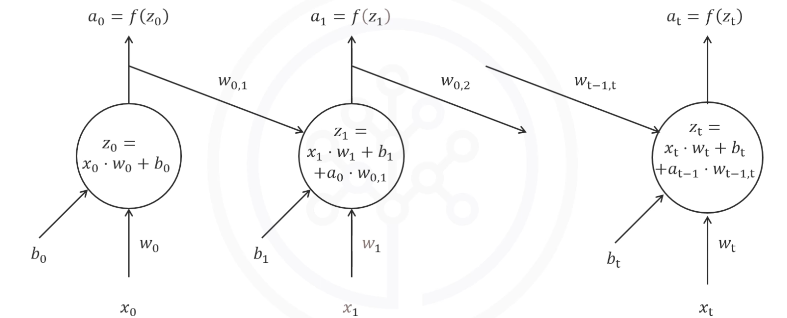
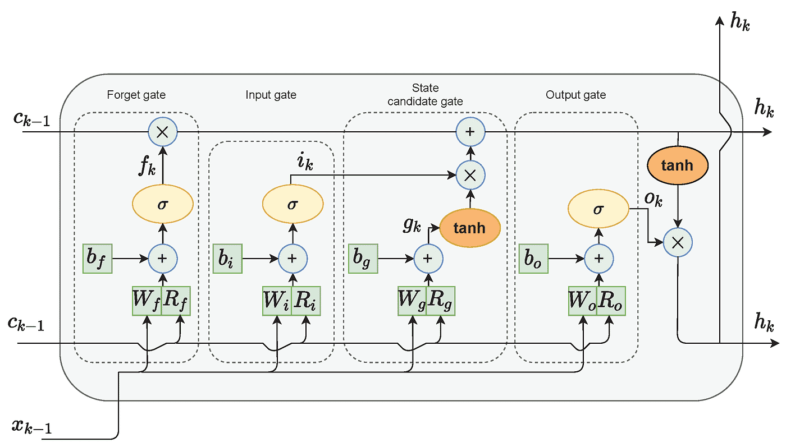

<h1 style=" text-align: center; font-size: 3em; font-family: 'Georgia', serif; color: #2c3e50; margin: 0.5em 0; padding: 10px 0; border-top: 4px solid #3498db; border-bottom: 4px solid #3498db; text-transform: uppercase; letter-spacing: 3px;">RNN</h1>

## RNN

- 定义：（Recurrent Neural Network, RNN）
	- 处理序列数据的神经网络
		- 聊天记录
		- 文本
		- 时间序列， 如股票、天气
		- 音频
- 特点：
	- **记忆能力**：具有反馈连接，能够通过循环机制保留历史信息
	- 网络节点间存在时间依赖
	- 可以处理变长的输入和输出
- 缺点：
	- **容易出现梯度消失或爆炸**的问题
	- 难以捕捉**长期依赖**
	- 计算效率低，训练过程较慢
- 应用场景：
	- 自然语言处理
	- 语音识别
	- 时间序列预测
- 入门典例：imdb_reviews
	- [Tensorflow 和 Keras 入门实战#IMDB_Reviews 影评情感分析](../3-DeepLearning/Tensorflow%20%E5%92%8C%20Keras%20%E5%85%A5%E9%97%A8%E5%AE%9E%E6%88%98.md#IMDB_Reviews 影评情感分析)

### 工作原理 🔧 
- RNN 通过**循环连接 (Recurrent Connection)** 来实现记忆
	- 一部分输出会反馈到输入层， 用于下一次计算
- 在每一个时间步，RNN都会进行以下操作：
	1. 输入数据：
		- $x_t$  每个时间步t的输入数据
		- $w_{t-1,t}$  RNN 中连接前后两个时间步的权重。 如：$w_{0,1}$
			- 它是**训练过程** 中学习得到的一个参数
			- 通过 **梯度下降** 或其他优化算法在 **训练阶段** 被逐渐调整
		- $a_{t-1}$ 上一时间步的激活值（隐藏状态）
	2. 加权求和
		- 公式：$$z_t = x_t \cdot w_t + b_t + a_{t-1} \cdot w_{t-1,t}$$
	3. 激活, 得到当前时间步的**隐藏输出**$a_t$
		- 公式：$a_t = f(z_t)$
		- 激活函数通常是ReLU, tanh等
	4. 将隐藏状态(hidden state)输出作为下一个时间步的输入
	
### 设计原则
- 共享权重
	- 每个时间步使用相同的权重进行计算
	- 减少模型复杂度，提高泛化能力
- 递归结构
	- 通过隐藏状态的递归传递捕捉时序信息
	- 能够有效处理序列数据
- 时间依赖性
	- 每个时间步的隐状态依赖于当前输入和上一个时间步的隐藏状态
	- 这使得RNN能够捕捉长时间依赖
- 反向传播通过时间 BPTT
	- 通过反向传播算法计算梯度并优化网络参数
	
## LSTM
> 长短期记忆网络 

- 定义：（Long Short-Term Memory, LSTM）
	- 特殊类型的RNN
	- 解决了RNN在处理长期依赖问题上的梯度消失问题
- 特点：
	- 通过遗忘门、输入门、输出门来控制信息流
	- 适合学习长时间依赖关系的数据
	- 能够选择性记忆和遗忘信息
- 缺点：
	- 计算量大
	- 训练时间长
	- 模型较为复杂
- 应用场景：
	- 语音识别
	- 机器翻译
	- 文本生成
	- 图片生成
	- 时间序列预测

## GRU

## 参考资料

- [Sequences, Time Series and Prediction by Laurence](https://www.coursera.org/learn/tensorflow-sequences-time-series-and-prediction)
- [Natural Language Processing with Sequence Models](https://www.coursera.org/programs/sobma/learn/sequence-models-in-nlp?authProvider=bancolombia&specialization=natural-language-processing)
- [Sequence Models by Andrew Ng](https://www.coursera.org/learn/nlp-sequence-models)

