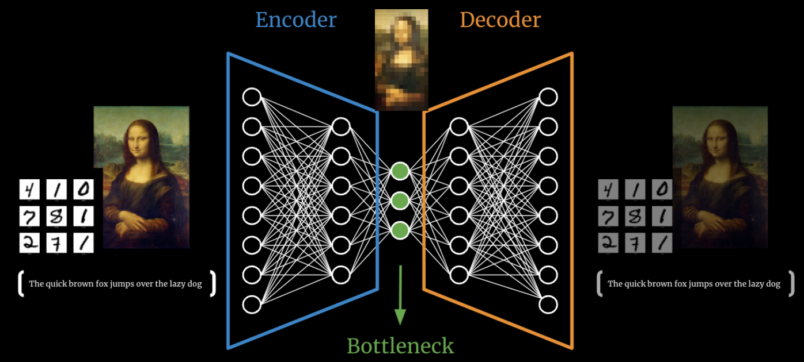

<h1 style=" text-align: center; font-size: 3em; font-family: 'Georgia', serif; color: #2c3e50; margin: 0.5em 0; padding: 10px 0; border-top: 4px solid #3498db; border-bottom: 4px solid #3498db; text-transform: uppercase; letter-spacing: 3px;">Autoencoder</h1>

## 自编码器 AutoEncoder
### 什么是AE?

- 定义：(Autoencoder, AE)
	- 编码：将输入压缩成一个较小的表示
	- 解码：重构出原始输入
- 核心思想：
	- 将输入数据压缩成一个低维表示（也就是编码）
	- 然后从这个低维表示重建出尽可能接近于原始输入的数据。
	- [Why Autoencoder are so Effective?](https://www.saberhq.com/blog/autoencoders)
- 训练目标：
	- 最小化重建误差，让解码器输出的结果尽量接近原始输入。
		- 常用的损失函数是MSE和crossentropy
- 作用：
	- 无监督学习
		- 通过压缩和重建过程进行特征学习
		- 可用于数据降维、特征学习、去噪等
		- 学习数据的潜在表示
	- 自监督学习
		- **数据本身生成标签**
- 优点
	- 稳定
	- 训练快速
- 缺点：
	- 可能会丢失一些重要信息
	- 生成能力较差
	- 对异常值敏感
- 应用场景：
	- 数据降维
	- 图像去噪
	- 异常检测
	- 特征提取
	- 生成模型
		- VAE和GAN一样，可以生成与训练数据相似的样本
- 其他背景
	- 一种早期的深度学习模型
		- **1986**: Geoffrey Hinton等人提出了基础的自编码器概念
		- **2006**: Geoffrey Hinton等人发表了深度自编码器的相关论文，推动了深度学习的复兴。
- 变种：
	- 变分自编码器 VAE
	- 去噪自编码器 Denoising Autoencoder
	- Convolutional Autoencoders

### AE的结构
![[autoencoder-simple.png]]
#### 编码器 Encoder
- 原理：
	- 将输入数据压缩成低维表示
	- 提取输入数据的特征
- 🧠：
	- 通常是由一系列的NN Layer组成，最终得到一个低维度的隐空间表示 (也就是编码)。

#### 瓶颈层 Latent Space
- 定义
	- 编码器输出的低维表示
	- 通常是一个向量，代表了输入数据的最简洁、最紧凑的表示。

潜在变量 Latent Variable
> 就是压缩后的**低维表示**，是输入数据的压缩版本，也叫编码 code。
- 该向量包含了尽可能多的输入数据中的重要特征信息。

### BottleNeck
- 定义：
	- AE中的最小维度表示，代表信息的最大压缩 (对原始数据的最抽象理解)
	- 它是编码器输出的最紧凑、最具代表性的信息表示。
- 特征
	- 低维度
	- 信息瓶颈
	- 潜在空间表示
	- 正则化形式 (如VAE)

#### 解码器 Decoder
- 定义
	- 从低维的编码中恢复出输入数据。
	- 解码器尽量重建出与原始输入相似的数据。

## RBM
> **RBM**（**Restricted Boltzmann Machine**）**受限玻尔兹曼机**

- 应用场景
	- 特征学习 / 表征学习
	- 生成模型
	- 降维
	- 聚类分析
	- 概率分类和关联规则挖掘

