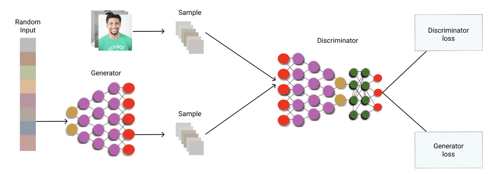

<h1 style=" text-align: center; font-size: 3em; font-family: 'Georgia', serif; color: #2c3e50; margin: 0.5em 0; padding: 10px 0; border-top: 4px solid #3498db; border-bottom: 4px solid #3498db; text-transform: uppercase; letter-spacing: 3px;">自监督学习</h1>

## 融合模型 Diffusion Models

- 定义
	- 一种生成模型从随机噪声中生成逼真数据。
- 核心思想
	- 概率模型(probabilistic models) 显式学习一个数据分布，通过模拟从噪声到数据的生成过程
	- 每一步都是基于概率分布的推断(sampling)
- 重要组件：
	- Diffusion Process 从清晰图像慢慢加噪，直到变成纯噪声
	- Reverse Process 训练一个模型学习反向过程，把噪声还原成真实图像
		- 从随机噪声开始
		- 应用一系列转变
		- 模仿diffusion process (反向操作)
		- 产生一个前后一致的样本
- 特点
	- 多步去噪 (几十步到几千步)
	- 高质量 细节丰富
- 学习目标
	- 学习如何从纯噪声中生成数据
- 应用
	- 图像生成 (DAL-E 2, Imagen)
	- 语音/音频合成(WaveGrad)
	- 分子结构生成 （科学计算）
	- 视频预测与编辑
	- 图像降噪
	- 数据增强
- 与GANs的关键对比
	- 优势：
		- 训练稳定性更高
		- 模态覆盖更完整
		- 渐进式生成质量更高
	- 劣势
		- 采样速度慢
		- 微高灵活性较低
- 核心改进方向
	- 加速采样
		- DDIM 确定性采样
		- 知蒸馏技术 (Progressive Distillation)
	- 条件生成控制
		- Classifier Guidance
		- Classifier-Free Guidance
	- 架构创新
		-  U-Net改进 （Diffusion Transformers）
		- 3D扩散 (视频/点云生成)

### 训练过程
#### 1. 正向过程 Forward Process
> 加噪音过程

- 目标：
	- 将干净的图像$x_0$加入高斯噪声，逐步转化成**纯噪音**$x_T$.
- 🧠
	- 这是一个马尔可夫过程
	- Diffusion Model的Diffusion正是取名于图像 **逐步被高斯噪声“扩散”的过程**
- 输入输出
	- 输入：原始图像 $x_0$
	- 输出：含噪图像 $x_1, x_2, \dots, x_T$
- 训练流程
	1. 取原图$x_0$
	2. 随机选一个时间步t
	3. 用正向加噪公式添加噪声$x_t = \sqrt{\bar{\alpha}_t} x_0 + \sqrt{1 - \bar{\alpha}_t} \epsilon$
- 公式 $$q(x_t | x_{t-1}) = \mathcal{N}(x_t; \sqrt{1 - \beta_t} \cdot x_{t-1}, \beta_t \cdot I)$$
	-  $\beta_t$：噪声强度（预先设定的一系列很小的值）
	- $\bar{\alpha}t = \prod{s=1}^{t} (1 - \beta_s)$
	
#### 2. 学习去噪
- 目标
	- 训练一个神经网络(U-Net)， 来：
		- 预测 $\epsilon$：噪声
		- 预测 $x_0$：干净图像
		- 预测 $x_{t-1}$：前一个状态（原始DDPM设定）
- 输入输出
	 - 输入: 噪声图像$x_t$, 和时间步t
	 - 输出：噪声估计 $\hat{\epsilon}_\theta(x_t, t)$
		 - **模型认为加在** x_0 **上的噪声** $\hat{\epsilon}_\theta$
 - 工作流程
	 4. 将$x_0$和时间t输入给U-Net,训练它预测这个加进去的噪声 $\hat{\epsilon}_\theta = \text{U-Net}(x_t, t)$
	 5. 用 MSE loss：$\mathcal{L} = \| \epsilon - \hat{\epsilon}_\theta(x_t, t) \|^2$
    
- 通常最主流的方式是预测噪声$\epsilon$，然后使用如下损失函数进行训练 $$\mathcal{L}{\text{simple}} = \mathbb{E}{x_0, t, \epsilon} \left[ \left\| \epsilon - \epsilon_\theta(x_t, t) \right\|^2 \right]$$

### 生成过程

#### 反向过程 Backward Process
> 反扩散
> 从噪声生成图像

- 目标
	- 学习如何从纯噪声一步步“反扩散”回去，得到图像$x_0$
- 输入输出
	- 输入：纯噪声图像 $x_T \sim \mathcal{N}(0, I)$
	- 输出：清晰图像（逐步去噪）
- 工作流程
	- 从随机高斯噪声 $x_T \sim \mathcal{N}(0, I)$ 开始，逐步去噪：$$x_T \rightarrow x_{T-1} \rightarrow \cdots \rightarrow x_0$$
	- 每一步t 根据模型预测的噪声 $\epsilon_\theta(x_t, t)$ 来预测前一状态：
		- 把当前的$x_t$和t送入U-Net,预测噪声$\hat{\epsilon}_\theta(x_t, t)$
		- 然后用预测的噪声反推$x_{t-1}$, 执行去噪一步 $x_{t-1} = \frac{1}{\sqrt{1 - \beta_t}} \left(x_t - \frac{\beta_t}{\sqrt{1 - \bar{\alpha}t}} \cdot \epsilon\theta(x_t, t)\right) + \text{noise}$
	- 最终得到近似的清晰图像
- 模型的训练目标
	- 学会拟合这个条件概率分布
- 特点
	- 每一步生成都是一个概率采样过程
	- 最终生成的图像结果是从高维噪声分布中采样出来的。
---
## 生成对抗网络 GANS

- 定义
	-  Generative Adversarial Networks
	- 由两个神经网络组成
		- 生成器 Generator
		- 判别器 Discriminator
	- 用于生成数据(如图像、文本或音频)
- 类型
	- 自监督学习：当判别器的真假标签由数据分布自动生成 伪标签
		- 比如，将真实数据的一部分遮挡起来，作为目标变量
	- 无监督学习：当训练数据完全没有标签，仅依靠原始数据分布进行训练
		- 比如：生成人脸，风景等无标注图标
### 基本架构

#### 生成器 Generator
- 角色： 扮演 骗子 Counterfeiters。
- 作用：生成 数据 （通常是图像、声音）
- 对抗目标：
	- 欺骗判别器
	- 优化神经网络参数(权重矩阵与偏置)，使得生成的数据更逼真
- 输入：
	- **随机噪声向量** z，通常是100维
- 生成过程
	- 通过神经网络层，生成器会将z逐步解码成一个和真实数据形状相同的图像。
	- 在反向传播时，生成器会不断调整生成器内部神经网络参数，而z是固定不变的
- 输出：
	- 生成器根据输入的噪声z， 尝试生成合成的数据样本 G(z)

#### 判别器 Discriminator
- 角色： 扮演侦探 Authenticators
- 作用：
	- 区分真实数据和生成数据，识别生成器生成的欺诈性样本
- 对抗目标：
	- 准确辨别输入数据的真假
	- 调整网络结构中的参数，使得判别器识别真假更准确
- 输入：
	- 真实输入数据 x
	- 生成器生成的假数据 G(z)
- 输出：
	- `[0,1]`之间的概率，表示输入数据的置信度
	- 通常使用sigmoid激活函数

### 对抗过程 Adversarial Process
- 核心思想：
	- GANs的训练过程是一种 博弈 过程
	- 生成器不断生成更真实的假数据来 欺骗 判别器
	- 判别器不断提高自己的能力，试图更好地区分真假数据
- 目标：
	- 促使生成器生成越来越真实的样本
	- 判别器则越来越擅长辨别真假
	
### 工作流程

1. 初始化
	- 生成器 (Generator) 和判别器 (Discriminator)，初始化神经网络结构。
		- 两个网络的参数通常都是随机初始化的
	- 噪声向量 z
		- 从一个简单的概率分布中随机抽取的，通常是100维。
		- z 在一个批次内是固定的，在每个迭代中会变化。
2. 生成器生成假数据
	- 接收输入 z
	- 通过神经网络生成一个假数据样本
		- 文本，视频 或音频
	- 计算损失函数 Generator Loss
3. 判别器判别真假数据
	- 接收输入：
		- 真实数据： 来自训练集
		- 假数据： 来自生成器的输出
	- 计算损失函数 Discriminator Loss
		- loss函数通常是binary_crossentropy
4. 反向传播和更新参数
	- 判别器调整其网络参数
	- 生成器网络参数更新
5. 迭代训练
	- 在每次迭代中，生成器和判别器会互相更新各自的参数
	- 在每迭代开始，z会得新生成
	- 经过多次训练，生成器生成的数据越来越逼真；判别器越来越难经区分真假

