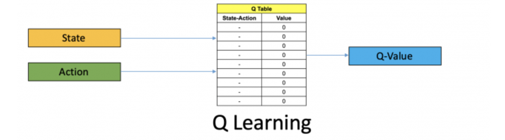
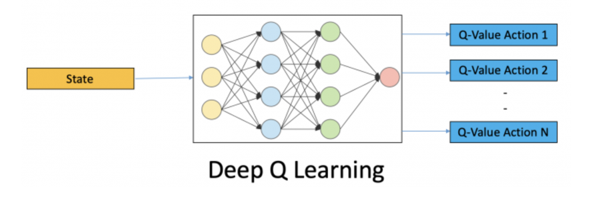
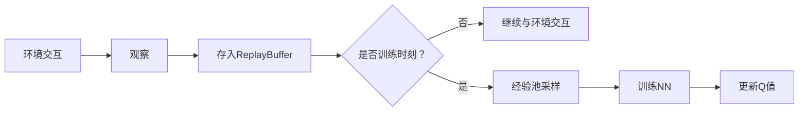

<h1 style=" text-align: center; font-size: 3em; font-family: 'Georgia', serif; color: #2c3e50; margin: 0.5em 0; padding: 10px 0; border-top: 4px solid #3498db; border-bottom: 4px solid #3498db; text-transform: uppercase; letter-spacing: 3px;">Reinforcement Learning</h1>

## 1. 强化学习基础

### 1.1 核心概念

- **什么是强化学习 (Reinforcement Learning)？**
	- 让智能体与环境交互
	- 通过不断试错来学习如何决策
	- 目标是最大化长期累积奖励
- **应用场景**
	- 游戏 (AlphaGo, Atari, Dota, 星际争霸)
	- 机器人：机械臂控制、步行机器人
	- 自动驾驶：决策规划系统
	- 金融投资：量化策略优化
	- 推荐系统：动态个性化推荐


### 1.2 主要元素
- **智能体 (Agent)**
	- 学习做决策的主体，如机器人、游戏玩家
- **状态 (State)**
	- 当前环境的情况描述，如棋盘布局、游戏画面
	- 状态可以是标量数据、向量(如速度)、矩阵(如游戏画面)或张量
- **动作 (Action)**
	- Agent 在某一状态下可以选择的行为
	- 可以是离散的(如左右移动)或连续的(如转向角度)
- **奖励 (Reward)**
	- 环境给Agent的反馈，用来评估行动好坏
	- 通常是一个标量值，表示即时反馈
- **策略 (Policy)**
	- 决定Agent如何在每个状态下选择动作的规则
	- 可表示为函数 π(a|s)，即在状态s下选择动作a的概率
- **价值函数 (Value Function)**
	- 衡量一个状态或状态-动作组合的长期奖励预期
	- 帮助智能体评估不同状态的"价值"
- **回合 (Episode)** 
	- 从初始状态开始到结束状态的一段完整交互过程


### 1.3 学习流程
1. Agent 观察当前状态 $s_t$
2. 根据策略 $\pi(s_t)$ 选择一个动作 $a_t$
3. 执行动作 $a_t$，环境转移到新状态 $s_{t+1}$，并给予奖励 $r_t$
4. Agent根据奖励和新状态来更新策略
5. 重复以上步骤，直到学会最优策略


## 2. 强化学习的理论基础

### 2.1 三大核心函数
- **状态价值函数 $V^π(s)$**
	- 在状态s下遵循策略π的预期累积回报
	- 公式：$V^π(s) = E_π[\sum_{k=0}^{\infty} \gamma^k r_{t+k+1} | S_t = s]$
- **动作价值函数 $Q^π(s,a)$**
	- 在状态s采取动作a后遵循π的预期累积回报
	- 公式：$Q^π(s,a) = E_π[\sum_{k=0}^{\infty} \gamma^k r_{t+k+1} | S_t = s, A_t = a]$
- **优势函数 $A^π(s,a)$**
	- $A^π(s,a) = Q^π(s,a) - V^π(s)$
	- 衡量在状态s下选择动作a相对于平均表现的优势

### 2.2 两大基础方法
- **Value-Based 基于价值的方法**
	- 代表算法：Q-Learning, DQN
	- 目标： **选分高**
	- 特点：学习价值函数 → 推导最优策略
	- 适用：离散动作空间
	- 局限：不适合连续动作空间
- **Policy-Based 基于策略的方法**
	- 代表算法：REINFORCE, PPO, TRPO
	- 目标： **抽签多**
	- 特点：直接优化策略参数
	- 优势：处理连续动作空间更高效
	- 适用：连续控制问题

## 3. 经典强化学习算法

### 3.1 时序差分法
- **SARSA (On-policy)**
	- 基于当前策略进行学习
	- 更新公式：$Q(s_t,a_t) \leftarrow Q(s_t,a_t) + \alpha[r_t + \gamma Q(s_{t+1},a_{t+1}) - Q(s_t,a_t)]$
- **Q-learning (Off-policy)**
	- 独立于当前策略进行学习
	- 更新公式：$Q(s_t,a_t) \leftarrow Q(s_t,a_t) + \alpha[r_t + \gamma \max_a Q(s_{t+1},a) - Q(s_t,a_t)]$

### 3.2 深度强化学习
- **DQN (Deep Q-Network)**
	- 结合深度学习与Q-learning
	- 核心创新：经验回放 + 目标网络
- **DDPG (Deep Deterministic Policy Gradient)**
	- 适用于连续动作空间
	- 结合了DQN与策略梯度
- **SAC (Soft Actor-Critic)**
	- 结合最大熵框架的演员-评论家算法
	- 平衡探索与利用

### 3.3 策略优化
- **TRPO (Trust Region Policy Optimization)**
	- 使用信赖域方法限制策略更新
	- 保证单调策略改进
- **PPO (Proximal Policy Optimization)**
	- TRPO的简化实现
	- 使用裁剪目标函数限制策略变化

## 4. 算法详解

### 4.1 Q-Learning
[Deep Reinforcement Learning: Guide to Deep Q-Learning](https://blog.mlq.ai/deep-reinforcement-learning-q-learning/)

- **定义**
	- 基于价值的强化学习算法
	- Agent 与环境互动
	- 为Agent的行为学习一个策略
	- 随着时间推移，最大化累计奖励
- **目标**
	- 学习一个Q函数  $Q(s, a)$
		- 估算在给定状态s下采取行动a后，未来<font style="background-color:yellow; color:black">长期、最大化</font>的 **期望累积回报（expected cumulative reward）**
		- 从而决定最优行为策略
- **特点**
	- 训练Agents来制定决策序列
	- 在一个状态中学习特定行为的价值
	- 离线学习(Off-policy)：可以学习最优动作策略，而不必严格遵循
- **工作流程**
	1. **初始化环境和参数**
		- 定义一个平台，比如OpenAI's Gym
		- 初始化 Q-table
			- Q表是表格结构(矩阵)，用于记录所有状态-动作对对应的Q值 $Q(s, a)$
		- 设置超参数
			- 学习率 (Learning Rate)
			- 折扣因子 (Discount Factor)
			- 探索率 (Exploration Rate)
	2. **训练循环**
		1. 初始化状态
		2. 选择动作
			- 使用<font style="background-color:yellow; color:black">Epsilon贪婪(ε-greedy)策略</font>来平衡探索和利用
		3. 执行动作 
		4. 更新Q-values
			- 使用<font style="background-color:yellow; color:black">贝尔曼方程(BellmanEquation)</font>：$Q(s,a) \leftarrow Q(s,a) + \alpha[r + \gamma \max_{a'} Q(s',a') - Q(s,a)]$
				- 动态规划的核心基础，用于递归计算最优价值函数
				- **当前状态（或状态-动作对）的价值** 分解为
					- 即时奖励 reward
					- 未来价值折扣和 （后续状态价值乘以折扣因子 γ）
		5. 重复上述过程：减少探索率，逐渐从探索转向利用
	3. **评估Agent**
		- 使用学习到的策略与环境交互
		- 利用已学习的Q-values来最大化奖励
		- 通过多个回合的累积奖励来衡量性能
- **优点**
	- 简单直观，易于实现
	- 适用于小型离散状态和动作空间
- **局限性**
	- 不适用于连续状态空间或大规模问题
	- 需要完整的状态表示

**Q表示例：**

|      | **动作 A** | **动作 B** | **动作 C** |
| ---- | -------- | -------- | -------- |
| 状态 1 | 1.2      | 0.5      | -0.3     |
| 状态 2 | 0.7      | 1.0      | 0.1      |
| 状态 3 | 0.0      | -1.2     | 0.8      |
| 状态 4 | 0.4      | 0.6      | 0.9      |

### 4.2 深度Q网络 (DQN)
> **Deep Q-Networks** 或 **Deep Q-Learning** 



- **定义**
	- 当状态空间非常大时，无法使用Q表
	- 使用**神经网络来预测**某个状态下各个动作的Q值
		- **神经网络近似Q函数**：$Q(s, a; \theta) \approx Q^*(s, a)$
			- $Q(s, a; \theta)$ 是神经网络的输出（给定状态 s 和动作 a）
			- $\theta$ 是神经网络的参数（权重和偏置）
- **关键技术创新**
	- **经验回放 (Experience Replay)**
		- 目标：存储和重用过去的经验样本
		- 优点：打破时间相关性，提升训练稳定性
	- **目标网络 (Target Network)**
		- 使用另一个固定参数的网络计算目标Q值
		- 减少训练不稳定性
	- **神经网络结构**
		- 输入：状态向量或图像
		- 输出：每个可能动作的Q值
- **经验池 Replay Buffer**
	- 存放一条条的经验
	- 经验是一个5元组 $(s_t, a_t, r_t, s_{t+1}, done)$ 
		- 记录t和t+1的状态，t时刻的行动a和奖励r，是否到达终止状态done
```text
Agent与环境交互：
    观察 (s, a, r, s')
         ↓
    存入经验池（Replay Buffer）
         ↓
每隔一段时间：
    从经验池中随机抽出 batch（比如32条）
         ↓
    用这些数据训练神经网络，更新Q函数
         ↓
    定期更新目标网络
```

- 【**权重更新**】和Primary Q-network相比的差异：
	- 更新频率慢，每隔固定的训练步骤(如1000个训练步)才更新一次；
	- 更新方式 
		- 硬更新 hard update： 直接将Primary网络权重完全复制给target network
		- 软更新 soft update：用参数平均的方法缓慢更新

|**网络**|**参数更新频率**|**参数更新方式**|**目的**|
|---|---|---|---|
|Primary Q Net|每训练 step 更新|梯度下降反向传播更新|学习当前最优 Q 函数|
|Target Q Net|每隔 N step 硬更新 或软更新|复制或部分平均 Primary 参数|稳定目标 Q 值估计|

- **工作流程**




## 5. 强化学习的实现技巧

### 5.1 探索机制
- **ε-greedy策略**
	- 它是**value-based 方法中的动作选择策略**
	- 在Q-Learning或QDNs中， 智能体维护一个Q表或Q网络。在每个时间步通过以下策略选择动作：
	- 公式：$$\text{action} = \begin{cases} \text{随机选择一个动作} & \text{概率为 } \varepsilon \\ \arg\max_a Q(s, a) & \text{概率为 } 1 - \varepsilon \end{cases}$$
		-  ε：探索率（exploration rate）
			- 越小越倾向于 exploitation（利用已有知识）
			- 越大越倾向于 exploration（探索新动作）
		- 以ε概率随机探索，以1-ε概率选择当前最优动作
- **噪声探索**
	- Ornstein-Uhlenbeck过程（适用于连续控制）
	- 向确定性动作添加时间相关噪声
- **内在好奇心**
	- 基于预测误差或新奇度生成内在奖励
	- 鼓励探索未知状态

### 5.2 稳定训练技巧
- **目标网络冻结**
	- 定期更新目标网络参数
	- 减少训练不稳定性
- **奖励裁剪**
	- 将奖励限制在特定范围内
	- 防止值函数估计不稳定
- **梯度裁剪**
	- 限制梯度大小
	- 防止参数更新过大

## 6. 前沿发展方向

### 6.1 多智能体系统
- **竞争环境**
	- 多个智能体相互竞争
	- 自我对弈和进化策略
- **协作机制**
	- 智能体间协作完成任务
	- 集体奖励与个体贡献

### 6.2 分层强化学习
- **技能自动发现**
	- 学习可重用的低级技能
	- 通过内在动机发现有用行为
- **时序抽象**
	- 在不同时间尺度上做决策
	- 高层策略选择低层技能

### 6.3 元强化学习
- **快速适应新任务**
	- 学习如何学习
	- 少量经验快速适应新环境

### 6.4 基于模型的方法
- **世界模型学习**
	- 学习环境动态模型
	- 通过模拟减少与实际环境交互
- **模型预测控制**
	- 使用学习的模型进行规划
	- 结合规划与学习的优势