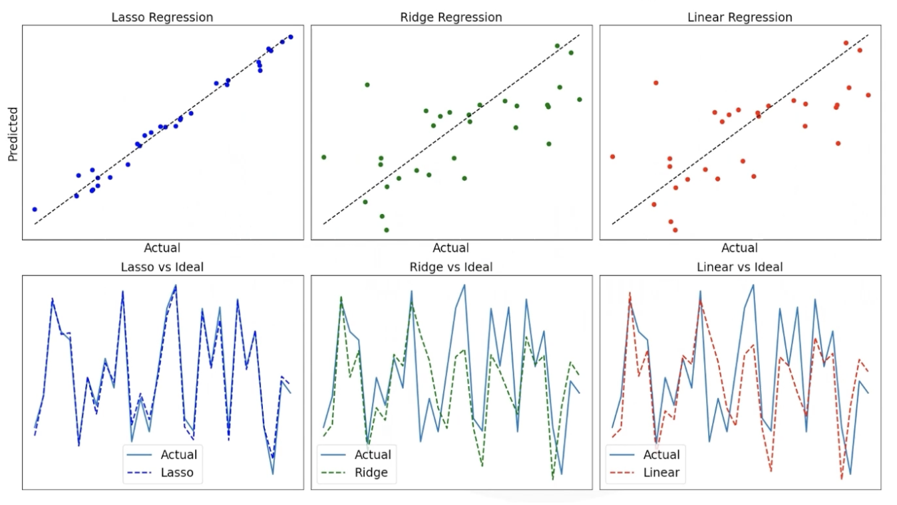

## 1. 数据层面优化

- 数据质量
	- 异常值处理
		- IQR
		- Z-score
- 特征工程
	- 特征选择
		- 方差阈值
		- 卡方检验
		- RFE
	- 特征变换
		- 标准化
		- 归一化
		- 对数变换
	- 特征构造
		- 交叉特征
		- 多项式特征
- 数据平衡
	- 过采样
	- 欠采样
	- 类别权重调

### 数据增强 Data Augmentation
- 定义
	- 从现有数据集中生成更多变异的训练样本
- 目标
	- 增强模型泛化能力
	- 缓解过拟合现象
	- 模拟数据分布的多样性
- 常见方法
	- 图像增强
		- 几何变换：旋转/ 平移/ 翻转 /缩放 zoom
		- 色彩扰动：亮度 / 对比度 / 饱和度 
		- 随机裁剪
		- 添加噪声 (Gaussian/Shot Noise)
		- 高级技术： 
			- Mixup/CutMix、风格迁移
			- featurewise_center **中心化** 减去整个数据集的平均值
	- 文本增强
		- 语义替换： 同义词/反义词替换
		- 语法变换： 句型重排/主动被动转换
		- 自动翻译
		- Concatenate 合成长文本
	- 音频增强
		- 时序变换：速度时间轴变换
		- 噪声流入：环境噪声叠加
		- 频谱扰动：频域调整
	- 通用方法
		- SMOTE 平衡分类数据
		- EDA 文本增强算法
		- 生成模型： GAN/VQ-VAE
- 变换策略
	- 保持基础数据本征特征
	- 保持正类/负类 样本方向
	- 动态调整变换强度
- 均衡控制
	- 类别平衡增强 防止过采样偏差
	- 真实分布逼近
- 效果评估
	- 观测指标
		- Test Accuracy提升
		- Faster Convergence 速度
		- Robustness到对抗攻击
	- 验证方法：
		- T-SNE特征可视化
		- 梯度敏感性分析
		- 00D检测能力测试
- 应用场景
	- 图像分类/目标检测/语义分割
	- NLP文本预训练
	- 医疗影像分析
	- 工业瑕疵检测

---

## 2 模型调优
> 直接调整模型的结构、超参数、损失函数等，以提升性能。

- 模型优化需求
	- 强化性能
	- 提高效率
	- 更好的可扩展性
	- 更快收敛 (更短的训练次数和时间)
	- 提高准确率
- 通用优化技术
	- 权重初始化
	- 学习率调度
	- 批量归一化
	- 混合精度训练 Mixed Precision
	- 模型剪树 Model Pruning
	- 量化 Quantization
- 收益
	- 加快训练
	- 减小模型大小
	- 更有效地利用资源
	- 在训练和推理上获得更好性能
	- 为部署提供可扩展性
	- 更低的岸上和功耗

---
### 2.1 超参数调优

- 什么是超参数
	- 控制模型训练过程的变量
	- 在训练开始前 设置
- 常见超参数
	- Learning Rate
	- Batch Size
	- Number of Layers
	- Units Per Layer
- 调优思路
	- 搜寻最佳的超参数值
#### 超参数调优方法
- Grid Search
- Random Search
- Hyperopt
- Hyperband
- Bayesian Optimization

#### 学习率策略
- 学习率衰减 (Step/Exponential)
- 自适应优化器 (Adam/RMSprop)

#### 权重初始化 
- Zeros/Ones
	- 只适用于偏置，❌不适用于权重
- GlorotUniform
	- 保持前后层方差一致，解决梯度消失问题
	- 激活函数：tanh、sigmoid
- GlorotNormal
	- Xavier但使用正态分布
	- 激活函数： tanh sigmoid
- HeUniform
	- 为ReLU设计，适合不对称激活
- HeNormal
	- He初始化+正态分布
	- 激活函数 ： ReLU、LeakyReLU
- LeCunUniform
	- 为Selu激活函数设计
- LeCunNormal
	- 与LeCunUniform相似，分布不同
- Orthogonal
	- 初始化为正交矩阵，适合RNN
	- 激活函数： tanh

---
### 2.2 控制模型复杂度

- 模型过于复杂带来的影响？
	- 止过拟合
	- 推理慢
	- 内存不足
	- 训练不稳定
- 控制复杂度常见的方法
	- 🧱 模型结构简单化
		- 选用轻量架构，如MobileNet、EfficientNet、TinyBERT
		- 降低层次Depth、通道数Width、参数量
		- 使用可分离卷积
	- 正则化
		- L1/L2正则： 限制权重大小
		- Dropout： 随机屏蔽神经元
		- EarlyStopping：避免过度训练
	- ✂模型剪枝 Model Pruning
		- 删除重要性低的神经元和权重
	- 知识蒸馏 Distillation
		- 用复杂模型训练简单模型， 提升小模型性能
	- 量化 Quantization
		- 减少参数的表示位宽 (float32 → int8)，间接简化运算复杂度
- 模型泛化能力评估 
	- 偏差-方差权衡
- 数据参数与数据质量评估
	- 目标：
		- 高信噪比，高稀疏系数 的数据更优质
	- **Sparse Coefficients（稀疏系数）**
		- 大部分系数为0或接近0
	- **信噪比 SNR (Signal-to-Noise Ratio)**
		- 信息量与噪音的比率
#### 正则化技术 Regularization
	
- 定义：正则化是一个**防止过度**拟合的**回归技术**
	- 作用于 特征选择 阶段
	- 调整 **强噪音对应的特征** 的权重，从而在本轮训练不使用该特征。
- 基本思想：在训练时**限制模型**，防止模型的参数变得过大或过于复杂
	- 在损失函数中加入一个额外的项，用来**惩罚过于复杂的模型**。（去除无关或噪音特征）
	- 在普通线性回归中，目标是最小化loss函数
	

**L1正则化（Lasso Regularization）**
- 对模型参数的绝对值求和来增加惩罚项。
- 特点：
	- 特别适合处理稀疏数据
**L2正则化（Ridge Regularization）**
- 对模型参数的平方和进行惩罚。
**弹性网正则化（Elastic Net Regularization）**
- 也叫**L1/L2混合正则化**
- 弹性网正则化结合了L1正则和L2正则化的优点。

#### Dropout
- 定义：一种用于DL模型训练中的**正则化技术**。
- 目的：
	- 减少过拟合，提高模型泛化能力
	- 减少神经元之间的共适应性
- 原理：
	- 在每次训练迭代中，随机丢弃一部分神经元，不参与当前计算。
		- 丢弃比例由超参数 dropout rate决定，通常在0.2-0.5之间
	- 使得模型训练过程中不会过度依赖某些神经元，从而减少过拟合。
- 缺点：
	- 增加训练时间
		- 有效计算量增加
	- 可能影响模型学习效率
		- 过度使用阻碍模型学习到足够的特征

#### **早停（Early Stopping）**
[2.x 模型评估与调优#早停 Early Stopping](2.x%20%E6%A8%A1%E5%9E%8B%E8%AF%84%E4%BC%B0%E4%B8%8E%E8%B0%83%E4%BC%98#早停 Early Stopping)
- 早停也是一种正则化技术。
- 原理：
	- 在验证误差开始增大时提前停止训练
	- 避免模型训练得过长，防止开始记住训练数据中的噪声
#### 混合精度训练 Mixed Precision
- 定义
	- 使用不同精度(如float32和float16)进行计算和存储
- 目标
	- 提高训练速度
	- 减少内存占用
	- 提升硬件利用率
#### 模型量化 Quantization
- 作用
	- 💾 压缩模型体积
	- 🚀 加快推理速度
	- 🔋 降低功耗： 减少在移动端或边缘设备上的资源消耗
	- 🧠 几乎不影响精度
- 什么是模型量化？
	- 权重量化：  
		- 🌰 将float32的权重压缩为int8
	- 激活量化
		- 将推理时的中间激活转为低精度
	- 权重+激活
		- 结合权重和激活量化(最常用)
- 精度损失
	- 量化会降低模型权重和激活值的数据值精度，
		- 如将0.123456789 量化后可能表示为120
	- 这就会引入 **量化误差** （Quantization Error）

---
## 高级优化技术
- 自动化机器学习 (AutoML)
- 神经架构搜索 (NAS)
- 迁移学习
	- 预训练模型微调
- 半监督学习
- 对抗训练

### 迁移学习
- 定义 🧠
	- 从一个任务中学到的知识（通常是通过预训练的模型）应用到与之相关的另一个任务中
	- 从而加速新任务的学习，并提高模型的性能。
- 核心理念
	- 利用已有的知识，特别是对大规模数据集上训练的DL模型，将其应用到目标任务上。
- 用好迁移学习的关键要点：
	- 领域适用 
		- 特征分布对齐
		- 领域不变特征学习
		- 自适应算法设计
	- **预训练模型**
		- 预训练模型是先在大规模数据集上训练得到的模型，然后将其在目标任务上进行微调(fine-tuning)
		- 迁移学习常常依赖于预训练模型
	- 冻结早期层，仅调优后期层
	- 调整学习率
	- 使用数据增强
- 优点
	- 减少训练时间
	- 提高效率和性能
	- 在小数据集上有高准确率
- 主要类型
	- 同源迁移 ： 
		- 描述：
			- 源任务和目标任务属于同一个领域，但使用的**数据分布**可能略有不同，通常共享相同的：
				- 数据类型
				- 数据模态 (如都是图像)
		- 关注点：
			- 可迁移的模型结构
			- 可迁移的参数
		- 🌰：
			- 文本领域：
				- 使用互联网语料预训练BERT，然后在医学文献上微调来进行疾病诊断
			- 图像领域
				- 使用ImageNet预训练的ResNet50模型，进行猫狗二分类。
	- 异源迁移：
		- 描述
			- **数据特性**上存在差异。通常使用不同类型的数据
				- 数据模态不同：图/文/音
				- 数据分布不同：来源/统计特性、采集方式
				- 领域不同：从日常生图到医疗影像
		- 挑战：
			- 数据差异 可能导致性能
		- 核心思想
			- 找到跨领域、跨模态/分布的**共同知识或结构**
			- 设计特定的方法来**缓解数据间的差异**性
		- 这是迁移学习最强大的形式
	- 多任务学习：
		- 定义：
			- 同时学习多个相关任务，模型在多个任务上共享表示
			- **任务相关性**：
				- 多个任务共享一定的底层知识或特征表示
	- 领域适用：
		- 专注于处理不同数据分布之间的差异。
		- 目标：在同一领域上训练的模型能够很地应用于另一个领域
### 预训练模型
- 定义
	- 在大规模数据集 (如ImageNet, COCO, Wikipedia)上预训练过
	- 学习到通用的特征和模式
	- 具有较强的泛化能力
- 重要用途
	- 微调 Fine tuning：
		- 冻结预训练模型的底层层（通常是权重不变），只更新顶层（针对新任务的层）
		- 然后在目标任务的数据集上进行进一步训练。
			- 迁移学习的一种重要实现方式
	- 特征提取 Transfer Learning
		- 使用预训练模型的最后一层或多个层的输出作为固定编码器，将新数据编码成特征表示
		- 然后训练一个从头开始构建的小网络模型来利用这些固定的特征。
			- (也就是仅复用原模型参数，而不以其为基座再训练，这是和微调的本质区别)
- 优势
	- 节省计算资源
	- 提高性能
	- 训练时间短
- 常见的预训练模型
	- CV领域
		- VGG16/VGG19: 较早的深度卷积神经网络模型，常用于图像分类
		- ResNet: 一种通过引入残差连接解决深度神经网络训练困难的模型
			- ResNet50
			- ResNet101
			- ResNet152
		- InceptionV3: google. 具备多尺度特征提取能力
		- EfficientNet： 高效卷积神经网络。使用复合缩放方法优化网络结构，减少计算量
		- DenseNet：通过直接连接每一层的输出，以解决信息流和梯度消失的问题
	- NLP
		- BERT： 通过双向编码器表示学习文本特征
		- GPT
		- RoBERTa： 改进版的BERT，采用更多训练数据和时长，进一步提升性能
		- T5
		- XLNet：通过自回归和自编码结合的方式提升性能
	- 语音处理
		- WaveNet：Google提出
		- DeepSpeech：基于深度学习的自动语音识别ASR模型
	- 多模型模型
		- CLIP: Openai提出。可处理图像和文本输入，进行图像描述、搜索等任务
		- BLIP：擅长图像理解和生成
	

---
## 资源优化
- 计算加速
	- GPU/TPU利用
	- 混合精度训练
- 模型压缩
	- 量化 (8-bit/4-bit)
	- 知识蒸馏
	- 剪枝

