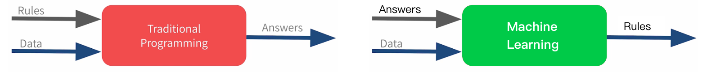
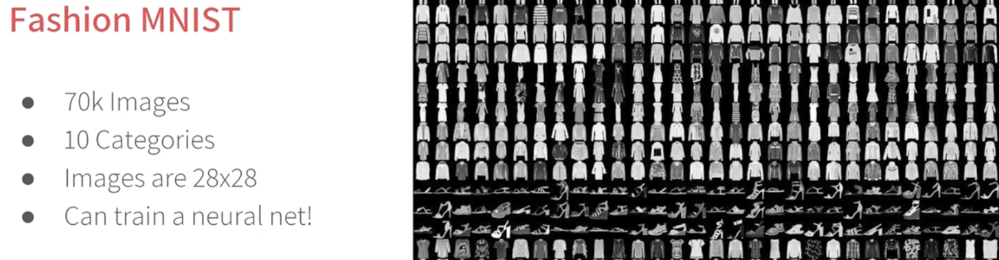

[Coursera课程： DeepLearning.AI TensorFlow Developer Professional Certificate ](https://www.coursera.org/professional-certificates/tensorflow-in-practice)

[Tensorflow Keras API](https://www.tensorflow.org/api_docs/python/tf/keras/)

[主讲老师劳伦斯的个人网站](https://laurencemoroney.com/about.html)

[Kaggle:机器学习赛事和挑战](https://www.kaggle.com/)

[Github Fashion Mnist](https://github.com/zalandoresearch/fashion-mnist)

[Corsera Official Colab](https://www.coursera.org/learn/introduction-tensorflow/ungradedLab/6Hb8q/get-hands-on-with-computer-vision-lab-1/lab?path=%2Flab%2Ftree%2Flab_1)



公式表示机器学习的数学原理 (根据数据和目标变量Lables， 推理得到规则函数)：
$$f(Data, Labels) = \text{Rules}$$

### 简单线性回归
<font style="background-color:tomato; color:black">快速上手</font> 训练一批数据，使其掌握 y=2x+1 的规律  
`x_array = [0, 1, 2, 3, 4, 5]` 特征    
`y_array = [-1, 1, 3, 5, 7, 9]` 标签  

#### Sequential API
经过 n 轮训练，计算机将掌握 y=2+1 的规律，给出一些测试值$x_i$，模型将给出$y_i = 2* x_i +1$的近似值
```python
import tensorflow as tf
import numpy as np

# 1. 构造训练数据 (y = 2x - 1)
def create_training_data():

    # Define feature and target tensors with the values for houses with 1 up to 6 bedrooms.
    # For this exercise, please arrange the values in ascending order (i.e. 1, 2, 3, and so on).
    x_train = np.array([0, 1, 2, 3, 4, 5], dtype=np.float32)  # 输入数据
    y_train = np.array([-1, 1, 3, 5, 7, 9], dtype=np.float32)   # 真实标签, 其实只有6个数[-1, 1, 3, 5, 7, 9]， x_train的值只有六个


    return x_train, x_train

def define_and_compile_model():

    # Define a compiled (but untrained) model。 定义模型，就是定义模型的神经图络层。
    model = tf.keras.Sequential([
        tf.keras.Input(shape=(1,)),  # 输入层：1个输入特征
        tf.keras.layers.Dense(units=1)  # 输出层：1个神经元
    ])

    # 编译模型
    # sgd（Stochastic Gradient Descent，随机梯度下降）
    # mse（Mean Squared Error，均方误差），衡量预测值与真实值之间的差距。
    model.compile(optimizer='sgd', loss="mse")

    return model

def train_model():

    # Define feature and target tensors with the values for houses with 1 up to 6 bedrooms
    # Hint: Remember you already coded a function that does this!
    x_train, y_train = create_training_data()

    model = define_and_compile_model()

    # Train your model for 500 epochs by feeding the training data
    model.fit(x_train, y_train, epochs=500, verbose=0)

    return model


# 保存模型
model = train_model()
model.save('my_model.keras')

# 加载模型
loaded_model = tf.keras.models.load_model('my_model.keras')

# 使用模型进行预测
xn = np.array([6], dtype=np.float32)  # 需要预测的 x 值
yn_pred = loaded_model.predict(xn)

print(f'输入 xn={xn[0]}，预测输出 yn={yn_pred}')

```
### Keras 入门
#### Functional API in Keras
```python
import numpy as np  
from tensorflow.keras.layers import Dropout, Input, Dense  
from tensorflow.keras.models import Model  
from tensorflow.keras.layers import BatchNormalization

X_train = np.random.rand(1000, 20) 
y_train = np.random.randint(2, size=(1000, 1)) 
X_test = np.random.rand(200, 20) 
y_test = np.random.randint(2, size=(200, 1)) 

input_layer = Input(shape=(20,))

hidden_layer1 = Dense(64, activation='relu')(input_layer) 
dropout1 = Dropout(0.5)(hidden_layer1)
batch_norm1 = BatchNormalization()(dropout1)

hidden_layer2 = Dense(64, activation='relu')(batch_norm1) 
dropout2 = Dropout(0.5)(hidden_layer2)
batch_norm2 = BatchNormalization()(dropout2)

output_layer = Dense(1, activation='sigmoid')(batch_norm2) 

model = Model(inputs=input_layer, outputs=output_layer)
model.compile(optimizer='adam', loss='binary_crossentropy', metrics=['accuracy'])
model.fit(X_train, y_train, epochs=10, batch_size=32) 
loss, accuracy = model.evaluate(X_test, y_test)
print(f'Test loss: {loss}')
print(f'Test accuracy: {accuracy}')
```
#### 自定义模型层
```python
from tensorflow.keras.layers import Layer
from tensorflow.keras.models import Sequential

class CustomDenseLayer(Layer):
    def __init__(self, units=128):
        super(CustomDenseLayer, self).__init__()
        self.units = units

    def build(self, input_shape):
        self.w = self.add_weight(shape=(input_shape[-1], self.units),
                                 initializer='random_normal',
                                 trainable=True)
        self.b = self.add_weight(shape=(self.units,),
                                 initializer='zeros',
                                 trainable=True)

    def call(self, inputs):
        return tf.nn.relu(tf.matmul(inputs, self.w) + self.b)

# Integrate the new custom layer into a model
model = Sequential([
    CustomDenseLayer(128),
    CustomDenseLayer(10)
])

# Recompile the model
model.compile(optimizer='adam', loss='categorical_crossentropy')

# Train the model again
model.fit(x_train, y_train, epochs=10, batch_size=32)
```

### Sarcasm - FNN

Sarcasm 新闻标题讽刺检测
- 问题分析
	- 问题类型： 二分类问题
	- 目标：
	    - 输入一段文字
	    - 输出：检测是否讽刺
	- 挑战：
	    - 讽刺的语义较为复杂，常常依赖于上下文、语气、文化背景等因素，难以通过简单的文本模式进行检测
	    - 讽刺的语言通常带有隐晦的情感，可能需要模型理解隐藏的情绪。
	    - 数据集可能有 类不平衡问题，即讽刺新闻的数量可能少于非讽刺新闻。
- 特征工程
	- 矢量化
	- 子词分词
- 模型选择
	- FNN
[✍️ Github-NLP-Sarcasm-FNN](https://github.com/jimmy-pink/colab-playground/blob/main/coursera-lab/nlp-sarcasm-fnn.ipynb)

```python
from keras import Sequential, Input, layers 
model = Sequential([ 
	Input(shape = (MAX_LENGTH, )), 
	layers.Embedding(VOCAB_SIZE, EMBEDDING_DIM), 
	layers.GlobalAveragePooling1D(), 
	layers.Dense(24, activation="relu"), 
	layers.Dense(1, activation="sigmoid") 
]) 
model.compile(optimizer="adam", loss="binary_crossentropy", metrics=['accuracy'])
```

## Fashion Mnist - CNN

<font style="background-color:tomato; color:black">快速上手</font> Fashion Mnist 训练模型识别服装类型

1. 问题定义：
	- 训练7万个时尚穿着，使机器能识别时装分类
2. 数据收集与准备：
	- [Github Fashion Mnist](https://github.com/zalandoresearch/fashion-mnist)
	- *数据源已经是干净、完整、有标签的数据，不需要再预处理*
	- 数据可视化 与 特征分析
		- matplotlab 可视化(原图为`28*28`像素，为方便显示已转为`16*16`)
		```text
		[[  0   0   0   0   0   0   0   0   0   0   0   0   0   0   0   0]
		 [  0   0   0   0   0   0   0   0   0   0   0   0   0   0   0   0]
		 [  0   0   0   0   0   0   0   0   0   1   1   0   0   0   1   0]
		 [  0   0   0   0   0   0   0   0   0   0   0   3   2   2   0   0]
		 [  0   0   0   0   0   0   0   1   0  16  11   0   0   0  37   3]
		 [  0   0   0   0   0   0   0   3   2  97 111  48  41  69 102   2]
		 [  0   0   0   0   0   0   3   0  60 132 157 180 172 171 126   0]
		 [  0   0   1   1   2   3   0  40 118 110 153 144 166 155 143  11]
		 [  1   1   0   0   0   0  44 118 109 130 146 147 161 146 167  63]
		 [  0   2  18  23  54  90 116 113 128 142 156 156 152 143 165 105]
		 [ 40  81  90  99 112 120 120 119 130 145 149 154 154 144 177 116]
		 [ 87 155 148 153 139 133 141 165 179 190 191 209 247 233 231 113]
		 [  0  11  45  90 113 117 118 117  80  24  13  67 129 105 102  45]
		 [  0   0   0   0   0   0   0   0   0   0   0   0   0   0   0   0]
		 [  0   1   1   3   4   4   4   4   3   1   1   2   4   3   3   2]
		 [  0   0   0   0   0   0   0   0   0   0   0   0   0   0   0   0]]
		```
		
3. 特征工程：
	- 归一化 Normalization：将数值从`[0, 255]`转为`[0, 1]`
4. 模型选择：
	- 卷积神经网络 CNN
		- 输入层：28像素图片
		- 卷积基：
			- 卷积层：`tf.keras.layers.Conv2D`
			- 池化层：`tf.keras.layers.MaxPooling2D`
		- 展开 Flattern： 将`28*28`图片像素矩阵转1维向量
			- 目的：连接全连接层。全连接层在神经网络中通常要求输入1维向量
		- ReLU密集层：`tf.keras.layers.Dense(128, activation='relu')`
			- 对卷积基提供的特征进一步处理和映射
		- 输出层：` tf.keras.layers.Dense(10, activation='softmax')`
			- 每个类别的probability
5. 模型训练
6. 模型评估

```python
import tensorflow as tf 
import numpy as np 

# Load the Fashion MNIST dataset 
fmnist = tf.keras.datasets.fashion_mnist 
(training_images, training_labels), (test_images, test_labels) = fmnist.load_data() 
# 归一化。Normalize the pixel values 
training_images = training_images / 255.0 
test_images = test_images / 255.0 
#将原本形状为 (28, 28) 的图像数组重塑为 (28, 28, 1)，将每个图像看作一个灰度图。 
training_images = np.expand_dims(training_images, axis=-1) 
# 添加一个单一卷积层和汇集层，提高预测的准确率 
model = tf.keras.models.Sequential([
    tf.keras.Input(shape=(28,28,1)),
    # 创建64个filters(滤波器，也就是卷积核),这些滤镜是3*3(也就是检查每个像素格3*3的像素)
    # 卷积不会压缩图像，卷积过后每个像素格上的数字都会被filter重新计算，输出的图像是26*26
    tf.keras.layers.Conv2D(64, (3,3), activation='relu'),
    # 最大池，每4个像素格中最大的值存活；会将图像压缩到分辨率减半。
    tf.keras.layers.MaxPooling2D(2,2),
    tf.keras.layers.Flatten(),
    tf.keras.layers.Dense(128, activation='relu'),
    tf.keras.layers.Dense(10, activation='softmax')
])
# Print the model summary 打印模型结构信息
model.summary()
model.compile(optimizer='adam', loss='sparse_categorical_crossentropy', metrics=['accuracy'])
# Train the model
model.fit(training_images, training_labels, epochs=5)

# 评估模型的损失值和精确度 不会反训模型
test_loss, test_accuracy = model.evaluate(test_images, test_labels, verbose=0)
```

## IMDB_Reviews 影评情感分析

-  问题分析
	
	- 问题类型： 二分类问题
	- 目标：
	    - 输入: 每条数据是一条影评（文本），可能包含多个词语
	    - 输出：情感标签：1表示正面评价，0表示负面评价。
	- 挑战：
		- **数据噪声**：影评的内容往往比较口语化，包含多种表述方式。
		    
		- **文本的长短不一**：每条影评的长度可能差异很大，有的非常简短，有的则很长。
		    
		- **词汇问题**：单词的多样性，词形变化（例如单复数、动词时态变化）等。
- 特征工程
	- 文本预处理： 不需要
	- 文本表示
	    - 子词分词：加载现成子词词库
	    - 文本矢量化
	        - TF-IDF（Term Frequency-Inverse Document Frequency）
	        - 词嵌入 Word Embedding
	        - 文本序列编码 TextVectorization
	- 序列长度处理
		- 由于影评的长度不一，需要对输入文本进行 **统一长度处理**，通常做法是：
	        - **截断（Truncating）**：对长于设定长度的文本进行截断。
	        - **填充（Padding）**：对短于设定长度的文本进行填充，常使用0填充。
- 模型选择
	- 双层LSTM

🌰 **imdb_reviews 影评情感分析**  
[✍️ Github-imdb_reviews-rnn](https://github.com/jimmy-pink/colab-machinelearning-playground/blob/main/tensorflow/nlp-imdb_reviews-rnn.ipynb)

```python
# Build the model
model = tf.keras.Sequential([
    tf.keras.Input(shape=(None,)),
    tf.keras.layers.Embedding(subword_tokenizer.vocabulary_size(), 64),
    tf.keras.layers.Bidirectional(tf.keras.layers.LSTM(32, return_sequences=True)),
    tf.keras.layers.Bidirectional(tf.keras.layers.LSTM(16)),
    tf.keras.layers.Dense(64, activation='relu'),
    tf.keras.layers.Dense(1, activation='sigmoid')
])
```

