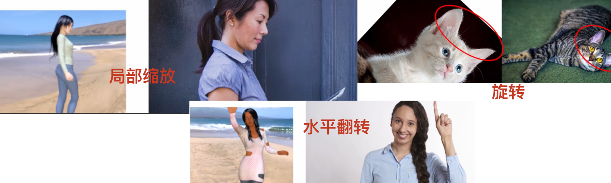

### **一、 图像增强的基本概念**

1. **定义和目标**：
    - 图像增强通过处理图像，改善其视觉效果或便于后续分析。
    - 目标包括提高图像的清晰度、对比度，突出特定区域或特征，以及去除噪声等。
    
2. 数据增强 Data Augment：
	- 在不增加数据规模的情况下，通过对数据增强，来减少训练数据的过度拟合
	- 对原始数据进行一定的变换 和 合成， 提高训练模型的健壮性。
	- 数据增强很花费 CPU/GPU，可能会导致训练很慢
	
3. **图像增强的类型**：
    - **空间域增强**：直接在像素级别上进行操作，如灰度变换、滤波等。
    - **频率域增强**：在图像的频率域中进行操作，如使用傅里叶变换进行滤波。

### **二、 空间域图像增强技术**

1. **亮度/对比度调整**：
    
    - 线性变换（如灰度窗口、整体对比度拉伸）。
    - 非线性变换（如对数变换、伽马校正）。
    - 直方图调整（如直方图均衡化、直方图规定化）。
2. **滤波技术**：
    - **平滑滤波**：去除噪声，如均值滤波、中值滤波、高斯滤波。
    - **锐化滤波**：增强图像的边缘和细节，如拉普拉斯算子、索贝尔算子、unsharp masking（拉普拉斯锐化）。
3. **形态学操作**：
    - 基于集合论的图像处理技术，如腐蚀、膨胀、开运算、闭运算。
    - 应用：去除小对象、分割、骨架提取等。

### **三、 频率域图像增强技术**

1. **傅里叶变换**：
    
    - 将图像从空间域转换到频率域。
    - 频率域中的操作：低通滤波、高通滤波、带通滤波。
2. **滤波器设计**：
    
    - 理想滤波器、巴特沃斯滤波器、切比雪夫滤波器。
    - 频率域滤波的应用：去除周期性噪声、增强特定频率成分。

### **四、 图像增强的应用**

1. **预处理阶段**：
    
    - 在目标检测、图像分割、特征提取等任务之前进行。
    - 提高后续算法的性能和鲁棒性。
2. **特定应用场景**：
    
    - 医学图像增强：突出血管、病灶等。
    - 遥感图像增强：提高地物的区分度，如植被、水体等。
    - 自动驾驶：增强道路、交通标志等特征，提高感知系统性能。

### **五、 图像增强的评估**

1. **主观评价**：
    
    - 人眼观察图像的直观感受。
    - 常用于初步筛选和比较不同的增强方法。
2. **客观评价**：
    
    - 基于图像质量指标，如峰值信噪比（PSNR）、结构相似性（SSIM）。
    - 需要建立标准图像与处理后的图像进行比较。

### **六、 图像增强的最新进展**

1. **基于深度学习的图像增强**：
    
    - 使用卷积神经网络（CNN）进行端到端的图像增强。
    - 应用：超分辨率、去噪、风格迁移等。
2. **自适应增强技术**：
    
    - 根据图像的局部特性调整增强参数。
    - 提高增强效果的全局性和一致性。