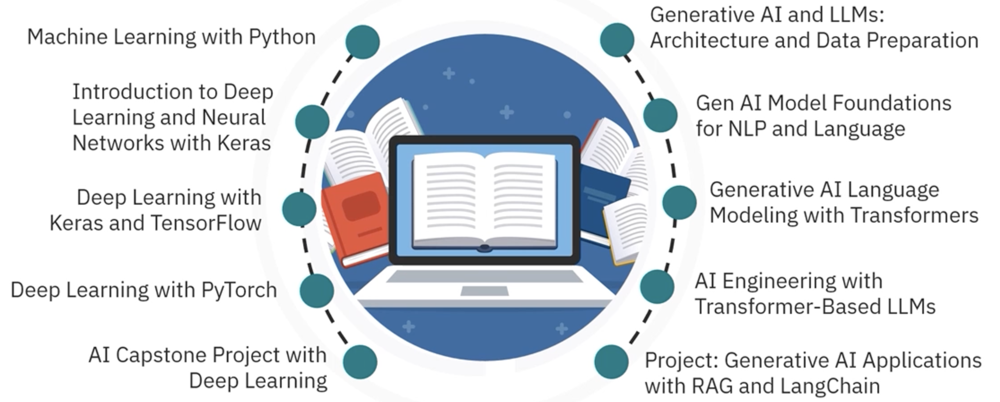

## 课程列表

IBM AI工程师专业证书课程列表：

**[IBM AI Engineering Professional Certificate](https://www.coursera.org/professional-certificates/ai-engineer#courses)**

1. [Machine Learning with Python](https://www.coursera.org/learn/machine-learning-with-python?specialization=ai-engineer)
	- 课程笔记：[IBM-1-Machine Learning with Python](../IBM-AI-Engineer-Course/IBM-1-Machine%20Learning%20with%20Python.md)
	- 核心知识：
		- [2.1 机器学习概述](2.1%20%E6%9C%BA%E5%99%A8%E5%AD%A6%E4%B9%A0%E6%A6%82%E8%BF%B0)
		- [2.2 机器学习的分类](2.2%20%E6%9C%BA%E5%99%A8%E5%AD%A6%E4%B9%A0%E7%9A%84%E5%88%86%E7%B1%BB)
		- [2.5 回归和分类](2.5%20%E5%9B%9E%E5%BD%92%E5%92%8C%E5%88%86%E7%B1%BB)
		- [2.6 聚类和降维](2.6%20%E8%81%9A%E7%B1%BB%E5%92%8C%E9%99%8D%E7%BB%B4)
		- [2.x 模型评估与调优](2.x%20%E6%A8%A1%E5%9E%8B%E8%AF%84%E4%BC%B0%E4%B8%8E%E8%B0%83%E4%BC%98)
	- 内容总结：
		- 机器学习生命周期阶段
		- 机器学习分类和模型
		- 偏差-方差权衡以优化模型性能。
		- 使用指标、交叉验证和超参数调整来评估模型性能
	
2. [DL and NN With Keras](https://www.coursera.org/learn/introduction-to-deep-learning-with-keras?specialization=ai-engineer)
	- 课程笔记：[IBM-2-DL and NN with Keras](../IBM-AI-Engineer-Course/IBM-2-DL%20and%20NN%20with%20Keras.md)
	- 核心知识：
		- [3.1 神经元和神经网络](3.1%20%E7%A5%9E%E7%BB%8F%E5%85%83%E5%92%8C%E7%A5%9E%E7%BB%8F%E7%BD%91%E7%BB%9C)
	- 内容总结：
		- 深度学习基础
		- 神经元和神经网络
		- 深度学习模型
			- CNN
			- RNN
			- Transformer
			- Autocoder
3. [Deep Learning with Keras and Tensorflow](https://www.coursera.org/learn/building-deep-learning-models-with-tensorflow?specialization=ai-engineer)
	- 课堂笔记：[IBM-3-DL with Keras and Tensorflow](../IBM-AI-Engineer-Course/IBM-3-DL%20with%20Keras%20and%20Tensorflow.md)
	- 内容总结：
		- Custom Layers and Models
		- 数据增强
		- 迁移学习
		- Transpose Convolution
		- Transformers for text generation
		- Autoencoders
		- Diffusion models
		- GANs
		- Custom Training Loops
		- 超参数调优
		- Q-Learning
		- Deep Q-Network
4. [Neural Network and PyTorch](https://www.coursera.org/learn/deep-neural-networks-with-pytorch/)
	- 课程笔记：[IBM-4-Neural Network and PyTorch](../IBM-AI-Engineer-Course/IBM-4-Neural%20Network%20and%20PyTorch.md)
5. [Deep Learning with PyTorch](https://www.coursera.org/learn/advanced-deep-learning-with-pytorch?specialization=ai-engineer)
6. [AI Capstone Project with Deep Learning](https://www.coursera.org/learn/ai-deep-learning-capstone?specialization=ai-engineerr)
7. [Generative AI and LLMs: Architecture and Data Preparation](https://www.coursera.org/learn/generative-ai-llm-architecture-data-preparation?specialization=ai-engineer)
8. [Gen AI Model Foundations for NLP & Language Understanding](https://www.coursera.org/learn/gen-ai-foundational-models-for-nlp-and-language-understanding?specialization=ai-engineer)

9. [Generative AI Language Modeling with Transformers](https://www.coursera.org/learn/generative-ai-language-modeling-with-transformers?specialization=ai-engineer)

10. [Generative AI Engineering and Fine-Tuning Transformers](https://www.coursera.org/learn/generative-ai-engineering-and-fine-tuning-transformers?specialization=ai-engineer)

11. [Generative AI Advance Fine-Tuning for LLMs](https://www.coursera.org/learn/generative-ai-advanced-fine-tuning-for-llms?specialization=ai-engineer)

12. [Fundamentals of Building AI Agents using RAG and LangChain](https://www.coursera.org/learn/fundamentals-of-ai-agents-using-rag-and-langchain?specialization=ai-engineer)

13. [Project: Generative AI with RAG and LangChain](https://www.coursera.org/learn/project-generative-ai-applications-with-rag-and-langchain?specialization=ai-engineer)

> 注：以上所有内容，已被整理到各级目录知识中。IBM-n开头的文档只摘录每节课的Summary。

## 参考资料

- [【2025版】这绝对是B站最好的Pytorch天花板教程，从入门到实战，通俗易懂，一套解决Pytorch框架所有问题！深度学习/人工智能/神经网络_哔哩哔哩_bilibili](https://www.bilibili.com/video/BV1JLPaeoE4L/?spm_id_from=333.337.search-card.all.click&vd_source=d2c6cad4e8b48a4a5ab3df7cb838685b)
- [PyTorch documentation — PyTorch 2.6 documentation](https://pytorch.org/docs/stable/index.html)

