## 🌟Course Introduction 🌟


### Pre-requisites
- Pandas
- NumPy
- Data preparation and data analysis with python

### What you will learn?
<<<<<<<< HEAD:IBM-AI-Engineer-Course/IBM- 1 - Machine Learning with Python.md

=====<font style="background-color:tomato; color:black">
>>>>>>>> origin/obsidian:IBM-AI-Engineer-Course/IBM-1-Machine Learning with Python.md

- Multiple linear regression
- Logistic regression
- Prediction
- Fraud Detection
- KNN and SVM

## M1:  ML Concepts

> Foundational machine learning concepts to delve deeper into applied machine learning modeling.


### Machine Learning

#### ML and DL 

Machine Learning :
- Using Algorithms
- Require Feature Engineering

Deep Learning:
- Using Multi-Layer Neural Network
- Automatically extract features

#### How machine learning work?

Teach computers to :
- learn from data
- identify patterns
- make decisions

Algorithms:
- Use computational methods for learning
- doesn't rely on a fixed algorithm

#### ML Paradigms

- **supervised learning models** :  train on labeled data 
- **unsupervised learning**:  works without labels.
- **semi-supervised learning**: works iteratively
- **reinforcement learning**: learns from feedback


### ML Techniques

<<<<<<<< HEAD:IBM-AI-Engineer-Course/IBM- 1 - Machine Learning with Python.md

</font>==<font style="background-color:tomato; color:black">
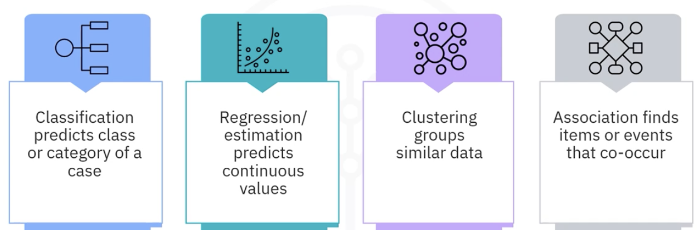
>>>>>>>> origin/obsidian:IBM-AI-Engineer-Course/IBM-1-Machine Learning with Python.md

- **classification**： predicts class or category of a case.
- **regression**:  predicts *continuous* values
- **clustering**： groups similar data
- **association**： finds items or events that co-occur
- **anomaly detection**: discovers abnormal and unusual cases
- **sequence mining**: predicts next event from ordered data
- **dimension reduction**: reduces size of data
- **recommendation systems** : associate people's preferences.

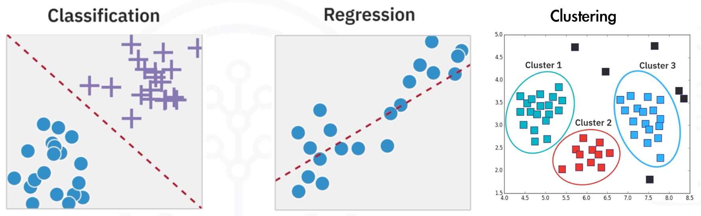

### Applications of ML

<<<<<<<< HEAD:IBM-AI-Engineer-Course/IBM- 1 - Machine Learning with Python.md

</font>==<font style="background-color:tomato; color:black">

>>>>>>>> origin/obsidian:IBM-AI-Engineer-Course/IBM-1-Machine Learning with Python.md

#### Image Recognition with ML

> **Data**: Images of cats and dogs
> **Traditional Programming**: create rules to detect the animals
> **ML**: build a model to infer the animal type

<<<<<<<< HEAD:IBM-AI-Engineer-Course/IBM- 1 - Machine Learning with Python.md


#### Pairing ML with human intelligence


</font>==<font style="background-color:tomato; color:black">
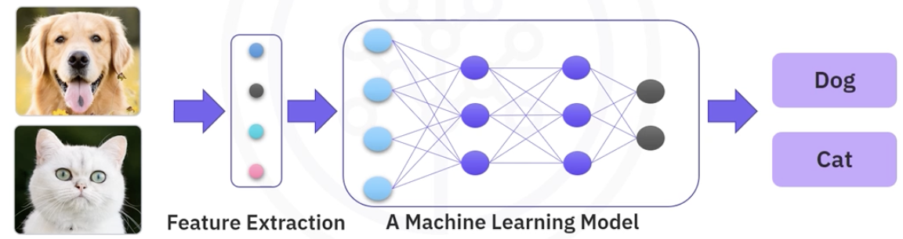

#### Pairing ML with human intelligence

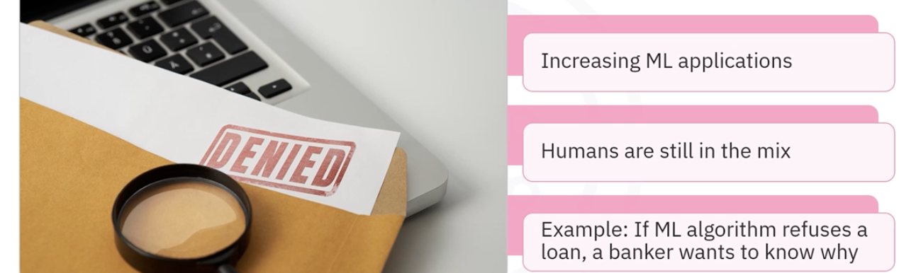
>>>>>>>> origin/obsidian:IBM-AI-Engineer-Course/IBM-1-Machine Learning with Python.md

- chatbot
- face recognition
- computer games

### Machine Learning Model Lifecycle

#### Processes of the lifecycle

- **🔍 Problem Definition**  
- **📊 Data Collection**  
- **🧹 Data Preparation**  
	- clean data
	- **Explore data analysis**
	- **Train-Test Split**
- **🤖 Model Development**  
	- explore existing frameworks
	- **content-based filtering** : focus on similarities between **product features**
	- **collaborative filtering**: recommend -->
		- **similar users** target item
		- **similar items** to users who buy target item
		- 查看详细内容： [推荐系统](../9-RecommendSystem/%E6%8E%A8%E8%8D%90%E7%B3%BB%E7%BB%9F.md) 
- ✅ **Model Evaluation**
- **🚀 Model Deployment**

### Tools for ML

<<<<<<<< HEAD:IBM-AI-Engineer-Course/IBM- 1 - Machine Learning with Python.md

</font>==<font style="background-color:tomato; color:black">
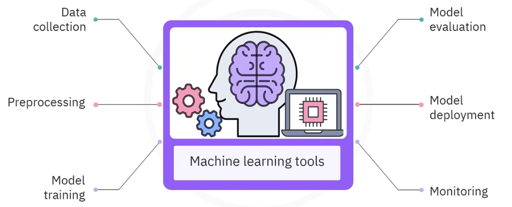
>>>>>>>> origin/obsidian:IBM-AI-Engineer-Course/IBM-1-Machine Learning with Python.md

#### Data

Data is a collection of:
-  raw facts
- figures
- information
used to draw insights, inform decisions, and fuel advanced technologies.
#### Common Languages for ML

- Python
	- analyzing and processing data
	- developing ML models
- R:
	- statistical learning
	- data exploration and ML
- Julia: parallel and distributed numerical computing support
- Scala： Processing big data and building ML pipelines
- Java： Support Scalable ML applications
- JavaScript: Running ML models in web browsers

#### Diff. types of ML tools

- Data processing and analytics
	- PostgreSQL 
	- Hadoop
	- Spark
	- Kafka
	- **Pandas**: Data manipulation and analysis
	- **NumPy**: Fast numerical computation on arrays and matrices.
- Data Visualization
	- Matplotlib
	- Seaborn
	- ggplot2
	- Tableau
- Shallow Machine Learning
	- **scipy**: computing for optimization, integration and linear regression
	- **scikit-learn**: suite of classification, regression, clustering and dimensionality reduction
- Deep Learning
	- TensorFlow
	- Keras
	- Theano
	- PyTorch
- Computer Vision Application
	- OpenCV: real-time computer vision applications
	- Scikit-image: image processing algorithms
	- TorchVision: 
- Natural Language Processing
	- **NLTK**: text processing, tokenization, and stemming
	- TextBlob: part-of-speech tagging, noun phrase extraction, sentiment analysis, and translation
	- Stanza: pre-trained models for tasks such as NER and dependency parsing
- Generative AI tools
	- Hugging face transformers
	- DALL-E
	- PyTorch

### Sciki-Learn Library

- Free ML library for python
- Classification, Regression, Clustering, and Dimensionality reduction algorithms
- Designed to work with NumPy and SciPy
- Excellent documentation and community support
- Constantly evolving
- Enables easy implementation of ML models

#### Machine Learning pipeline tasks
<<<<<<<< HEAD:IBM-AI-Engineer-Course/IBM- 1 - Machine Learning with Python.md

</font>=====
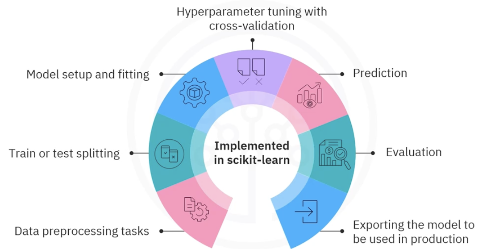
>>>>>>>> origin/obsidian:IBM-AI-Engineer-Course/IBM-1-Machine Learning with Python.md

#### Sk Learn Demo

- 标准化（Standardization）：
把特征转换成 **均值为 0，标准差为 1** 的分布，也叫 **Z-score 标准化**。
```python
import numpy as np  
from sklearn.preprocessing import StandardScaler

X = np.array([[1], [2], [3], [4], [5]])
X_scaled = StandardScaler().fit_transform(X)  
```
计算公式如下：
$$
X_{\text{scaled}} = \frac{X - \mu}{\sigma} , \mu 平均值，\sigma 为方差
$$
- 模型训练
线性回归 预测y=2x
```python
from sklearn.linear_model import LinearRegression  
import numpy as np  
  
# 训练数据  
X = np.array([[1], [2], [3], [4], [5]])  # 输入特征，必须是二维数组  
y = np.array([2, 4, 6, 8, 10])           # 标签（目标值）  
  
# 创建模型并训练  
model = LinearRegression()  
model.fit(X, y)  
# 使用模型进行预测  
y_pred = model.predict(np.array([[6], [7]])  )
```

### Module 1 Summary
- Artificial intelligence (AI) simulates human cognition, while machine learning (ML) uses algorithms and requires feature engineering to learn from data.
    
- Machine learning includes different types of models: supervised learning, which uses labeled data to make predictions; unsupervised learning, which finds patterns in unlabeled data; and semi-supervised learning, which trains on a small subset of labeled data.
    
- Key factors for choosing a machine learning technique include the type of problem to be solved, the available data, available resources, and the desired outcome.
    
- Machine learning techniques include anomaly detection for identifying unusual cases like fraud, classification for categorizing new data, regression for predicting continuous values, and clustering for grouping similar data points without labels.
    
- Machine learning tools support pipelines with modules for data preprocessing, model building, evaluation, optimization, and deployment.
    
- R is commonly used in machine learning for statistical analysis and data exploration, while Python offers a vast array of libraries for different machine learning tasks. Other programming languages used in ML include Julia, Scala, Java, and JavaScript, each suited to specific applications like high-performance computing and web-based ML models.
    
- Data visualization tools such as Matplotlib and Seaborn create customizable plots, ggplot2 enables building graphics in layers, and Tableau provides interactive data dashboards.
    
- Python libraries commonly used in machine learning include NumPy for numerical computations, Pandas for data analysis and preparation, SciPy for scientific computing, and Scikit-learn for building traditional machine learning models.
    
- Deep learning frameworks such as TensorFlow, Keras, Theano, and PyTorch support the design, training, and testing of neural networks used in areas like computer vision and natural language processing.
    
- Computer vision tools enable applications like object detection, image classification, and facial recognition, while natural language processing (NLP) tools like NLTK, TextBlob, and Stanza facilitate text processing, sentiment analysis, and language parsing.
    
- Generative AI tools use artificial intelligence to create new content, including text, images, music, and other media, based on input data or prompts.
    
- Scikit-learn provides a range of functions, including classification, regression, clustering, data preprocessing, model evaluation, and exporting models for production use.
    
- The machine learning ecosystem includes a network of tools, frameworks, libraries, platforms, and processes that collectively support the development and management of machine learning models.

## M2: Linear and Logistic Regression

>2 classical statistical methods:
> - linear regression
> - logistic regression

[[2.5 回归和分类]]

Regression is a statistical method used to model the **relationship** between a continuous input **variable**  and explanatory **features**.

a type of supervised learning model
<<<<<<<< HEAD:IBM-AI-Engineer-Course/IBM- 1 - Machine Learning with Python.md

</font>==<font style="background-color:tomato; color:black">
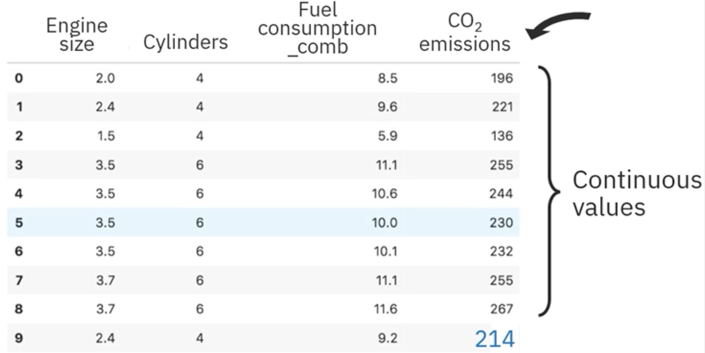
>>>>>>>> origin/obsidian:IBM-AI-Engineer-Course/IBM-1-Machine Learning with Python.md
### Regression algorithms

- Linear and polynomial 
- nonlinear regression
	- Random forest
	- Extreme Gradient Boosting (XGBoost)
	- K-nearest neighbors (KNN)
	- Support Vector machines (SVM)
	- Neural network


### Applications of Regression

- sales forecasting
- price estimating
- predictive maintenance
- employment income
- rainfall estimation
- wildfire probability and severity
- spread of infectious disease
- risk of chronic disease


### Type of Regression
- simple regression
	- simple linear regression
	- simple nonlinear regression
- multiple regression
	- multiple linear regression
	- multiple nonlinear regression

#### Simple Linear Regression
[SimpleLinearRegression-Jupyter Lab](jupyter-demo/IBM-1-2-1-SimpleLinearRegression.ipynb)
<<<<<<<< HEAD:IBM-AI-Engineer-Course/IBM- 1 - Machine Learning with Python.md

</font>=====
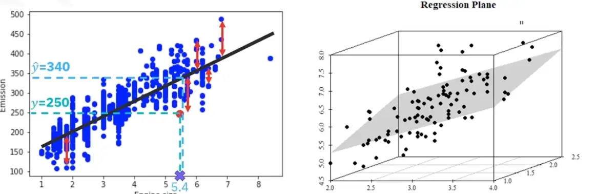
>>>>>>>> origin/obsidian:IBM-AI-Engineer-Course/IBM-1-Machine Learning with Python.md
predict a continuous value
- the Best Fit
find the <font style="background-color:tomato; color:black">regression line</font> or hyperplane that best describe the relationship between X and Y.  

#### OLS Regression 

 **Sum of Squared Residuals, SSR**
$$\text{SSR} = \sum_{i=1}^{n} (y_i - \hat{y}_i)^2$$

- easy to understand and interpret
- the method doesn't require any tuning
- solution just a calculation
- accuracy can be greatly reduced by outliers

#### Multiple Linear Regression
[MultipleLinearRegression-Jupyter Lab](jupyter-demo/IBM-1-2-2-MultipleLinearRegression.ipynb)


Features:
- better than simple linear regression
- too many variables can cause overfitting
- To improve prediction, convert categorical independent vars into numerical vars

Application:
- used in education to predict outcomes and explain relationships
- used to predict the impact of changes in "what-if" scenarios

<font style="background-color:orange; color:black">correlation pitfalls</font>
- remove redundant variables
- select vars which are :
	- most understood
	- controllable
	- most correlated with target

Fitting a <font style="background-color:tomato; color:black">hyperplane</font>


<font style="background-color:tomato; color:black">Least Squares Solution</font>
is usually the best solution for standard linear regression.

#### Nonlinear Regression
<<<<<<<< HEAD:IBM-AI-Engineer-Course/IBM- 1 - Machine Learning with Python.md

=====<font style="background-color:tomato; color:black">
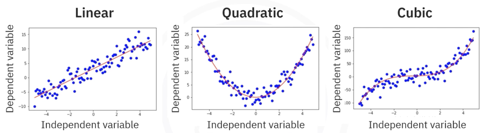
>>>>>>>> origin/obsidian:IBM-AI-Engineer-Course/IBM-1-Machine Learning with Python.md
Features：
- Represented by a nonlinear equation
	- polynomial
	- exponential
	- logarithmic
	- nonlinear function
	- periodicity

### logistic regression

- sigmoid 
- cross-entropy
- decision boundary
- stochastic gradient descent SGD
- log-loss
- threshold probability

<<<<<<<< HEAD:IBM-AI-Engineer-Course/IBM- 1 - Machine Learning with Python.md

</font>=====
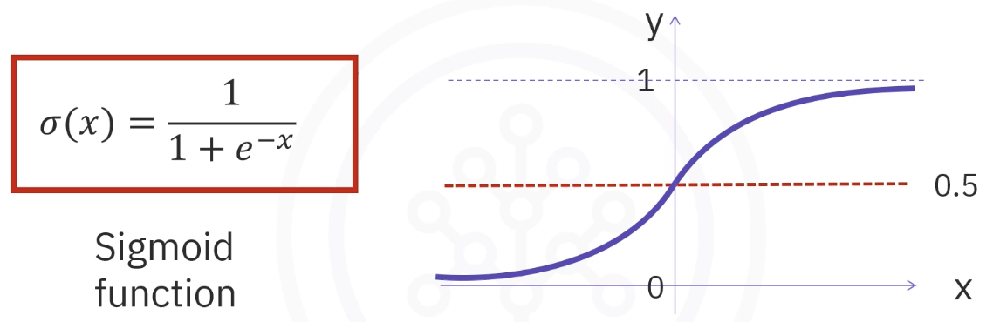
>>>>>>>> origin/obsidian:IBM-AI-Engineer-Course/IBM-1-Machine Learning with Python.md


### Module 2 Summary
- Regression models relationships between a continuous target variable and explanatory features, covering simple and multiple regression types.
    
- Simple regression uses a single independent variable to estimate a dependent variable, while multiple regression involves more than one independent variable.
    
- Regression is widely applicable, from forecasting sales and estimating maintenance costs to predicting rainfall and disease spread.
    
- In simple linear regression, a best-fit line minimizes errors, measured by Mean Squared Error (MSE); this approach is known as Ordinary Least Squares (OLS).
    
- OLS regression is easy to interpret but sensitive to outliers, which can impact accuracy.
    
- Multiple linear regression extends simple linear regression by using multiple variables to predict outcomes and analyze variable relationships.
    
- Adding too many variables can lead to overfitting, so careful variable selection is necessary to build a balanced model.
    
- Nonlinear regression models complex relationships using polynomial, exponential, or logarithmic functions when data does not fit a straight line.
    
- Polynomial regression can fit data but mayoverfit by capturing random noise rather than underlying patterns.
    
- Logistic regression is a probability predictor and binary classifier, suitable for binary targets and assessing feature impact.
    
- Logistic regression minimizes errors using log-loss and optimizes with gradient descent or stochastic gradient descent for efficiency.
    
- Gradient descent is an iterative process to minimize the cost function, which is crucial for training logistic regression models.

### Cheat Sheet
#### Comparing different regression types

|Model Name|Description|Code Syntax|
|---|---|---|
|Simple linear regression|**Purpose:** To predict a dependent variable based on one independent variable.  <br>**Pros:** Easy to implement, interpret, and efficient for small datasets.  <br>**Cons:** Not suitable for complex relationships; prone to underfitting.  <br>**Modeling equation:** y = b0 + b1x|1. `from sklearn.linear_model import LinearRegression`<br>2. `model = LinearRegression()`<br>3. `model.fit(X, y)`|
|Polynomial regression|**Purpose:** To capture nonlinear relationships between variables.  <br>**Pros:** Better at fitting nonlinear data compared to linear regression.  <br>**Cons:** Prone to overfitting with high-degree polynomials.  <br>**Modeling equation:** y = b0 + b1x + b2x2 + ...|1. `from sklearn.preprocessing import PolynomialFeatures`<br>2. `from sklearn.linear_model import LinearRegression`<br>3. `poly = PolynomialFeatures(degree=2)`<br>4. `X_poly = poly.fit_transform(X)`<br>5. `model = LinearRegression().fit(X_poly, y)`|
|Multiple linear regression|**Purpose:** To predict a dependent variable based on multiple independent variables.  <br>**Pros:** Accounts for multiple factors influencing the outcome.  <br>**Cons:** Assumes a linear relationship between predictors and target.  <br>**Modeling equation:** y = b0 + b1x1 + b2x2 + ...|1. `from sklearn.linear_model import LinearRegression`<br>2. `model = LinearRegression()`<br>3. `model.fit(X, y)`|
|Logistic regression|**Purpose:** To predict probabilities of categorical outcomes.  <br>**Pros:** Efficient for binary classification problems.  <br>**Cons:** Assumes a linear relationship between independent variables and log-odds.  <br>**Modeling equation:** log(p/(1-p)) = b0 + b1x1 + ...|1. `from sklearn.linear_model import LogisticRegression`<br>2. `model = LogisticRegression()`<br>3. `model.fit(X, y)`|

#### Associated functions commonly used

|Function/Method Name|Brief Description|Code Syntax|
|---|---|---|
|train_test_split|Splits the dataset into training and testing subsets to evaluate the model's performance.|1. `from sklearn.model_selection import train_test_split`<br>2. `X_train, X_test, y_train, y_test = train_test_split(X, y, test_size=0.2, random_state=42)`|
|StandardScaler|Standardizes features by removing the mean and scaling to unit variance.|1. `from sklearn.preprocessing import StandardScaler`<br>2. `scaler = StandardScaler()`<br>3. `X_scaled = scaler.fit_transform(X)`|
|log_loss|Calculates the logarithmic loss, a performance metric for classification models.|1. `from sklearn.metrics import log_loss`<br>2. `loss = log_loss(y_true, y_pred_proba)`|
|mean_absolute_error|Calculates the mean absolute error between actual and predicted values.|1. `from sklearn.metrics import mean_absolute_error`<br>2. `mae = mean_absolute_error(y_true, y_pred)`|
|mean_squared_error|Computes the mean squared error between actual and predicted values.|1. `from sklearn.metrics import mean_squared_error`<br>2. `mse = mean_squared_error(y_true, y_pred)`|
|root_mean_squared_error|Calculates the root mean squared error (RMSE), a commonly used metric for regression tasks.|1. `from sklearn.metrics import mean_squared_error`<br>2. `import numpy as np`<br>3. `rmse = np.sqrt(mean_squared_error(y_true, y_pred))`|
|r2_score|Computes the R-squared value, indicating how well the model explains the variability of the target variable.|1. `from sklearn.metrics import r2_score`<br>2. `r2 = r2_score(y_true, y_pred)`|

## M3: Building Supervised Learning Models

### Basics
#### Classification
<<<<<<<< HEAD:IBM-AI-Engineer-Course/IBM- 1 - Machine Learning with Python.md

=====<font style="background-color:tomato; color:black">
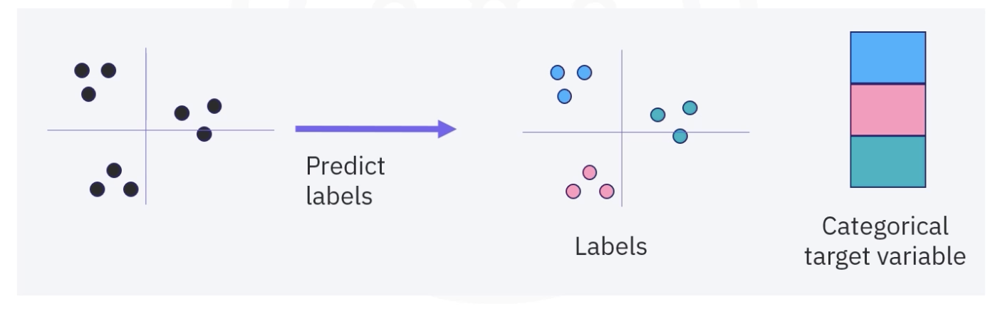
>>>>>>>> origin/obsidian:IBM-AI-Engineer-Course/IBM-1-Machine Learning with Python.md


#### Application of Classification
- problems expressed as associations between feature and target variables
- used to build apps for 
	- email filtering
	- speech-to-text
	- handwriting recognition
	- biometric identification
- Customer Service
	- churn prediction
	- customer segmentation
	- advertising ： predict if a customer will respond to a campign

#### Classification Algorithms
- Naive Bayes
- Logistic Regression
- Decision Trees
- K-nearest neighbors
- Support Vector Machines (SVM)
- Neural networks

#### Multi-class classification

- One-Versus-All 
- one-versus-one


### Type of Classification Algorithm

#### Decision Trees
- Classification Tree
- Regression Tree

#### Support Vector Machine SVM
<<<<<<<< HEAD:IBM-AI-Engineer-Course/IBM- 1 - Machine Learning with Python.md

</font>=====
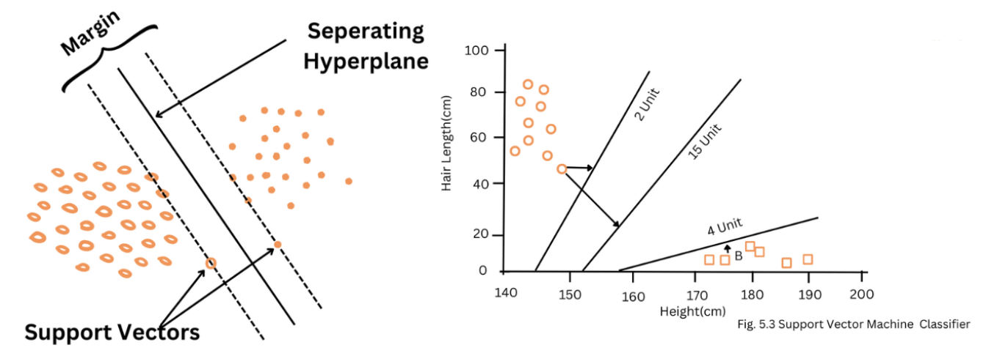
>>>>>>>> origin/obsidian:IBM-AI-Engineer-Course/IBM-1-Machine Learning with Python.md

### K-Nearest Neighbors
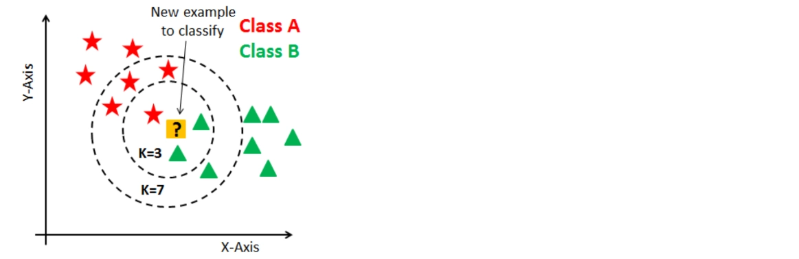

### Ensemble Models
####  Random Forest
#### XGBoost

### Module 3 Summary

- Classification is a supervised machine learning method used to predict labels on new data with applications in churn prediction, customer segmentation, loan default prediction, and multiclass drug prescriptions.
    
- Binary classifiers can be extended to multiclass classification using one-versus-all or one-versus-one strategies.
    
- A decision tree classifies data by testing features at each node, branching based on test results, and assigning classes at leaf nodes.
    
- Decision tree training involves selecting features that best split the data and pruning the tree to avoid overfitting.
    
- Information gain and Gini impurity are used to measure the quality of splits in decision trees.
    
- Regression trees are similar to decision trees but predict continuous values by recursively splitting data to maximize information gain.
    
- Mean Squared Error (MSE) is used to measure split quality in regression trees.
    
- K-Nearest Neighbors (k-NN) is a supervised algorithm used for classification and regression by assigning labels based on the closest labeled data points.
    
- To optimize k-NN, test various k values and measure accuracy, considering class distribution and feature relevance.
    
- Support Vector Machines (SVM) build classifiers by finding a hyperplane that maximizes the margin between two classes, effective in high-dimensional spaces but sensitive to noise and large datasets.
    
- The bias-variance tradeoff affects model accuracy, and methods such as bagging, boosting, and random forests help manage bias and variance to improve model performance.
    
- Random forests use bagging to train multiple decision trees on bootstrapped data, improving accuracy by reducing variance.

### Cheat Sheet: Building Supervised Learning Models

|Process Name|Brief Description|Code Syntax|
|---|---|---|
|One vs One classifier (using logistic regression)|**Process:** This method trains one classifier for each pair of classes.  <br>**Key hyperparameters:**  <br>- `estimator`: Base classifier (e.g., logistic regression)  <br>**Pros:** Can work well for small datasets.  <br>**Cons:** Computationally expensive for large datasets.  <br>**Common applications:** Multiclass classification problems where the number of classes is relatively small.|1. from sklearn.multiclass import OneVsOneClassifier  <br>    <br>2. from sklearn.linear_model import LogisticRegression  <br>    <br>3. model = OneVsOneClassifier(LogisticRegression())|
|One vs All classifier (using logistic regression)|**Process:** Trains one classifier per class, where each classifier distinguishes between one class and the rest.  <br>**Key hyperparameters:**  <br>- `estimator`: Base classifier (e.g., Logistic Regression)  <br>- `multi_class`: Strategy to handle multiclass classification (`ovr`)  <br>**Pros:** Simpler and more scalable than One vs One.  <br>**Cons:** Less accurate for highly imbalanced classes.  <br>**Common applications:** Common in multiclass classification problems such as image classification.|1. from sklearn.multiclass import OneVsRestClassifier  <br>    <br>2. from sklearn.linear_model import LogisticRegression  <br>    <br>3. model = OneVsRestClassifier(LogisticRegression())<br><br>          <br><br>        <br><br>or<br><br>1. from sklearn.linear_model import LogisticRegression  <br>    <br>2. model_ova = LogisticRegression(multi_class='ovr')|
|Decision tree classifier|**Process:** A tree-based classifier that splits data into smaller subsets based on feature values.  <br>**Key hyperparameters:**  <br>- `max_depth`: Maximum depth of the tree  <br>**Pros:** Easy to interpret and visualize.  <br>**Cons:** Prone to overfitting if not pruned properly.  <br>**Common applications:** Classification tasks, such as credit risk assessment.|1. from sklearn.tree import DecisionTreeClassifier  <br>    <br>2. model = DecisionTreeClassifier(max_depth=5)|
|Decision tree regressor|**Process:** Similar to the decision tree classifier, but used for regression tasks to predict continuous values.  <br>**Key hyperparameters:**  <br>- `max_depth`: Maximum depth of the tree  <br>**Pros:** Easy to interpret, handles nonlinear data.  <br>**Cons:** Can overfit and perform poorly on noisy data.  <br>**Common applications:** Regression tasks, such as predicting housing prices.|1. from sklearn.tree import DecisionTreeRegressor  <br>    <br>2. model = DecisionTreeRegressor(max_depth=5)|
|Linear SVM classifier|**Process:** A linear classifier that finds the optimal hyperplane separating classes with a maximum margin.  <br>**Key hyperparameters:**  <br>- `C`: Regularization parameter  <br>- `kernel`: Type of kernel function (`linear`, `poly`, `rbf`, etc.)  <br>- `gamma`: Kernel coefficient (only for `rbf`, `poly`, etc.)  <br>**Pros:** Effective for high-dimensional spaces.  <br>**Cons:** Not ideal for nonlinear problems without kernel tricks.  <br>**Common applications:** Text classification and image recognition.|1. from sklearn.svm import SVC  <br>    <br>2. model = SVC(kernel='linear', C=1.0)|
|K-nearest neighbors classifier|**Process:** Classifies data based on the majority class of its nearest neighbors.  <br>**Key hyperparameters:**  <br>- `n_neighbors`: Number of neighbors to use  <br>- `weights`: Weight function used in prediction (`uniform` or `distance`)  <br>- `algorithm`: Algorithm used to compute the nearest neighbors (`auto`, `ball_tree`, `kd_tree`, `brute`)  <br>**Pros:** Simple and effective for small datasets.  <br>**Cons:** Computationally expensive as the dataset grows.  <br>**Common applications:** Recommendation systems, image recognition.|1. from sklearn.neighbors import KNeighborsClassifier  <br>    <br>2. model = KNeighborsClassifier(n_neighbors=5, weights='uniform')|
|Random Forest regressor|**Process:** An ensemble method using multiple decision trees to improve accuracy and reduce overfitting.  <br>**Key hyperparameters:**  <br>- `n_estimators`: Number of trees in the forest  <br>- `max_depth`: Maximum depth of each tree  <br>**Pros:** Less prone to overfitting than individual decision trees.  <br>**Cons:** Model complexity increases with the number of trees.  <br>**Common applications:** Regression tasks such as predicting sales or stock prices.|1. from sklearn.ensemble import RandomForestRegressor  <br>    <br>2. model = RandomForestRegressor(n_estimators=100, max_depth=5)|
|XGBoost regressor|**Process:** A gradient boosting method that builds trees sequentially to correct errors from previous trees.  <br>**Key hyperparameters:**  <br>- `n_estimators`: Number of boosting rounds  <br>- `learning_rate`: Step size to improve accuracy  <br>- `max_depth`: Maximum depth of each tree  <br>**Pros:** High accuracy and works well with large datasets.  <br>**Cons:** Computationally intensive, complex to tune.  <br>**Common applications:** Predictive modeling, especially in Kaggle competitions.|1. import xgboost as xgb  <br>    <br>2. model = xgb.XGBRegressor(n_estimators=100, learning_rate=0.1, max_depth=5)|


|Method Name|Brief Description|Code Syntax|
|---|---|---|
|OneHotEncoder|Transforms categorical features into a one-hot encoded matrix.|1. from sklearn.preprocessing import OneHotEncoder  <br>    <br>2. encoder = OneHotEncoder(sparse=False)  <br>    <br>3. encoded_data = encoder.fit_transform(categorical_data)|
|accuracy_score|Computes the accuracy of a classifier by comparing predicted and true labels.|1. from sklearn.metrics import accuracy_score  <br>    <br>2. accuracy = accuracy_score(y_true, y_pred)|
|LabelEncoder|Encodes labels (target variable) into numeric format.|1. from sklearn.preprocessing import LabelEncoder  <br>    <br>2. encoder = LabelEncoder()  <br>    <br>3. encoded_labels = encoder.fit_transform(labels)|
|plot_tree|Plots a decision tree model for visualization.|1. from sklearn.tree import plot_tree  <br>    <br>2. plot_tree(model, max_depth=3, filled=True)|
|normalize|Scales each feature to have zero mean and unit variance (standardization).|1. from sklearn.preprocessing import normalize  <br>    <br>2. normalized_data = normalize(data, norm='l2')|
|compute_sample_weight|Computes sample weights for imbalanced datasets.|1. from sklearn.utils.class_weight import compute_sample_weight  <br>    <br>2. weights = compute_sample_weight(class_weight='balanced', y=y)|
|roc_auc_score|Computes the Area Under the Receiver Operating Characteristic Curve (AUC-ROC) for binary classification models.|1. from sklearn.metrics import roc_auc_score  <br>    <br>2. auc = roc_auc_score(y_true, y_score)|

## M4: Building Unsupervised Learning Models

### Summary
- Clustering is a machine learning technique used to group data based on similarity, with applications in customer segmentation and anomaly detection.
    
- K-means clustering partitions data into clusters based on the distance between data points and centroids but struggles with imbalanced or non-convex clusters.
    
- Heuristic methods such as silhouette analysis, the elbow method, and the Davies-Bouldin Index help assess k-means performance.
    
- DBSCAN is a density-based algorithm that creates clusters based on density and works well with natural, irregular patterns.
    
- HDBSCAN is a variant of DBSCAN that does not require parameters and uses cluster stability to find clusters.
    
- Hierarchical clustering can be divisive (top-down) or agglomerative (bottom-up) and produces a dendrogram to visualize the cluster hierarchy.
    
- Dimension reduction simplifies data structure, improves clustering outcomes, and is useful in tasks such as face recognition (using eigenfaces).
    
- Clustering and dimension reduction work together to improve model performance by reducing noise and simplifying feature selection.
    
- PCA, a linear dimensionality reduction method, minimizes information loss while reducing dimensionality and noise in data.
    
- t-SNE and UMAP are other dimensionality reduction techniques that map high-dimensional data into lower-dimensional spaces for visualization and analysis.

### Cheat Sheet： Building Unsupervised Learning Models

#### Unsupervised learning models

|Model Name|Brief Description|Code Syntax|
|---|---|---|
|UMAP|UMAP (Uniform Manifold Approximation and Projection) is used for dimensionality reduction.  <br>**Pros:** High performance, preserves global structure.  <br>**Cons:** Sensitive to parameters.  <br>**Applications:** Data visualization, feature extraction.  <br>**Key hyperparameters:**<br><br>- **n_neighbors:** Controls the local neighborhood size (default = 15).<br>- **min_dist:** Controls the minimum distance between points in the embedded space (default = 0.1).<br>- **n_components:** The dimensionality of the embedding (default = 2).|1. from umap.umap_ import UMAP<br>2. umap = UMAP(n_neighbors=15, min_dist=0.1, n_components=2)|
|t-SNE|t-SNE (t-Distributed Stochastic Neighbor Embedding) is a nonlinear dimensionality reduction technique.  <br>**Pros:** Good for visualizing high-dimensional data.  <br>**Cons:** Computationally expensive, prone to overfitting.  <br>**Applications:** Data visualization, anomaly detection.  <br>**Key hyperparameters:**<br><br>- **n_components:** The number of dimensions for the output (default = 2).<br>- **perplexity:** Balances attention between local and global aspects of the data (default = 30).<br>- **learning_rate:** Controls the step size during optimization (default = 200).|1. from sklearn.manifold import TSNE<br>2. tsne = TSNE(n_components=2, perplexity=30, learning_rate=200)|
|PCA|PCA (principal component analysis) is used for linear dimensionality reduction.  <br>**Pros:** Easy to interpret, reduces noise.  <br>**Cons:** Linear, may lose information in nonlinear data.  <br>**Applications:** Feature extraction, compression.  <br>**Key hyperparameters:**<br><br>- **n_components:** Number of principal components to retain (default = 2).<br>- **whiten:** Whether to scale the components (default = False).<br>- **svd_solver:** The algorithm to compute the components (default = 'auto').|1. from sklearn.decomposition import PCA<br>2. pca = PCA(n_components=2)|
|DBSCAN|DBSCAN (Density-Based Spatial Clustering of Applications with Noise) is a density-based clustering algorithm.  <br>**Pros:** Identifies outliers, does not require the number of clusters.  <br>**Cons:** Difficult with varying density clusters.  <br>**Applications:** Anomaly detection, spatial data clustering.  <br>**Key hyperparameters:**<br><br>- **eps:** The maximum distance between two points to be considered neighbors (default = 0.5).<br>- **min_samples:** Minimum number of samples in a neighborhood to form a cluster (default = 5).|1. from sklearn.cluster import DBSCAN<br>2. dbscan = DBSCAN(eps=0.5, min_samples=5)|
|HDBSCAN|HDBSCAN (Hierarchical DBSCAN) improves on DBSCAN by handling varying density clusters.  <br>**Pros:** Better handling of varying densities.  <br>**Cons:** Can be slower than DBSCAN.  <br>**Applications:** Large datasets, complex clustering problems.  <br>**Key hyperparameters:**<br><br>- **min_cluster_size:** The minimum size of clusters (default = 5).<br>- **min_samples:** Minimum number of samples to form a cluster (default = 10).|1. import hdbscan<br>2. clusterer = hdbscan.HDBSCAN(min_cluster_size=5)|
|K-Means clustering|K-Means is a centroid-based clustering algorithm that groups data into k clusters.  <br>**Pros:** Efficient, simple to implement.  <br>**Cons:** Sensitive to initial cluster centroids.  <br>**Applications:** Customer segmentation, pattern recognition.  <br>**Key hyperparameters:**<br><br>- **n_clusters:** Number of clusters (default = 8).<br>- **init:** Method for initializing the centroids ('k-means++' or 'random', default = 'k-means++').<br>- **n_init:** Number of times the algorithm will run with different centroid seeds (default = 10).|1. from sklearn.cluster import KMeans<br>2. kmeans = KMeans(n_clusters=3)|

#### Associated fuctions used

|Method|Brief Description|Code Syntax|
|---|---|---|
|make_blobs|Generates isotropic Gaussian blobs for clustering.|1. from sklearn.datasets import make_blobs<br>2. X, y = make_blobs(n_samples=100, centers=2, random_state=42)|
|multivariate_normal|Generates samples from a multivariate normal distribution.|1. from numpy.random import multivariate_normal<br>2. samples = multivariate_normal(mean=[0, 0], cov=[[1, 0], [0, 1]], size=100)|
|plotly.express.scatter_3d|Creates a 3D scatter plot using Plotly Express.|1. import plotly.express as px<br>2. fig = px.scatter_3d(df, x='x', y='y', z='z')<br>3. fig.show()|
|geopandas.GeoDataFrame|Creates a GeoDataFrame from a Pandas DataFrame.|1. import geopandas as gpd<br>2. gdf = gpd.GeoDataFrame(df, geometry='geometry')|
|geopandas.to_crs|Transforms the coordinate reference system of a GeoDataFrame.|1. gdf = gdf.to_crs(epsg=3857)|
|contextily.add_basemap|Adds a basemap to a GeoDataFrame plot for context.|1. import contextily as ctx<br>2. ax = gdf.plot(figsize=(10, 10))<br>3. ctx.add_basemap(ax)|
|pca.explained_variance_ratio_|Returns the proportion of variance explained by each principal component.|1. from sklearn.decomposition import PCA<br>2. pca = PCA(n_components=2)<br>3. pca.fit(X)<br>4. variance_ratio = pca.explained_variance_ratio_|


## M5:  Evaluating and Validating Machine Learning Models

### Summary
- Supervised learning evaluation assesses a model's ability to predict outcomes for unseen data, often using a train/test split to estimate performance.
    
- Key metrics for classification evaluation include accuracy, confusion matrix, precision, recall, and the F1 score, which balances precision and recall.
    
- Regression model evaluation metrics include MAE, MSE, RMSE, R-squared, and explained variance to measure prediction accuracy.
    
- Unsupervised learning models are evaluated for pattern quality and consistency using metrics like Silhouette Score, Davies-Bouldin Index, and Adjusted Rand Index.
    
- Dimensionality reduction evaluation involves Explained Variance Ratio, Reconstruction Error, and Neighborhood Preservation to assess data structure retention.
    
- Model validation, including dividing data into training, validation, and test sets, helps prevent overfitting by tuning hyperparameters carefully.
    
- Cross-validation methods, especially K-fold and stratified cross-validation, support robust model validation without overfitting to test data.
    
- Regularization techniques, such as ridge (L2) and lasso (L1) regression, help prevent overfitting by adding penalty terms to linear regression models.
    
- Data leakage occurs when training data includes information unavailable in real-world data, which is preventable by separating data properly and mindful feature selection.
    
- Common modeling pitfalls include misinterpreting feature importance, ignoring class imbalance, and relying excessively on automated processes without causal analysis.
    
- Feature importance assessments should consider redundancy, scale sensitivity, and avoid misinterpretation, as well as inappropriate assumptions about causation.
    
### Cheat Sheet：Model evaluation metrics and methods

|Method Name|Description|Code Syntax|
|---|---|---|
|classification_report|Generates a report with precision, recall, F1-score, and support for each class in classification problems. Useful for model evaluation.  <br>**Hyperparameters**:  <br>target_names: List of labels to include in the report.  <br>**Pros**: Provides a comprehensive evaluation of classification models.  <br>**Limitations**: May not provide enough insight for imbalanced datasets.|1. from sklearn.metrics import classification_report<br>2. # y_true: True labels<br>3. # y_pred: Predicted labels<br>4. # target_names: List of target class names<br>5. report = classification_report(y_true, y_pred, target_names=["class1", "class2"])|
|confusion_matrix|Computes a confusion matrix to evaluate the classification performance, showing counts of true positives, false positives, true negatives, and false negatives.  <br>**Hyperparameters**:  <br>labels: List of class labels to include.  <br>**Pros**: Essential for understanding classification errors.  <br>**Limitations**: Doesn't give insights into prediction probabilities.|1. from sklearn.metrics import confusion_matrix<br>2. # y_true: True labels<br>3. # y_pred: Predicted labels<br>4. conf_matrix = confusion_matrix(y_true, y_pred)|
|mean_squared_error|Calculates the mean squared error (MSE), a common metric for regression models. Lower values indicate better performance.  <br>**Hyperparameters**:  <br>sample_weight: Weights to apply to each sample.  <br>**Pros**: Simple and widely used metric.  <br>**Limitations**: Sensitive to outliers, as large errors are squared.|1. from sklearn.metrics import mean_squared_error<br>2. # y_true: True values<br>3. # y_pred: Predicted values<br>4. # sample_weight: Optional, array of sample weights<br>5. mse = mean_squared_error(y_true, y_pred)|
|root_mean_squared_error|Calculates the root mean squared error (RMSE), which is the square root of the MSE. RMSE gives more interpretable results as it is in the same units as the target.  <br>**Hyperparameters**:  <br>sample_weight: Weights to apply to each sample.  <br>**Pros**: More interpretable than MSE.  <br>**Limitations**: Like MSE, it can be sensitive to large errors and outliers.|1. from sklearn.metrics import root_mean_squared_error<br>2. # y_true: True values<br>3. # y_pred: Predicted values<br>4. # sample_weight: Optional, array of sample weights<br>5. rmse = root_mean_squared_error(y_true, y_pred)|
|mean_absolute_error|Measures the average magnitude of errors in predictions, without considering their direction. Useful for understanding the average error size.  <br>**Hyperparameters**:  <br>sample_weight: Optional sample weights.  <br>**Pros**: Less sensitive to outliers compared to MSE.  <br>**Limitations**: Does not penalize large errors as much as MSE or RMSE.|1. from sklearn.metrics import mean_absolute_error<br>2. # y_true: True values<br>3. # y_pred: Predicted values<br>4. mae = mean_absolute_error(y_true, y_pred)|
|r2_score|Computes the coefficient of determination (R²), which represents the proportion of variance explained by the model. A higher value indicates a better fit.  <br>**Pros**: Provides a clear indication of model performance.  <br>**Limitations**: Doesn't always represent model quality, especially for non-linear models.|1. from sklearn.metrics import r2_score<br>2. # y_true: True values<br>3. # y_pred: Predicted values<br>4. r2 = r2_score(y_true, y_pred)|
|silhouette_score|Measures the quality of clustering by assessing the cohesion within clusters and separation between clusters. Higher scores indicate better clustering.  <br>**Hyperparameters**:  <br>metric: Distance metric to use.  <br>**Pros**: Useful for validating clustering performance.  <br>**Limitations**: Sensitive to outliers and choice of distance metric.|1. from sklearn.metrics import silhouette_score<br>2. # X: Data used in clustering<br>3. # labels: Cluster labels for each sample<br>4. score = silhouette_score(X, labels, metric='euclidean')|
|silhouette_samples|Provides silhouette scores for each individual sample, indicating how well it fits its assigned cluster.  <br>**Hyperparameters**:  <br>metric: Distance metric to use.  <br>**Pros**: Offers granular insight into each sample's clustering quality.  <br>**Limitations**: Same as silhouette_score; sensitive to outliers and distance metric.|1. from sklearn.metrics import silhouette_samples<br>2. # X: Data used in clustering<br>3. # labels: Cluster labels for each sample<br>4. samples = silhouette_samples(X, labels, metric='euclidean')|
|davies_bouldin_score|Measures the average similarity ratio of each cluster with the most similar cluster. Lower values indicate better clustering.  <br>**Pros**: Provides a simple, effective clustering evaluation.  <br>**Limitations**: May not work well with highly imbalanced clusters.|1. from sklearn.metrics import davies_bouldin_score<br>2. # X: Data used in clustering<br>3. # labels: Cluster labels for each sample<br>4. db_score = davies_bouldin_score(X, labels)|
|Voronoi|Computes the Voronoi diagram, which partitions space based on the nearest neighbor.  <br>**Pros**: Useful for spatial analysis and clustering.  <br>**Limitations**: Limited to use cases that involve spatial partitioning of data.|1. from scipy.spatial import Voronoi<br>2. # points: Coordinates for Voronoi diagram<br>3. vor = Voronoi(points)|
|voronoi_plot_2d|Plots the Voronoi diagram in 2D for visualizing clustering results.  <br>**Hyperparameters**:  <br>show_vertices: Whether to display the vertices.  <br>**Pros**: Great for visualizing spatial clustering.  <br>**Limitations**: Limited to 2D spaces and large datasets may cause performance issues.|1. from scipy.spatial import voronoi_plot_2d<br>2. # vor: Voronoi diagram object<br>3. voronoi_plot_2d(vor, show_vertices=True)|
|matplotlib.patches.Patch|Creates custom shapes such as rectangles, circles, or ellipses for adding to plots.  <br>**Hyperparameters**:  <br>color: Fills color of the shape.  <br>**Pros**: Versatile for visual customization.  <br>**Limitations**: May not support all shapes or complex customizations.|1. import matplotlib.patches as patches<br>2. # Create a rectangle with specified width, height, and position<br>3. rectangle = patches.Rectangle((0, 0), 1, 1, color='blue')|
|explained_variance_score|Measures the proportion of variance explained by the model's predictions. A higher score indicates better performance.  <br>**Pros**: Helps in assessing the fit of regression models.  <br>**Limitations**: Not suitable for classification tasks.|1. from sklearn.metrics import explained_variance_score<br>2. # y_true: True values<br>3. # y_pred: Predicted values<br>4. ev_score = explained_variance_score(y_true, y_pred)|
|Ridge regression|Performs ridge regression (L2 regularization) to avoid overfitting by penalizing large coefficients.  <br>**Hyperparameters**:  <br>alpha: Regularization strength.  <br>**Pros**: Helps reduce overfitting in regression models.  <br>**Limitations**: May not work well with sparse data.|1. from sklearn.linear_model import Ridge<br>2. # alpha: Regularization strength (larger values indicate stronger regularization)<br>3. ridge = Ridge(alpha=1.0)|
|Lasso regression|Performs lasso regression (L1 regularization), which encourages sparsity by penalizing the absolute value of coefficients.  <br>**Hyperparameters**:  <br>alpha: Regularization strength.  <br>**Pros**: Encourages sparse solutions, useful for feature selection.  <br>**Limitations**: May struggle with multicollinearity.|1. from sklearn.linear_model import Lasso<br>2. # alpha: Regularization strength (larger values indicate stronger regularization)<br>3. lasso = Lasso(alpha=0.1)|
|Pipeline|Chains multiple steps of preprocessing and modeling into a single object, ensuring efficient workflow.  <br>**Pros**: Simplifies code, ensures reproducibility.  <br>**Limitations**: May not work well with complex pipelines requiring dynamic configurations.|1. from sklearn.pipeline import Pipeline<br>2. # steps: List of tuples with name and estimator/transformer<br>3. pipeline = Pipeline(steps=[('scaler', StandardScaler()), ('model', Ridge(alpha=1.0))])|
|GridSearchCV|Performs exhaustive search over a specified parameter grid to find the best model configuration.  <br>**Hyperparameters**:  <br>param_grid: Dictionary of parameter grids.  <br>**Pros**: Ensures optimal model parameters.  <br>**Limitations**: Computationally expensive for large grids.|1. from sklearn.model_selection import GridSearchCV<br>2. # estimator: Model to be tuned<br>3. # param_grid: Dictionary with parameters to search over<br>4. grid_search = GridSearchCV(estimator=Ridge(), param_grid={'alpha': [0.1, 1.0, 10.0]})|

### Visualization strategies for k-means evaluation

| **Process Name**             | **Brief Description**                                                                                                                                                                                                                                      | **Code Snippet**                                                                                                                                                                                                                                                                                                                                                                                                                                                                                                                                                                                                                                                                                                                                                                                                                                                                                                                                                                                                                                                                                                                                  |
| ---------------------------- | ---------------------------------------------------------------------------------------------------------------------------------------------------------------------------------------------------------------------------------------------------------- | ------------------------------------------------------------------------------------------------------------------------------------------------------------------------------------------------------------------------------------------------------------------------------------------------------------------------------------------------------------------------------------------------------------------------------------------------------------------------------------------------------------------------------------------------------------------------------------------------------------------------------------------------------------------------------------------------------------------------------------------------------------------------------------------------------------------------------------------------------------------------------------------------------------------------------------------------------------------------------------------------------------------------------------------------------------------------------------------------------------------------------------------------- |
| **Multiple runs of k-means** | Executes KMeans clustering multiple times with different random initializations to assess variability in cluster assignments.  <br>  <br>**Advantage:** Helps visualize consistency.  <br>  <br>**Limitation:** Computationally costly for large datasets. | 1. `# Number of runs for KMeans with different random states`<br>2. `n_runs = 4`<br>3. `inertia_values = []`<br><br>5. `plt.figure(figsize=(12, 12))`<br><br>7. `# Run K-Means multiple times with different random states`<br>8. `for i in range(n_runs):`<br>9.     `` kmeans = KMeans(n_clusters=4, random_state=None)  # Use the default `n_init` ``<br>10.     `kmeans.fit(X)`<br>11.     `inertia_values.append(kmeans.inertia_)`<br><br>13.     `# Plot the clustering result`<br>14.     `plt.subplot(2, 2, i + 1)`<br>15.     `plt.scatter(X[:, 0], X[:, 1], c=kmeans.labels_, cmap='tab10', alpha=0.6, edgecolor='k')`<br>16.     `plt.scatter(kmeans.cluster_centers_[:, 0], kmeans.cluster_centers_[:, 1], c='red', s=200, marker='x', label='Centroids')`<br>17.     `plt.title(f'K-Means Clustering Run {i + 1}')`<br>18.     `plt.xlabel('Feature 1')`<br>19.     `plt.ylabel('Feature 2')`<br>20.     `plt.legend()`<br><br>22. `plt.tight_layout()`<br>23. `plt.show()`<br><br>25. `# Print inertia values`<br>26. `for i, inertia in enumerate(inertia_values, start=1):`<br>27.     `print(f'Run {i}: Inertia={inertia:.2f}')` |
| **Elbow method**             | Evaluates the optimal number of clusters by plotting inertia (within-cluster sum of squares) for different **k** values.  <br>  <br>**Advantage:** Easy to interpret.  <br>  <br>**Limitation:** Subjective elbow point.                                   | 1. `# Range of k values to test`<br>2. `k_values = range(2, 11)`<br><br>4. `# Store performance metrics`<br>5. `inertia_values = []`<br>6. `for k in k_values:`<br>7.     `kmeans = KMeans(n_clusters=k, random_state=42)`<br>8.     `y_kmeans = kmeans.fit_predict(X)`<br><br>10.     `# Calculate and store metrics`<br>11.     `inertia_values.append(kmeans.inertia_)`<br><br>13. `# Plot the inertia values (Elbow Method)`<br>14. `plt.figure(figsize=(18, 6))`<br>15. `plt.subplot(1, 3, 1)`<br>16. `plt.plot(k_values, inertia_values, marker='o')`<br>17. `plt.title('Elbow Method: Inertia vs. k')`<br>18. `plt.xlabel('Number of Clusters (k)')`<br>19. `plt.ylabel('Inertia')`                                                                                                                                                                                                                                                                                                                                                                                                                                                        |
| **Silhouette method**        | Determines the optimal number of clusters by evaluating Silhouette Scores for different **k** values.  <br>**Advantage:** Considers both cohesion and separation.  <br>**Limitation:** High computation for large datasets.                                | 1. `# Range of k values to test`<br>2. `k_values = range(2, 11)`<br><br>4. `# Store performance metrics`<br>5. `silhouette_scores = []`<br>6. `for k in k_values:`<br>7.     `kmeans = KMeans(n_clusters=k, random_state=42)`<br>8.     `y_kmeans = kmeans.fit_predict(X)`<br>9.     `silhouette_scores.append(silhouette_score(X, y_kmeans))`<br><br>11. `# Plot the Silhouette Scores`<br>12. `plt.figure(figsize=(18, 6))`<br>13. `plt.subplot(1, 3, 2)`<br>14. `plt.plot(k_values, silhouette_scores, marker='o')`<br>15. `plt.title('Silhouette Score vs. k')`<br>16. `plt.xlabel('Number of Clusters (k)')`<br>17. `plt.ylabel('Silhouette Score')`                                                                                                                                                                                                                                                                                                                                                                                                                                                                                         |
| **Davies-Bouldin Index**     | Evaluates clustering performance by calculating DBI for different **k** values.  <br>**Advantage:** Quantifies compactness and separation.  <br>**Limitation:** Sensitive to cluster shapes and density.                                                   | 1. `# Range of k values to test`<br>2. `k_values = range(2, 11)`<br><br>4. `# Store performance metrics`<br>5. `davies_bouldin_indices = []`<br>6. `for k in k_values:`<br>7.     `kmeans = KMeans(n_clusters=k, random_state=42)`<br>8.     `y_kmeans = kmeans.fit_predict(X)`<br>9.     `davies_bouldin_indices.append(davies_bouldin_score(X, y_kmeans))`<br><br>11. `# Plot the Davies-Bouldin Index`<br>12. `plt.figure(figsize=(18, 6))`<br>13. `plt.subplot(1, 3, 3)`<br>14. `plt.plot(k_values, davies_bouldin_indices, marker='o')`<br>15. `plt.title('Davies-Bouldin Index vs. k')`<br>16. `plt.xlabel('Number of Clusters (k)')`<br>17. `plt.ylabel('Davies-Bouldin Index')`                                                                                                                                                                                                                                                                                                                                                                                                                                                           |


## M6: Final Exam and Project

[IBM-1-6-2-Final-Rainfall-Classifier.ipynb](../../IBM-AI-Engineer-Course/jupyter-demo/IBM-1-6-2-Final-Rainfall-Classifier.ipynb)