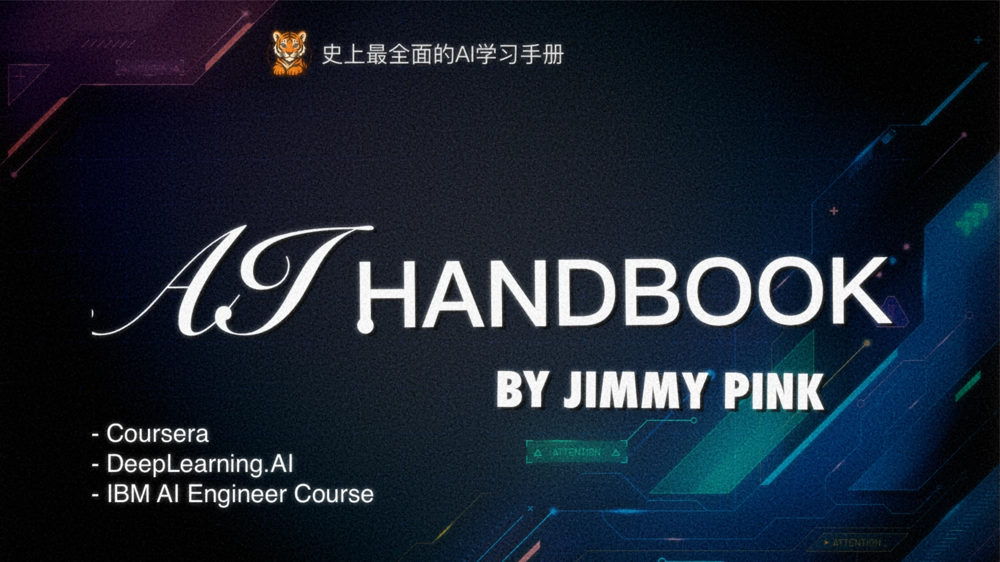

# AI学习手册

史上最全面的AI学习手册，面向**普通白领、程序员、创业者**及**业余AI学习爱好者**。

[🔗 访问 GitHub Pages](https://jimmy-pink.github.io)

欢迎来到 **AI学习手册**！  
这是一本精心整理的学习笔记、教程与资源融合。
- 记录了系统学习人工智能的完整路径
- 整理了坊间流传的知名AI学习手册
- 数百万次AI知识交流，对关键知识点做详细补充和绘图解释

无论你是刚入门的新手，还是正在进阶的学习者，这份手册都能为你提供**结构化、系统化的学习资料**，涵盖从基础概念到前沿应用的广阔领域。

### ✨  特点

- **定位清晰**：面向初学者到中高级AI学习者，注重循序渐进。
- **内容严谨**：
	- 参考了Coursera、MIT、斯坦福等优质公开课程
	- 多平台生成式AI知识构建和复核。
- **自用+共享**：原本为个人学习整理，现开放共享，希望帮助更多人高效掌握AI技术。

---

## 📚 知识大纲

> 📂 [点击查看最新完整目录](./_sidebar.md)

本手册结构化地划分为以下核心章节：

1. **学习序言** —— 为什么要学习AI？
2. **基础必备** —— 数学、Python编程、常用工具。
3. **机器学习** —— 监督学习、无监督学习、常见算法。
4. **深度学习** —— 卷积神经网络（CNN）、循环神经网络（RNN）、Transformer。
5. **计算机视觉** —— 图像分类、目标检测、图像分割。
6. **自然语言处理（NLP）** —— 文本处理、语言模型、LLM。
7. **RAG 技术** —— 基于检索增强生成的应用。
8. **AI智能体（Agent）** —— MCP，A2A，Prompt，Agent
9. **推荐系统** —— 从基础推荐到智能推荐系统构建。
10. **AI全栈开发** —— 后端、前端与模型部署实践。

---

## 📖 知识库说明

### 重要引用参考资料列表

+ 《The Document is All You Need！一站式LLM底层技术原理入门指南》by 陈敏凯 （非常适合小白快速入门，搞懂基本原理）
+ Coursera AI 相关课程
	+ [[IBM- 0 - Course Introduction and Study Plan|IBM全套AI工程师课程]]  (适合普通程序员快速上手， 课程非常全面，Jupyter小项目多)
+ [《动手学深度学习》by b站李沐](https://zh-v2.d2l.ai/) 
+  [跟着迪哥学Python数据分析与机器学习实战](https://github.com/tangyudi/Ai-Learn)

### 基于 Obsidian 构建

本知识库基于 [Obsidian](https://obsidian.md) 编辑与管理，  
推荐使用 Obsidian 阅读，特别是在手机端，可获得更加顺畅、沉浸式的学习体验。

### 承诺长期维护

本手册承诺持续更新与维护，  
不仅对已有内容不断打磨完善，也会同步总结AI领域的新兴技术与趋势，致力于打造最实用、最全面的AI学习参考书。

---

如果你喜欢这份知识库，欢迎⭐Star支持！  
你的支持，是我持续更新的最大动力！🚀
